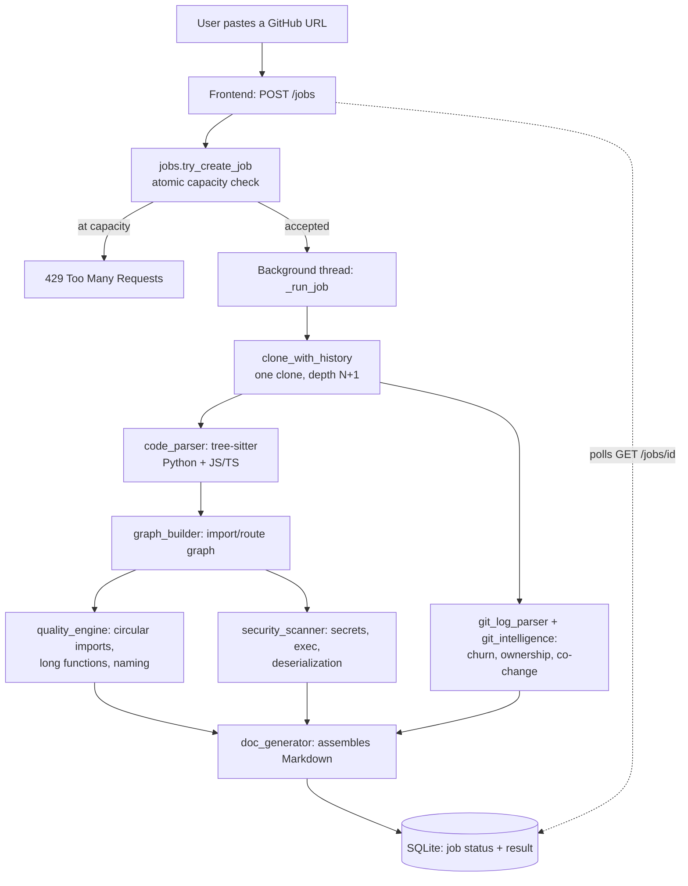

# Atlas Architecture

## Overview

Atlas turns a public GitHub URL into a full engineering review, entirely
via deterministic static analysis — no LLM calls in the analysis pipeline
itself. See `docs/superpowers/specs/` for the design doc behind each piece
below (dated, one per feature).

## Request flow

## Backend modules (`backend/app/`)

| Module | Responsibility |
|---|---|
| `main.py` | FastAPI routes, CORS, rate limiting, logging setup |
| `config.py` | Env-driven config (CORS origins, log level), fails fast on misconfiguration |
| `rate_limiter.py` | In-memory sliding-window per-client rate limiter |
| `jobs.py` | SQLite-backed async job state, atomic capacity-checked creation, cleanup |
| `models.py` | Pydantic request/response schemas shared across endpoints |
| `timing.py` | Per-stage wall-clock timing, logged per job |
| `cloner.py` | Shallow / history-depth git clones into a temp dir |
| `stack_detector.py` | Heuristic framework/DB/deployment detection |
| `code_parser.py` | Tree-sitter parsing (Python, JS/TS) into `FileSymbols` |
| `graph_builder.py` | Import + route graph (NetworkX `DiGraph`) |
| `quality_engine.py` | Circular imports (via strongly-connected components), long/complex functions, naming |
| `security_scanner.py` | Regex-based secrets/dangerous-exec/deserialization detection |
| `git_log_parser.py` | `git log --numstat` → structured commits |
| `git_intelligence.py` | Churn, ownership, co-change (capped to avoid the O(k²) blowup documented in the performance-benchmarking spec) |
| `semantic_analysis.py` | Architecture metrics, dependency criticality, layer detection, engineering hotspots, coupling/smell detection |
| `technical_debt.py` | Weighted debt score reusing quality/semantic/git data — no new parsing |
| `performance_analyzer.py` | Static performance signals (large functions, branch count, dependency bottlenecks) |
| `ai_explain.py` | Pluggable `Explainer` (deterministic-template + optional Anthropic) grounded to an explicit evidence list |
| `snapshot.py` | Builds the compact `AnalysisSnapshot` persisted per job, used by comparison |
| `comparison_engine.py` | Diffs two `AnalysisSnapshot`s into metric/set changes and regression/improvement findings |
| `report_pipeline.py` | Wires the above into `/analyze`, `/documentation`, and the job runner |
| `doc_generator.py` | Assembles the final Markdown report (and the comparison report) |

## Frontend (`frontend/src/`)

Single-page: `App.tsx` (submit → poll → render), `MarkdownReport.tsx`
(renders the Markdown, lazy-loads Mermaid only when a diagram is actually
present). Job state survives a page refresh via `localStorage` — see the
refresh-recovery design doc.

## Why deterministic analysis, not an LLM wrapper

Every finding-producing engine above is static analysis: tree-sitter
ASTs, graph algorithms (strongly-connected components for circular
imports), regex patterns, git history parsing. This is a deliberate
positioning choice (see project history): understanding a codebase is a
more stable problem than generating one, and deterministic analysis is
cheaper, faster, and doesn't hallucinate a dependency that isn't there.

`ai_explain.py` is the one place an LLM call can happen, and it's
structurally incapable of bypassing the rule above: every call is
handed an explicit list of deterministic facts (`_grounded_in`) and
asked to explain only those — it never sees raw repo content and
cannot introduce a finding the deterministic engines didn't already
produce. It's also fully optional: with no `ATLAS_ANTHROPIC_API_KEY`
configured (the default), the exact same evidence is rendered through
a template instead, and every AI-path failure mode falls back to that
same template rather than degrading the response.

## Data flow constraints worth knowing

- File-count (5,000) and per-file size (2MB) caps bound how much a single
  pathological repo can make Atlas do — see `report_pipeline.py`.
- Co-change analysis skips any single commit touching >100 files (an
  initial "add everything" commit, common in real repos) — see
  `git_intelligence.py` and the performance-benchmarking design doc for
  why this matters (unbounded, it's an O(k²) blowup).
- The job capacity cap (`_MAX_ACTIVE_JOBS`) and the per-client rate
  limiter are two separate, complementary mechanisms — see the
  production-security-hardening design doc for what each one actually
  protects against, and the CORS-hardening doc for the rate limiter's
  known reverse-proxy limitation.
