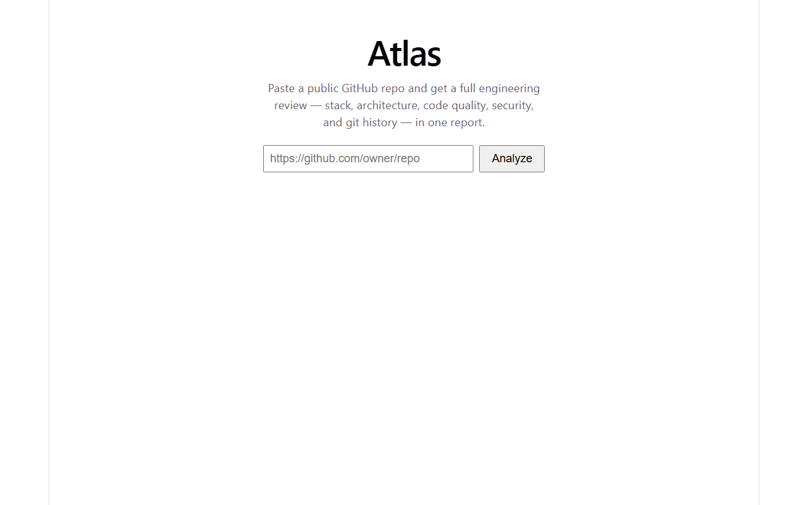
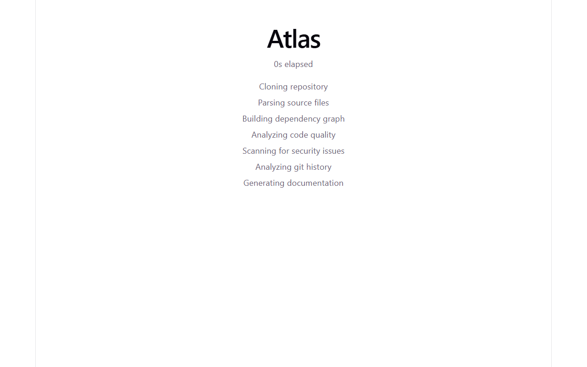
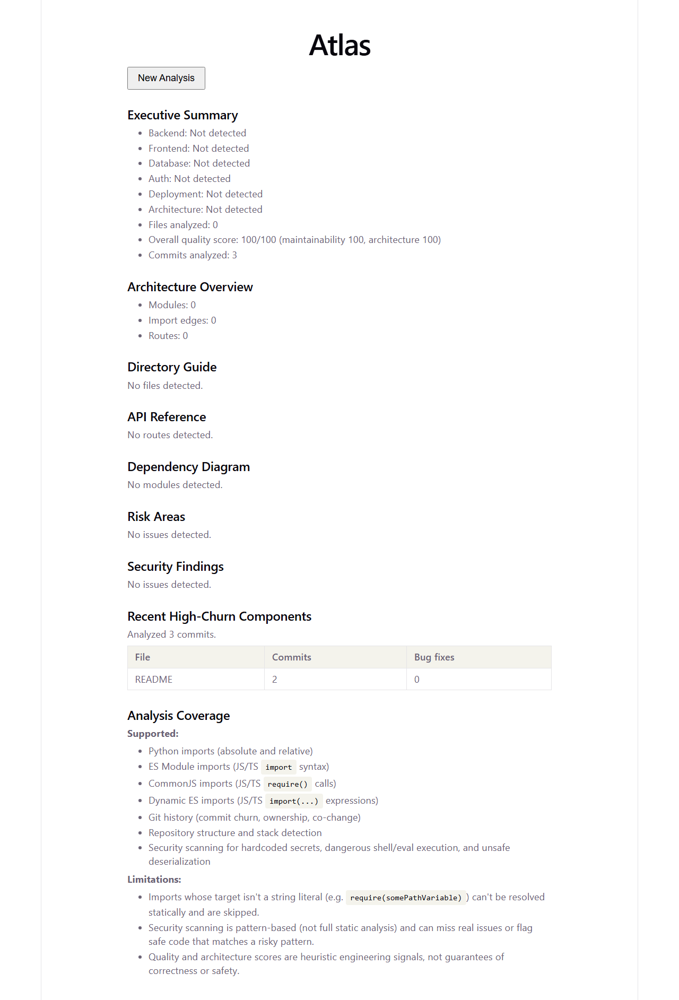
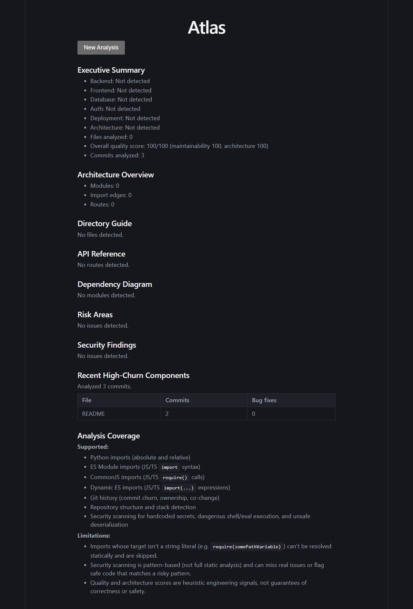

# Atlas

Software Intelligence Platform — paste a GitHub repo, get a full engineering
review instead of a chatbot.

**Try it live: [frontend-alpha-brown-16.vercel.app](https://frontend-alpha-brown-16.vercel.app)**
(frontend on Vercel, backend on Railway — see [`DEPLOYMENT.md`](DEPLOYMENT.md)
for the setup, including the two real deploy issues found doing this for
real: a hardcoded port that ignored the platform's injected `$PORT`, and a
Railway root-directory setting that silently didn't apply to a monorepo
build until re-triggered from a fresh commit.)

Atlas analyzes GitHub repositories to reveal architecture, dependency
relationships, code quality, Git history insights, security findings, and
engineering documentation — using deterministic software analysis, not an
LLM guessing at your code.

Given a public GitHub URL, Atlas clones it and produces:

- **Repository Intelligence** — stack/language/framework/deployment detection.
- **Architecture Graph** — a module/import/route dependency graph.
- **Code Quality Engine** — circular imports, long/complex functions, naming
  issues, rolled into maintainability/architecture scores.
- **Security Scanner** — deterministic checks for hardcoded secrets, dangerous
  execution, and unsafe deserialization.
- **Git Intelligence** — file churn, bug-fix hotspots, ownership, and
  co-change patterns from commit history.
- **Semantic Repository Intelligence** — graph-theoretic architecture metrics
  (centrality, articulation points, bridges), dependency criticality ranking,
  deterministic layer detection (says so honestly when a repo doesn't match a
  recognized convention, rather than guessing), engineering hotspots (churn ×
  centrality × complexity), and coupling/architectural-smell detection.
- **Documentation Generator** — a single Markdown report combining all of the
  above, with Mermaid dependency, critical-module, and subsystem diagrams.
- **Repository Comparison** — compare two completed analyses (`POST /compare`)
  for measurable architecture/quality/security/git/semantic changes, with
  documented significance thresholds — never a "better/worse" verdict, only
  specific deltas.
- **Technical Debt Engine** (`POST /technical-debt`) — modules ranked by a
  weighted combination of complexity-under-churn, criticality-under-size,
  coupling/architectural smells, and circular-dependency membership, with
  per-module evidence and a confidence flag.
- **Performance Analyzer** (`POST /performance-analysis`) — static-only
  signals (very-large functions, high branch counts, dependency
  bottlenecks); deliberately doesn't attempt N+1/ORM/runtime detection.
- **AI Architect / AI Mentor** (`POST /ai-architect`, `POST /ai-mentor`) —
  optional AI explanations of what the deterministic engines above already
  found. The AI layer never invents findings: it's handed an explicit list
  of deterministic facts and asked to explain only those, and it degrades
  to a template-based explanation (not an error) with no API key configured.

Everything above the AI Architect/Mentor layer is deterministic, static
analysis — no LLM calls. The AI layer is additive and optional: it explains
facts the deterministic engines already computed, and never runs without
them. See two real generated reports in [`docs/examples/`](docs/examples/)
(a Python CLI framework and a CommonJS Node.js server).

## Screenshots

| | |
|---|---|
|  |  |
|  |  |

## Running it

- **Quick start**: `docker compose up --build` — see [`DEPLOYMENT.md`](DEPLOYMENT.md).
  The compose stack (build, backend healthcheck, frontend serving) is
  validated on every push via [`docker-validate.yml`](.github/workflows/docker-validate.yml) —
  no local machine in dev has Docker installed, so CI is the real check.
- **Backend only**: see [`backend/README.md`](backend/README.md). Once running,
  interactive API docs are at `http://127.0.0.1:8000/docs` (Swagger UI, auto-generated).
- **Frontend only**: `cd frontend && npm install && npm run dev` (needs the
  backend running; see `VITE_API_BASE` in `DEPLOYMENT.md`).

The frontend is a paste-a-URL flow: submit a repo, watch per-stage progress,
get back the rendered report. It survives a page refresh mid-analysis.

## Documentation

- [`ARCHITECTURE.md`](ARCHITECTURE.md) — module responsibilities, request-flow diagram.
- [`DEPLOYMENT.md`](DEPLOYMENT.md) — environment variables, Docker, production checklist.
- [`TROUBLESHOOTING.md`](TROUBLESHOOTING.md) — common setup/runtime issues.
- [`CONTRIBUTING.md`](CONTRIBUTING.md) — local setup, test/lint commands, PR conventions.
- [`FAQ.md`](FAQ.md) — what Atlas is/isn't, how it was validated, and a full
  known-limitations list (security scanner blind spots, scoring caveats,
  size caps, the rate limiter's known reverse-proxy gap).
- [`ROADMAP.md`](ROADMAP.md) — what's shipped and validated vs. planned.
- [`CHANGELOG.md`](CHANGELOG.md) — what's shipped, grouped by milestone.
- [`SECURITY.md`](SECURITY.md) — how to report a vulnerability.
- [`docs/examples/`](docs/examples/) — real generated reports.
- [`docs/benchmarks/`](docs/benchmarks/) — measured performance and
  real-repository validation results.
- `docs/superpowers/specs/` — a design doc per feature, including explicitly
  documented known limitations for each (source material for `FAQ.md`).

## Project layout

- `backend/` — FastAPI app (`app/`), pytest suite (`tests/`), benchmarking
  scripts (`scripts/`, see `docs/benchmarks/`).
- `frontend/` — React + Vite + TypeScript.
- `docs/superpowers/specs/` — design docs, one per phase/feature.
- `docs/superpowers/plans/` — implementation plans for earlier phases.

## Limitations

See [`FAQ.md`](FAQ.md) for the full known-limitations list — e.g. the
CORS/rate-limiting posture documented in the production-security-hardening
and CORS-hardening specs, the AI layer's mocked-not-live-validated
Anthropic path, and what the Performance Analyzer deliberately doesn't
attempt.
