## Executive Summary

- Backend: Django
- Frontend: Not detected
- Database: Not detected
- Auth: Not detected
- Deployment: Not detected
- Architecture: Not detected
- Files analyzed: 1511
- Overall quality score: 55/100 (maintainability 94, architecture 16)
- Commits analyzed: 500 (history truncated)

## Architecture Overview

- Modules: 1511
- Import edges: 4989
- Routes: 0

Most depended-upon modules:
- __init__.py (318 importers)
- __init__.py (242 importers)
- exceptions.py (221 importers)
- __init__.py (205 importers)
- functional.py (133 importers)
- __init__.py (114 importers)
- __init__.py (109 importers)
- __init__.py (109 importers)
- __init__.py (101 importers)
- __init__.py (98 importers)

## Directory Guide

| Directory | Files |
|---|---|
| django | 994 |
| tests | 490 |
| js_tests | 11 |
| scripts | 11 |
| docs | 4 |
| . | 1 |

## API Reference

No routes detected.

## Dependency Diagram

```mermaid
graph TD
    n14["__init__.py"] --> n34["version.py"]
    n14["__init__.py"] --> n9["__init__.py"]
    n14["__init__.py"] --> n3["__init__.py"]
    n14["__init__.py"] --> n7["__init__.py"]
    n3["__init__.py"] --> n2["exceptions.py"]
    n3["__init__.py"] --> n25["deprecation.py"]
    n3["__init__.py"] --> n4["functional.py"]
    n3["__init__.py"] --> n7["__init__.py"]
    n0["__init__.py"] --> n12["__init__.py"]
    n38["signals.py"] --> n9["__init__.py"]
    n38["signals.py"] --> n3["__init__.py"]
    n38["signals.py"] --> n2["exceptions.py"]
    n38["signals.py"] --> n0["__init__.py"]
    n38["signals.py"] --> n13["__init__.py"]
    n38["signals.py"] --> n4["functional.py"]
    n38["signals.py"] --> n31["__init__.py"]
    n38["signals.py"] --> n6["__init__.py"]
    n38["signals.py"] --> n22["__init__.py"]
    n38["signals.py"] --> n12["__init__.py"]
    n38["signals.py"] --> n7["__init__.py"]
    n38["signals.py"] --> n16["__init__.py"]
    n39["testcases.py"] --> n9["__init__.py"]
    n39["testcases.py"] --> n3["__init__.py"]
    n39["testcases.py"] --> n12["__init__.py"]
    n39["testcases.py"] --> n2["exceptions.py"]
    n39["testcases.py"] --> n31["__init__.py"]
    n39["testcases.py"] --> n0["__init__.py"]
    n39["testcases.py"] --> n8["__init__.py"]
    n39["testcases.py"] --> n38["signals.py"]
    n39["testcases.py"] --> n10["utils.py"]
    n39["testcases.py"] --> n4["functional.py"]
    n10["utils.py"] --> n9["__init__.py"]
    n10["utils.py"] --> n3["__init__.py"]
    n10["utils.py"] --> n12["__init__.py"]
    n10["utils.py"] --> n2["exceptions.py"]
    n10["utils.py"] --> n0["__init__.py"]
    n10["utils.py"] --> n22["__init__.py"]
    n10["utils.py"] --> n38["signals.py"]
    n10["utils.py"] --> n7["__init__.py"]
    n10["utils.py"] --> n6["__init__.py"]
    n10["utils.py"] --> n34["version.py"]
    n10["utils.py"] --> n1["__init__.py"]
    n1["__init__.py"] --> n39["testcases.py"]
    n1["__init__.py"] --> n10["utils.py"]
    n26["encoding.py"] --> n4["functional.py"]
    n28["html.py"] --> n3["__init__.py"]
    n28["html.py"] --> n2["exceptions.py"]
    n28["html.py"] --> n25["deprecation.py"]
    n28["html.py"] --> n4["functional.py"]
    n28["html.py"] --> n36["http.py"]
    n28["html.py"] --> n24["regex_helper.py"]
    n36["http.py"] --> n24["regex_helper.py"]
    n29["module_loading.py"] --> n9["__init__.py"]
    n24["regex_helper.py"] --> n4["functional.py"]
    n34["version.py"] --> n24["regex_helper.py"]
    n34["version.py"] --> n14["__init__.py"]
    n15["options.py"] --> n14["__init__.py"]
    n15["options.py"] --> n9["__init__.py"]
    n15["options.py"] --> n3["__init__.py"]
    n15["options.py"] --> n21["__init__.py"]
    n15["options.py"] --> n35["utils.py"]
    n15["options.py"] --> n16["__init__.py"]
    n15["options.py"] --> n2["exceptions.py"]
    n15["options.py"] --> n0["__init__.py"]
    n15["options.py"] --> n8["__init__.py"]
    n15["options.py"] --> n7["__init__.py"]
    n15["options.py"] --> n25["deprecation.py"]
    n15["options.py"] --> n28["html.py"]
    n15["options.py"] --> n36["http.py"]
    n15["options.py"] --> n6["__init__.py"]
    n15["options.py"] --> n17["models.py"]
    n37["sites.py"] --> n9["__init__.py"]
    n37["sites.py"] --> n3["__init__.py"]
    n37["sites.py"] --> n15["options.py"]
    n37["sites.py"] --> n16["__init__.py"]
    n37["sites.py"] --> n2["exceptions.py"]
    n37["sites.py"] --> n8["__init__.py"]
    n37["sites.py"] --> n7["__init__.py"]
    n37["sites.py"] --> n4["functional.py"]
    n37["sites.py"] --> n29["module_loading.py"]
    n37["sites.py"] --> n6["__init__.py"]
    n35["utils.py"] --> n16["__init__.py"]
    n35["utils.py"] --> n2["exceptions.py"]
    n35["utils.py"] --> n0["__init__.py"]
    n35["utils.py"] --> n7["__init__.py"]
    n35["utils.py"] --> n13["__init__.py"]
    n35["utils.py"] --> n28["html.py"]
    n35["utils.py"] --> n24["regex_helper.py"]
    n35["utils.py"] --> n6["__init__.py"]
    n35["utils.py"] --> n15["options.py"]
    n35["utils.py"] --> n20["expressions.py"]
    n11["models.py"] --> n9["__init__.py"]
    n11["models.py"] --> n21["__init__.py"]
    n11["models.py"] --> n17["models.py"]
    n11["models.py"] --> n2["exceptions.py"]
    n11["models.py"] --> n0["__init__.py"]
    n11["models.py"] --> n13["__init__.py"]
    n11["models.py"] --> n6["__init__.py"]
    n16["__init__.py"] --> n9["__init__.py"]
    n16["__init__.py"] --> n3["__init__.py"]
    n16["__init__.py"] --> n2["exceptions.py"]
    n16["__init__.py"] --> n29["module_loading.py"]
    n16["__init__.py"] --> n11["models.py"]
    n33["fields.py"] --> n17["models.py"]
    n33["fields.py"] --> n12["__init__.py"]
    n33["fields.py"] --> n2["exceptions.py"]
    n33["fields.py"] --> n0["__init__.py"]
    n33["fields.py"] --> n5["__init__.py"]
    n33["fields.py"] --> n27["__init__.py"]
    n33["fields.py"] --> n4["functional.py"]
    n17["models.py"] --> n9["__init__.py"]
    n17["models.py"] --> n0["__init__.py"]
    n17["models.py"] --> n5["__init__.py"]
    n17["models.py"] --> n6["__init__.py"]
    n23["base.py"] --> n14["__init__.py"]
    n23["base.py"] --> n12["__init__.py"]
    n23["base.py"] --> n2["exceptions.py"]
    n23["base.py"] --> n0["__init__.py"]
    n23["base.py"] --> n34["version.py"]
    n23["base.py"] --> n13["__init__.py"]
    n23["base.py"] --> n9["__init__.py"]
    n31["__init__.py"] --> n14["__init__.py"]
    n31["__init__.py"] --> n9["__init__.py"]
    n31["__init__.py"] --> n3["__init__.py"]
    n31["__init__.py"] --> n2["exceptions.py"]
    n31["__init__.py"] --> n23["base.py"]
    n31["__init__.py"] --> n13["__init__.py"]
    n20["expressions.py"] --> n2["exceptions.py"]
    n20["expressions.py"] --> n0["__init__.py"]
    n20["expressions.py"] --> n5["__init__.py"]
    n20["expressions.py"] --> n4["functional.py"]
    n20["expressions.py"] --> n19["__init__.py"]
    n30["lookups.py"] --> n2["exceptions.py"]
    n30["lookups.py"] --> n20["expressions.py"]
    n30["lookups.py"] --> n27["__init__.py"]
    n30["lookups.py"] --> n4["functional.py"]
    n30["lookups.py"] --> n19["__init__.py"]
    n5["__init__.py"] --> n2["exceptions.py"]
    n5["__init__.py"] --> n20["expressions.py"]
    n5["__init__.py"] --> n27["__init__.py"]
    n5["__init__.py"] --> n30["lookups.py"]
    n27["__init__.py"] --> n14["__init__.py"]
    n27["__init__.py"] --> n9["__init__.py"]
    n27["__init__.py"] --> n3["__init__.py"]
    n27["__init__.py"] --> n12["__init__.py"]
    n27["__init__.py"] --> n0["__init__.py"]
    n27["__init__.py"] --> n13["__init__.py"]
    n27["__init__.py"] --> n25["deprecation.py"]
    n27["__init__.py"] --> n4["functional.py"]
    n27["__init__.py"] --> n6["__init__.py"]
    n27["__init__.py"] --> n20["expressions.py"]
    n27["__init__.py"] --> n19["__init__.py"]
    n6["__init__.py"] --> n4["functional.py"]
    n6["__init__.py"] --> n24["regex_helper.py"]
    n6["__init__.py"] --> n3["__init__.py"]
    n32["tests.py"] --> n8["__init__.py"]
    n32["tests.py"] --> n14["__init__.py"]
    n32["tests.py"] --> n21["__init__.py"]
    n32["tests.py"] --> n15["options.py"]
    n32["tests.py"] --> n35["utils.py"]
    n32["tests.py"] --> n16["__init__.py"]
    n32["tests.py"] --> n11["models.py"]
    n32["tests.py"] --> n17["models.py"]
    n32["tests.py"] --> n12["__init__.py"]
    n32["tests.py"] --> n18["__init__.py"]
    n32["tests.py"] --> n1["__init__.py"]
    n32["tests.py"] --> n10["utils.py"]
    n32["tests.py"] --> n7["__init__.py"]
    n32["tests.py"] --> n13["__init__.py"]
    n32["tests.py"] --> n26["encoding.py"]
    n32["tests.py"] --> n28["html.py"]
    n32["tests.py"] --> n36["http.py"]
```

_(40 of 1511 modules shown, capped for readability)_

## Risk Areas

- **critical** `django/__init__.py:0` circular_import: Circular dependency cluster of 141 modules: django/__init__.py, django/apps/__init__.py, django/apps/config.py, django/apps/registry.py, django/conf/__init__.py, django/core/cache/__init__.py, django/core/cache/backends/base.py, django/core/cache/backends/filebased.py, django/core/checks/__init__.py, django/core/checks/async_checks.py, django/core/checks/caches.py, django/core/checks/commands.py, django/core/checks/compatibility/django_4_0.py, django/core/checks/database.py, django/core/checks/files.py, django/core/checks/mail.py, django/core/checks/messages.py, django/core/checks/model_checks.py, django/core/checks/registry.py, django/core/checks/security/base.py, and 121 more
- **critical** `django/contrib/admin/__init__.py:0` circular_import: Circular dependency cluster of 12 modules: django/contrib/admin/__init__.py, django/contrib/admin/checks.py, django/contrib/admin/decorators.py, django/contrib/admin/filters.py, django/contrib/admin/models.py, django/contrib/admin/options.py, django/contrib/admin/sites.py, django/contrib/admin/templatetags/admin_list.py, django/contrib/admin/templatetags/admin_urls.py, django/contrib/admin/utils.py, django/contrib/admin/views/main.py, django/contrib/admin/widgets.py
- **critical** `django/contrib/gis/geos/__init__.py:0` circular_import: Circular dependency cluster of 11 modules: django/contrib/gis/geos/__init__.py, django/contrib/gis/geos/collections.py, django/contrib/gis/geos/coordseq.py, django/contrib/gis/geos/factory.py, django/contrib/gis/geos/geometry.py, django/contrib/gis/geos/io.py, django/contrib/gis/geos/linestring.py, django/contrib/gis/geos/point.py, django/contrib/gis/geos/polygon.py, django/contrib/gis/geos/prepared.py, django/contrib/gis/geos/prototypes/io.py
- **important** `docs/lint.py:55` high_complexity: Function 'check_line_too_long_django' has branch count 15 (threshold 10)
- **important** `scripts/prepare_commit_msg.py:31` high_complexity: Function 'process_commit_message' has branch count 13 (threshold 10)
- **important** `django/apps/config.py:100` high_complexity: Function 'create' has branch count 15 (threshold 10)
- **important** `django/conf/__init__.py:241` high_complexity: Function '__init__' has branch count 12 (threshold 10)
- **important** `django/db/transaction.py:237` high_complexity: Function '__exit__' has branch count 18 (threshold 10)
- **important** `django/dispatch/dispatcher.py:476` high_complexity: Function '_live_receivers' has branch count 12 (threshold 10)
- **important** `django/forms/fields.py:1099` high_complexity: Function 'clean' has branch count 13 (threshold 10)
- **important** `django/forms/fields.py:1202` high_complexity: Function 'set_choices' has branch count 14 (threshold 10)
- **important** `django/forms/models.py:141` high_complexity: Function 'fields_for_model' has branch count 17 (threshold 10)
- **important** `django/forms/models.py:589` high_complexity: Function 'modelform_factory' has branch count 11 (threshold 10)
- **important** `django/forms/models.py:825` high_complexity: Function 'validate_unique' has branch count 15 (threshold 10)
- **important** `django/http/multipartparser.py:133` high_complexity: Function '_parse' has branch count 33 (threshold 10)
- **important** `django/http/response.py:223` high_complexity: Function 'set_cookie' has branch count 13 (threshold 10)
- **important** `django/middleware/cache.py:88` high_complexity: Function 'process_response' has branch count 11 (threshold 10)
- **important** `django/template/base.py:530` high_complexity: Function 'parse' has branch count 13 (threshold 10)
- **important** `django/template/base.py:803` high_complexity: Function 'resolve' has branch count 11 (threshold 10)
- **important** `django/template/base.py:965` high_complexity: Function '_resolve_lookup' has branch count 15 (threshold 10)

_...and 1638 additional findings._

## Security Findings

- **critical** `scripts/pr_quality/tests/test_check_pr.py:147` hardcoded_secret: Possible hardcoded secret (password/token/key assigned a literal value)
- **critical** `tests/admin_inlines/tests.py:1472` hardcoded_secret: Possible hardcoded secret (password/token/key assigned a literal value)
- **critical** `tests/admin_inlines/tests.py:2240` hardcoded_secret: Possible hardcoded secret (password/token/key assigned a literal value)
- **critical** `tests/admin_inlines/tests.py:2253` hardcoded_secret: Possible hardcoded secret (password/token/key assigned a literal value)
- **critical** `tests/admin_inlines/tests.py:2591` hardcoded_secret: Possible hardcoded secret (password/token/key assigned a literal value)
- **critical** `tests/admin_inlines/tests.py:2600` hardcoded_secret: Possible hardcoded secret (password/token/key assigned a literal value)
- **critical** `tests/admin_views/test_forms.py:18` hardcoded_secret: Possible hardcoded secret (password/token/key assigned a literal value)
- **critical** `tests/admin_views/test_multidb.py:54` hardcoded_secret: Possible hardcoded secret (password/token/key assigned a literal value)
- **critical** `tests/auth_tests/test_admin_multidb.py:42` hardcoded_secret: Possible hardcoded secret (password/token/key assigned a literal value)
- **critical** `tests/auth_tests/test_auth_backends.py:1421` hardcoded_secret: Possible hardcoded secret (password/token/key assigned a literal value)
- **critical** `tests/auth_tests/test_auth_backends.py:1433` hardcoded_secret: Possible hardcoded secret (password/token/key assigned a literal value)
- **critical** `tests/auth_tests/test_forms.py:56` hardcoded_secret: Possible hardcoded secret (password/token/key assigned a literal value)
- **critical** `tests/auth_tests/test_forms.py:59` hardcoded_secret: Possible hardcoded secret (password/token/key assigned a literal value)
- **critical** `tests/auth_tests/test_forms.py:61` hardcoded_secret: Possible hardcoded secret (password/token/key assigned a literal value)
- **critical** `tests/auth_tests/test_forms.py:467` hardcoded_secret: Possible hardcoded secret (password/token/key assigned a literal value)
- **critical** `tests/auth_tests/test_login.py:10` hardcoded_secret: Possible hardcoded secret (password/token/key assigned a literal value)
- **critical** `tests/auth_tests/test_middleware.py:190` hardcoded_secret: Possible hardcoded secret (password/token/key assigned a literal value)
- **critical** `tests/auth_tests/test_models.py:227` hardcoded_secret: Possible hardcoded secret (password/token/key assigned a literal value)
- **critical** `tests/auth_tests/test_signals.py:15` hardcoded_secret: Possible hardcoded secret (password/token/key assigned a literal value)
- **critical** `tests/auth_tests/test_signals.py:16` hardcoded_secret: Possible hardcoded secret (password/token/key assigned a literal value)

_...and 131 additional findings._

## Recent High-Churn Components

Analyzed 500 commits (history truncated — repo has more commits than analyzed).

| File | Commits | Bug fixes |
|---|---|---|
| docs/releases/6.1.txt | 53 | 38 |
| tests/admin_views/tests.py | 20 | 15 |
| AUTHORS | 18 | 18 |
| docs/internals/deprecation.txt | 18 | 11 |
| docs/topics/email.txt | 18 | 7 |
| docs/releases/6.2.txt | 17 | 13 |
| django/contrib/admin/options.py | 17 | 12 |
| docs/ref/settings.txt | 16 | 6 |
| tests/cache/tests.py | 14 | 11 |
| docs/releases/index.txt | 11 | 0 |

## Analysis Coverage

**Supported:**
- Python imports (absolute and relative)
- ES Module imports (JS/TS `import` syntax)
- CommonJS imports (JS/TS `require()` calls)
- Dynamic ES imports (JS/TS `import(...)` expressions)
- Git history (commit churn, ownership, co-change)
- Repository structure and stack detection
- Security scanning for hardcoded secrets, dangerous shell/eval execution, and unsafe deserialization

**Limitations:**
- Imports whose target isn't a string literal (e.g. `require(somePathVariable)`) can't be resolved statically and are skipped.
- Security scanning is pattern-based (not full static analysis) and can miss real issues or flag safe code that matches a risky pattern.
- Quality and architecture scores are heuristic engineering signals, not guarantees of correctness or safety.
