## Executive Summary

- Backend: Not detected
- Frontend: React
- Database: Not detected
- Auth: Not detected
- Deployment: Not detected
- Architecture: Not detected
- Files analyzed: 4482
- Overall quality score: 42/100 (maintainability 64, architecture 19)
- Commits analyzed: 500 (history truncated)

## Architecture Overview

- Modules: 4482
- Import edges: 3527
- Routes: 9

Most depended-upon modules:
- index.ts (64 importers)
- CompilerError.ts (59 importers)
- HIR.ts (50 importers)
- ReactInternalTypes.js (50 importers)
- utils.ts (49 importers)
- index.ts (47 importers)
- context.js (47 importers)
- visitors.ts (41 importers)
- Button.js (34 importers)
- ButtonIcon.js (34 importers)

## Directory Guide

| Directory | Files |
|---|---|
| compiler | 2086 |
| packages | 1893 |
| fixtures | 323 |
| scripts | 162 |
| flow-typed | 11 |
| . | 7 |

## API Reference

| Method | Path | File |
|---|---|---|
| GET | / | fixtures/fizz/server/server.js |
| GET | /buffer | fixtures/fizz/server/server.js |
| GET | /stream | fixtures/fizz/server/server.js |
| GET | /string | fixtures/fizz/server/server.js |
| GET | /source-maps | fixtures/flight-esm/server/global.js |
| GET | / | fixtures/flight-esm/server/region.js |
| POST | / | fixtures/flight-esm/server/region.js |
| GET | /source-maps | fixtures/flight-esm/server/region.js |
| GET | /todos | fixtures/flight-esm/server/region.js |
| GET | / | fixtures/flight-parcel/src/server.tsx |
| POST | / | fixtures/flight-parcel/src/server.tsx |
| GET | /todos/:id | fixtures/flight-parcel/src/server.tsx |
| POST | /todos/:id | fixtures/flight-parcel/src/server.tsx |
| GET | /source-maps | fixtures/flight/server/global.js |
| GET | / | fixtures/flight/server/region.js |
| POST | / | fixtures/flight/server/region.js |
| GET | /source-maps | fixtures/flight/server/region.js |
| GET | /todos | fixtures/flight/server/region.js |
| GET | / | fixtures/ssr/server/index.js |
| GET | / | fixtures/ssr/server/index.js |
| GET | / | fixtures/ssr2/server/server.js |
| GET | / | fixtures/view-transition/server/index.js |
| GET | / | fixtures/view-transition/server/index.js |

## Dependency Diagram

```mermaid
graph TD
    n12["ts-compile-fixture.ts"] --> n17["Environment.ts"]
    n12["ts-compile-fixture.ts"] --> n1["index.ts"]
    n12["ts-compile-fixture.ts"] --> n2["CompilerError.ts"]
    n12["ts-compile-fixture.ts"] --> n4["HIR.ts"]
    n2["CompilerError.ts"] --> n1["index.ts"]
    n2["CompilerError.ts"] --> n5["utils.ts"]
    n10["Pipeline.ts"] --> n2["CompilerError.ts"]
    n10["Pipeline.ts"] --> n1["index.ts"]
    n10["Pipeline.ts"] --> n17["Environment.ts"]
    n17["Environment.ts"] --> n2["CompilerError.ts"]
    n17["Environment.ts"] --> n4["HIR.ts"]
    n17["Environment.ts"] --> n5["utils.ts"]
    n4["HIR.ts"] --> n2["CompilerError.ts"]
    n4["HIR.ts"] --> n5["utils.ts"]
    n4["HIR.ts"] --> n17["Environment.ts"]
    n30["PrintHIR.ts"] --> n2["CompilerError.ts"]
    n30["PrintHIR.ts"] --> n5["utils.ts"]
    n30["PrintHIR.ts"] --> n4["HIR.ts"]
    n8["visitors.ts"] --> n5["utils.ts"]
    n8["visitors.ts"] --> n6["index.ts"]
    n8["visitors.ts"] --> n4["HIR.ts"]
    n32["visitors.ts"] --> n4["HIR.ts"]
    n32["visitors.ts"] --> n8["visitors.ts"]
    n32["visitors.ts"] --> n5["utils.ts"]
    n28["store.js"] --> n33["types.js"]
    n7["context.js"] --> n28["store.js"]
    n29["DevTools.js"] --> n28["store.js"]
    n29["DevTools.js"] --> n7["context.js"]
    n29["DevTools.js"] --> n39["TreeContext.js"]
    n29["DevTools.js"] --> n24["hooks.js"]
    n24["hooks.js"] --> n7["context.js"]
    n39["TreeContext.js"] --> n7["context.js"]
    n39["TreeContext.js"] --> n28["store.js"]
    n34["ReactDOMComponent.js"] --> n27["ReactFiberConfigDOM.js"]
    n34["ReactDOMComponent.js"] --> n18["DOMPluginEventSystem.js"]
    n27["ReactFiberConfigDOM.js"] --> n34["ReactDOMComponent.js"]
    n27["ReactFiberConfigDOM.js"] --> n18["DOMPluginEventSystem.js"]
    n9["ReactFiberBeginWork.js"] --> n3["ReactInternalTypes.js"]
    n9["ReactFiberBeginWork.js"] --> n11["ReactFiberLane.js"]
    n9["ReactFiberBeginWork.js"] --> n23["ReactWorkTags.js"]
    n9["ReactFiberBeginWork.js"] --> n36["ReactFiberFlags.js"]
    n9["ReactFiberBeginWork.js"] --> n19["ReactFiberConfig.js"]
    n9["ReactFiberBeginWork.js"] --> n31["ReactFiberReconciler.js"]
    n9["ReactFiberBeginWork.js"] --> n16["ReactFiberHooks.js"]
    n9["ReactFiberBeginWork.js"] --> n0["ReactFiberWorkLoop.js"]
    n9["ReactFiberBeginWork.js"] --> n37["ReactFiberThrow.js"]
    n22["ReactFiberCommitWork.js"] --> n19["ReactFiberConfig.js"]
    n22["ReactFiberCommitWork.js"] --> n3["ReactInternalTypes.js"]
    n22["ReactFiberCommitWork.js"] --> n11["ReactFiberLane.js"]
    n22["ReactFiberCommitWork.js"] --> n16["ReactFiberHooks.js"]
    n22["ReactFiberCommitWork.js"] --> n23["ReactWorkTags.js"]
    n22["ReactFiberCommitWork.js"] --> n36["ReactFiberFlags.js"]
    n22["ReactFiberCommitWork.js"] --> n0["ReactFiberWorkLoop.js"]
    n25["ReactFiberCompleteWork.js"] --> n3["ReactInternalTypes.js"]
    n25["ReactFiberCompleteWork.js"] --> n11["ReactFiberLane.js"]
    n25["ReactFiberCompleteWork.js"] --> n19["ReactFiberConfig.js"]
    n25["ReactFiberCompleteWork.js"] --> n23["ReactWorkTags.js"]
    n25["ReactFiberCompleteWork.js"] --> n36["ReactFiberFlags.js"]
    n25["ReactFiberCompleteWork.js"] --> n0["ReactFiberWorkLoop.js"]
    n16["ReactFiberHooks.js"] --> n3["ReactInternalTypes.js"]
    n16["ReactFiberHooks.js"] --> n11["ReactFiberLane.js"]
    n16["ReactFiberHooks.js"] --> n36["ReactFiberFlags.js"]
    n16["ReactFiberHooks.js"] --> n19["ReactFiberConfig.js"]
    n16["ReactFiberHooks.js"] --> n23["ReactWorkTags.js"]
    n16["ReactFiberHooks.js"] --> n0["ReactFiberWorkLoop.js"]
    n16["ReactFiberHooks.js"] --> n9["ReactFiberBeginWork.js"]
    n11["ReactFiberLane.js"] --> n3["ReactInternalTypes.js"]
    n31["ReactFiberReconciler.js"] --> n3["ReactInternalTypes.js"]
    n31["ReactFiberReconciler.js"] --> n19["ReactFiberConfig.js"]
    n31["ReactFiberReconciler.js"] --> n11["ReactFiberLane.js"]
    n31["ReactFiberReconciler.js"] --> n23["ReactWorkTags.js"]
    n31["ReactFiberReconciler.js"] --> n0["ReactFiberWorkLoop.js"]
    n37["ReactFiberThrow.js"] --> n3["ReactInternalTypes.js"]
    n37["ReactFiberThrow.js"] --> n11["ReactFiberLane.js"]
    n37["ReactFiberThrow.js"] --> n23["ReactWorkTags.js"]
    n37["ReactFiberThrow.js"] --> n36["ReactFiberFlags.js"]
    n37["ReactFiberThrow.js"] --> n0["ReactFiberWorkLoop.js"]
    n0["ReactFiberWorkLoop.js"] --> n3["ReactInternalTypes.js"]
    n0["ReactFiberWorkLoop.js"] --> n11["ReactFiberLane.js"]
    n0["ReactFiberWorkLoop.js"] --> n16["ReactFiberHooks.js"]
    n0["ReactFiberWorkLoop.js"] --> n19["ReactFiberConfig.js"]
    n0["ReactFiberWorkLoop.js"] --> n23["ReactWorkTags.js"]
    n0["ReactFiberWorkLoop.js"] --> n36["ReactFiberFlags.js"]
    n0["ReactFiberWorkLoop.js"] --> n9["ReactFiberBeginWork.js"]
    n0["ReactFiberWorkLoop.js"] --> n25["ReactFiberCompleteWork.js"]
    n0["ReactFiberWorkLoop.js"] --> n37["ReactFiberThrow.js"]
    n0["ReactFiberWorkLoop.js"] --> n22["ReactFiberCommitWork.js"]
    n3["ReactInternalTypes.js"] --> n23["ReactWorkTags.js"]
    n3["ReactInternalTypes.js"] --> n36["ReactFiberFlags.js"]
    n3["ReactInternalTypes.js"] --> n11["ReactFiberLane.js"]
    n3["ReactInternalTypes.js"] --> n19["ReactFiberConfig.js"]
```

_(40 of 4482 modules shown, capped for readability)_

## Risk Areas

- **critical** `compiler/packages/babel-plugin-react-compiler/src/Babel/BabelPlugin.ts:0` circular_import: Circular dependency cluster of 46 modules: compiler/packages/babel-plugin-react-compiler/src/Babel/BabelPlugin.ts, compiler/packages/babel-plugin-react-compiler/src/Entrypoint/Options.ts, compiler/packages/babel-plugin-react-compiler/src/Entrypoint/Pipeline.ts, compiler/packages/babel-plugin-react-compiler/src/Entrypoint/Reanimated.ts, compiler/packages/babel-plugin-react-compiler/src/Flood/TypeErrors.ts, compiler/packages/babel-plugin-react-compiler/src/Flood/Types.ts, compiler/packages/babel-plugin-react-compiler/src/HIR/CollectHoistablePropertyLoads.ts, compiler/packages/babel-plugin-react-compiler/src/HIR/CollectOptionalChainDependencies.ts, compiler/packages/babel-plugin-react-compiler/src/HIR/DefaultModuleTypeProvider.ts, compiler/packages/babel-plugin-react-compiler/src/HIR/DeriveMinimalDependenciesHIR.ts, compiler/packages/babel-plugin-react-compiler/src/HIR/Dominator.ts, compiler/packages/babel-plugin-react-compiler/src/HIR/Environment.ts, compiler/packages/babel-plugin-react-compiler/src/HIR/FindContextIdentifiers.ts, compiler/packages/babel-plugin-react-compiler/src/HIR/Globals.ts, compiler/packages/babel-plugin-react-compiler/src/HIR/HIR.ts, compiler/packages/babel-plugin-react-compiler/src/HIR/HIRBuilder.ts, compiler/packages/babel-plugin-react-compiler/src/HIR/ObjectShape.ts, compiler/packages/babel-plugin-react-compiler/src/HIR/PrintHIR.ts, compiler/packages/babel-plugin-react-compiler/src/HIR/PropagateScopeDependenciesHIR.ts, compiler/packages/babel-plugin-react-compiler/src/HIR/TypeSchema.ts, and 26 more
- **critical** `packages/react-reconciler/src/ReactCapturedValue.js:0` circular_import: Circular dependency cluster of 59 modules: packages/react-reconciler/src/ReactCapturedValue.js, packages/react-reconciler/src/ReactChildFiber.js, packages/react-reconciler/src/ReactCurrentFiber.js, packages/react-reconciler/src/ReactEventPriorities.js, packages/react-reconciler/src/ReactFiber.js, packages/react-reconciler/src/ReactFiberAct.js, packages/react-reconciler/src/ReactFiberActivityComponent.js, packages/react-reconciler/src/ReactFiberApplyGesture.js, packages/react-reconciler/src/ReactFiberAsyncAction.js, packages/react-reconciler/src/ReactFiberAsyncDispatcher.js, packages/react-reconciler/src/ReactFiberBeginWork.js, packages/react-reconciler/src/ReactFiberCacheComponent.js, packages/react-reconciler/src/ReactFiberCallUserSpace.js, packages/react-reconciler/src/ReactFiberClassComponent.js, packages/react-reconciler/src/ReactFiberClassUpdateQueue.js, packages/react-reconciler/src/ReactFiberCommitEffects.js, packages/react-reconciler/src/ReactFiberCommitHostEffects.js, packages/react-reconciler/src/ReactFiberCommitViewTransitions.js, packages/react-reconciler/src/ReactFiberCommitWork.js, packages/react-reconciler/src/ReactFiberCompleteWork.js, and 39 more
- **critical** `packages/react-dom-bindings/src/client/DOMPropertyOperations.js:0` circular_import: Circular dependency cluster of 21 modules: packages/react-dom-bindings/src/client/DOMPropertyOperations.js, packages/react-dom-bindings/src/client/ReactDOMComponent.js, packages/react-dom-bindings/src/client/ReactDOMComponentTree.js, packages/react-dom-bindings/src/client/ReactDOMInput.js, packages/react-dom-bindings/src/client/ReactDOMSelect.js, packages/react-dom-bindings/src/client/ReactDOMTextarea.js, packages/react-dom-bindings/src/client/ReactDOMUpdatePriority.js, packages/react-dom-bindings/src/client/ReactFiberConfigDOM.js, packages/react-dom-bindings/src/events/DOMPluginEventSystem.js, packages/react-dom-bindings/src/events/ReactDOMControlledComponent.js, packages/react-dom-bindings/src/events/ReactDOMEventListener.js, packages/react-dom-bindings/src/events/ReactDOMEventReplaying.js, packages/react-dom-bindings/src/events/ReactDOMUpdateBatching.js, packages/react-dom-bindings/src/events/getListener.js, packages/react-dom-bindings/src/events/plugins/BeforeInputEventPlugin.js, packages/react-dom-bindings/src/events/plugins/ChangeEventPlugin.js, packages/react-dom-bindings/src/events/plugins/EnterLeaveEventPlugin.js, packages/react-dom-bindings/src/events/plugins/FormActionEventPlugin.js, packages/react-dom-bindings/src/events/plugins/ScrollEndEventPlugin.js, packages/react-dom-bindings/src/events/plugins/SelectEventPlugin.js, and 1 more
- **important** `packages/react-server/src/ReactFizzAsyncDispatcher.js:0` circular_import: Circular dependency cluster of 5 modules: packages/react-server/src/ReactFizzAsyncDispatcher.js, packages/react-server/src/ReactFizzCurrentTask.js, packages/react-server/src/ReactFizzHooks.js, packages/react-server/src/ReactFizzServer.js, packages/react-server/src/ReactFizzThenable.js
- **important** `packages/react-devtools-shared/src/backend/agent.js:0` circular_import: Circular dependency cluster of 6 modules: packages/react-devtools-shared/src/backend/agent.js, packages/react-devtools-shared/src/backend/types.js, packages/react-devtools-shared/src/backend/views/Highlighter/Highlighter.js, packages/react-devtools-shared/src/backend/views/Highlighter/index.js, packages/react-devtools-shared/src/backend/views/TraceUpdates/canvas.js, packages/react-devtools-shared/src/backend/views/TraceUpdates/index.js
- **important** `packages/react-devtools-shared/src/devtools/ProfilerStore.js:0` circular_import: Circular dependency cluster of 6 modules: packages/react-devtools-shared/src/devtools/ProfilerStore.js, packages/react-devtools-shared/src/devtools/ProfilingCache.js, packages/react-devtools-shared/src/devtools/store.js, packages/react-devtools-shared/src/devtools/utils.js, packages/react-devtools-shared/src/devtools/views/Components/TreeContext.js, packages/react-devtools-shared/src/devtools/views/context.js
- **important** `packages/react-native-renderer/src/__mocks__/react-native/Libraries/ReactPrivate/ReactNativePrivateInterface.js:0` circular_import: Circular dependency cluster of 6 modules: packages/react-native-renderer/src/__mocks__/react-native/Libraries/ReactPrivate/ReactNativePrivateInterface.js, packages/react-native-renderer/src/__mocks__/react-native/Libraries/ReactPrivate/createPublicInstance.js, packages/react-native-renderer/src/__mocks__/react-native/Libraries/ReactPrivate/createPublicRootInstance.js, packages/react-native-renderer/src/__mocks__/react-native/Libraries/ReactPrivate/createPublicTextInstance.js, packages/react-native-renderer/src/__mocks__/react-native/Libraries/ReactPrivate/getNativeTagFromPublicInstance.js, packages/react-native-renderer/src/__mocks__/react-native/Libraries/ReactPrivate/getNodeFromPublicInstance.js
- **important** `compiler/scripts/anonymize.js:149` high_complexity: Function 'AnonymizePlugin' has branch count 13 (threshold 10)
- **important** `compiler/scripts/test-rust-port.ts:217` high_complexity: Function 'compileFixture' has branch count 26 (threshold 10)
- **important** `compiler/scripts/test-rust-port.ts:578` high_complexity: Function 'findDivergencePass' has branch count 11 (threshold 10)
- **important** `compiler/scripts/ts-compile-fixture.ts:307` high_complexity: Function 'compileOneFunction' has branch count 77 (threshold 10)
- **important** `compiler/apps/playground/lib/compilation.ts:225` high_complexity: Function 'compile' has branch count 13 (threshold 10)
- **important** `compiler/apps/playground/components/Editor/Output.tsx:87` high_complexity: Function 'tabify' has branch count 14 (threshold 10)
- **important** `compiler/packages/babel-plugin-react-compiler/src/CompilerError.ts:565` high_complexity: Function 'printErrorSummary' has branch count 26 (threshold 10)
- **important** `compiler/packages/babel-plugin-react-compiler/src/CompilerError.ts:776` high_complexity: Function 'getRuleForCategoryImpl' has branch count 26 (threshold 10)
- **important** `compiler/packages/babel-plugin-react-compiler/src/Entrypoint/Options.ts:332` high_complexity: Function 'parsePluginOptions' has branch count 14 (threshold 10)
- **important** `compiler/packages/babel-plugin-react-compiler/src/Entrypoint/Pipeline.ts:148` high_complexity: Function 'runWithEnvironment' has branch count 25 (threshold 10)
- **important** `compiler/packages/babel-plugin-react-compiler/src/Entrypoint/Program.ts:1019` high_complexity: Function 'isValidPropsAnnotation' has branch count 27 (threshold 10)
- **important** `compiler/packages/babel-plugin-react-compiler/src/Flood/Types.ts:194` high_complexity: Function 'printConcrete' has branch count 21 (threshold 10)
- **important** `compiler/packages/babel-plugin-react-compiler/src/Flood/Types.ts:281` high_complexity: Function 'convertFlowType' has branch count 53 (threshold 10)

_...and 7204 additional findings._

## Security Findings

- **critical** `compiler/packages/react-mcp-server/src/utils/algolia.ts:14` hardcoded_secret: Possible hardcoded secret (password/token/key assigned a literal value)
- **critical** `packages/react-dom-bindings/src/shared/possibleStandardNames.js:16` hardcoded_secret: Possible hardcoded secret (password/token/key assigned a literal value)
- **critical** `scripts/tasks/danger.js:16` hardcoded_secret: Possible hardcoded secret (password/token/key assigned a literal value)
- **important** `compiler/packages/snap/src/sprout/evaluator.ts:255` dangerous_execution: eval() on untrusted input can execute arbitrary code
- **important** `flow-typed/environments/node.js:367` dangerous_execution: exec() on untrusted input can execute arbitrary code
- **important** `packages/react-devtools-extensions/deploy.js:43` dangerous_execution: exec() on untrusted input can execute arbitrary code
- **important** `packages/react-client/src/ReactClientDebugConfigBrowser.js:20` dangerous_execution: eval() on untrusted input can execute arbitrary code
- **important** `packages/react-client/src/ReactClientDebugConfigBrowser.js:23` dangerous_execution: eval() on untrusted input can execute arbitrary code
- **important** `packages/react-client/src/ReactClientDebugConfigBrowser.js:25` dangerous_execution: eval() on untrusted input can execute arbitrary code
- **important** `packages/react-client/src/ReactClientDebugConfigNode.js:20` dangerous_execution: eval() on untrusted input can execute arbitrary code
- **important** `packages/react-client/src/ReactClientDebugConfigNode.js:23` dangerous_execution: eval() on untrusted input can execute arbitrary code
- **important** `packages/react-client/src/ReactClientDebugConfigNode.js:25` dangerous_execution: eval() on untrusted input can execute arbitrary code
- **important** `packages/react-client/src/ReactClientDebugConfigPlain.js:20` dangerous_execution: eval() on untrusted input can execute arbitrary code
- **important** `packages/react-client/src/ReactClientDebugConfigPlain.js:21` dangerous_execution: eval() on untrusted input can execute arbitrary code
- **important** `packages/react-client/src/ReactClientDebugConfigPlain.js:23` dangerous_execution: eval() on untrusted input can execute arbitrary code
- **important** `packages/react-client/src/ReactFlightClient.js:2572` dangerous_execution: eval() on untrusted input can execute arbitrary code
- **important** `packages/react-devtools-core/src/backend.js:323` dangerous_execution: eval() on untrusted input can execute arbitrary code
- **important** `packages/react-devtools-extensions/firefox/test.js:62` dangerous_execution: exec() on untrusted input can execute arbitrary code
- **important** `packages/react-noop-renderer/src/ReactNoopFlightClient.js:112` dangerous_execution: eval() on untrusted input can execute arbitrary code
- **important** `packages/react-noop-renderer/src/ReactNoopFlightClient.js:113` dangerous_execution: eval() on untrusted input can execute arbitrary code

_...and 91 additional findings._

## Recent High-Churn Components

Analyzed 500 commits (history truncated — repo has more commits than analyzed).

| File | Commits | Bug fixes |
|---|---|---|
| packages/react-server/src/ReactFizzServer.js | 30 | 2 |
| packages/react-devtools-shared/src/backend/fiber/renderer.js | 28 | 6 |
| packages/shared/forks/ReactFeatureFlags.native-fb.js | 27 | 0 |
| packages/shared/forks/ReactFeatureFlags.native-oss.js | 26 | 0 |
| packages/shared/forks/ReactFeatureFlags.www.js | 26 | 1 |
| packages/shared/forks/ReactFeatureFlags.test-renderer.js | 25 | 0 |
| packages/shared/forks/ReactFeatureFlags.test-renderer.www.js | 25 | 0 |
| packages/shared/ReactFeatureFlags.js | 24 | 0 |
| packages/shared/forks/ReactFeatureFlags.test-renderer.native-fb.js | 24 | 0 |
| packages/react-server/src/ReactFlightServer.js | 22 | 4 |

## Analysis Coverage

**Supported:**
- Python imports (absolute and relative)
- ES Module imports (JS/TS `import` syntax)
- CommonJS imports (JS/TS `require()` calls)
- Dynamic ES imports (JS/TS `import(...)` expressions)
- Git history (commit churn, ownership, co-change)
- Repository structure and stack detection
- Security scanning for hardcoded secrets, dangerous shell/eval execution, and unsafe deserialization

**Limitations:**
- Imports whose target isn't a string literal (e.g. `require(somePathVariable)`) can't be resolved statically and are skipped.
- Security scanning is pattern-based (not full static analysis) and can miss real issues or flag safe code that matches a risky pattern.
- Quality and architecture scores are heuristic engineering signals, not guarantees of correctness or safety.
