## Executive Summary

- Backend: Not detected
- Frontend: React
- Database: Not detected
- Auth: Not detected
- Deployment: Not detected
- Architecture: Not detected
- Files analyzed: 2509
- Overall quality score: 47/100 (maintainability 65, architecture 29)
- Commits analyzed: 500 (history truncated)

## Architecture Overview

- Modules: 2509
- Import edges: 1079
- Routes: 9

Most depended-upon modules:
- index.ts (64 importers)
- CompilerError.ts (59 importers)
- HIR.ts (50 importers)
- utils.ts (49 importers)
- index.ts (47 importers)
- visitors.ts (41 importers)
- TestCase.js (32 importers)
- Fixture.js (28 importers)
- Environment.ts (23 importers)
- FixtureSet.js (21 importers)

## Directory Guide

| Directory | Files |
|---|---|
| compiler | 2086 |
| fixtures | 323 |
| packages | 82 |
| flow-typed | 11 |
| . | 7 |

## API Reference

| Method | Path | File |
|---|---|---|
| GET | / | fixtures/fizz/server/server.js |
| GET | /buffer | fixtures/fizz/server/server.js |
| GET | /stream | fixtures/fizz/server/server.js |
| GET | /string | fixtures/fizz/server/server.js |
| GET | /source-maps | fixtures/flight-esm/server/global.js |
| GET | / | fixtures/flight-esm/server/region.js |
| POST | / | fixtures/flight-esm/server/region.js |
| GET | /source-maps | fixtures/flight-esm/server/region.js |
| GET | /todos | fixtures/flight-esm/server/region.js |
| GET | / | fixtures/flight-parcel/src/server.tsx |
| POST | / | fixtures/flight-parcel/src/server.tsx |
| GET | /todos/:id | fixtures/flight-parcel/src/server.tsx |
| POST | /todos/:id | fixtures/flight-parcel/src/server.tsx |
| GET | /source-maps | fixtures/flight/server/global.js |
| GET | / | fixtures/flight/server/region.js |
| POST | / | fixtures/flight/server/region.js |
| GET | /source-maps | fixtures/flight/server/region.js |
| GET | /todos | fixtures/flight/server/region.js |
| GET | / | fixtures/ssr/server/index.js |
| GET | / | fixtures/ssr/server/index.js |
| GET | / | fixtures/ssr2/server/server.js |
| GET | / | fixtures/view-transition/server/index.js |
| GET | / | fixtures/view-transition/server/index.js |

## Dependency Diagram

```mermaid
graph TD
    n7["ts-compile-fixture.ts"] --> n37["BuildHIR.ts"]
    n7["ts-compile-fixture.ts"] --> n9["Environment.ts"]
    n7["ts-compile-fixture.ts"] --> n0["index.ts"]
    n7["ts-compile-fixture.ts"] --> n26["PropagateScopeDependenciesHIR.ts"]
    n7["ts-compile-fixture.ts"] --> n16["InferMutationAliasingEffects.ts"]
    n7["ts-compile-fixture.ts"] --> n32["InferMutationAliasingRanges.ts"]
    n7["ts-compile-fixture.ts"] --> n27["index.ts"]
    n7["ts-compile-fixture.ts"] --> n39["ValidateLocalsNotReassignedAfterRender.ts"]
    n7["ts-compile-fixture.ts"] --> n1["CompilerError.ts"]
    n7["ts-compile-fixture.ts"] --> n2["HIR.ts"]
    n7["ts-compile-fixture.ts"] --> n23["TestUtils.ts"]
    n7["ts-compile-fixture.ts"] --> n30["index.ts"]
    n1["CompilerError.ts"] --> n0["index.ts"]
    n1["CompilerError.ts"] --> n20["Result.ts"]
    n1["CompilerError.ts"] --> n3["utils.ts"]
    n25["Imports.ts"] --> n1["CompilerError.ts"]
    n25["Imports.ts"] --> n0["index.ts"]
    n25["Imports.ts"] --> n3["utils.ts"]
    n25["Imports.ts"] --> n9["Environment.ts"]
    n25["Imports.ts"] --> n20["Result.ts"]
    n25["Imports.ts"] --> n17["Program.ts"]
    n6["Pipeline.ts"] --> n30["index.ts"]
    n6["Pipeline.ts"] --> n1["CompilerError.ts"]
    n6["Pipeline.ts"] --> n20["Result.ts"]
    n6["Pipeline.ts"] --> n0["index.ts"]
    n6["Pipeline.ts"] --> n9["Environment.ts"]
    n6["Pipeline.ts"] --> n27["index.ts"]
    n6["Pipeline.ts"] --> n39["ValidateLocalsNotReassignedAfterRender.ts"]
    n6["Pipeline.ts"] --> n26["PropagateScopeDependenciesHIR.ts"]
    n6["Pipeline.ts"] --> n16["InferMutationAliasingEffects.ts"]
    n6["Pipeline.ts"] --> n32["InferMutationAliasingRanges.ts"]
    n17["Program.ts"] --> n1["CompilerError.ts"]
    n17["Program.ts"] --> n9["Environment.ts"]
    n17["Program.ts"] --> n27["index.ts"]
    n17["Program.ts"] --> n3["utils.ts"]
    n17["Program.ts"] --> n25["Imports.ts"]
    n17["Program.ts"] --> n6["Pipeline.ts"]
    n17["Program.ts"] --> n0["index.ts"]
    n17["Program.ts"] --> n20["Result.ts"]
    n36["Types.ts"] --> n4["index.ts"]
    n36["Types.ts"] --> n0["index.ts"]
    n36["Types.ts"] --> n3["utils.ts"]
    n37["BuildHIR.ts"] --> n1["CompilerError.ts"]
    n37["BuildHIR.ts"] --> n3["utils.ts"]
    n37["BuildHIR.ts"] --> n9["Environment.ts"]
    n37["BuildHIR.ts"] --> n2["HIR.ts"]
    n37["BuildHIR.ts"] --> n15["HIRBuilder.ts"]
    n37["BuildHIR.ts"] --> n18["ObjectShape.ts"]
    n9["Environment.ts"] --> n1["CompilerError.ts"]
    n9["Environment.ts"] --> n30["index.ts"]
    n9["Environment.ts"] --> n20["Result.ts"]
    n9["Environment.ts"] --> n31["Globals.ts"]
    n9["Environment.ts"] --> n2["HIR.ts"]
    n9["Environment.ts"] --> n18["ObjectShape.ts"]
    n9["Environment.ts"] --> n36["Types.ts"]
    n9["Environment.ts"] --> n3["utils.ts"]
    n31["Globals.ts"] --> n2["HIR.ts"]
    n31["Globals.ts"] --> n18["ObjectShape.ts"]
    n31["Globals.ts"] --> n3["utils.ts"]
    n31["Globals.ts"] --> n9["Environment.ts"]
    n31["Globals.ts"] --> n4["index.ts"]
    n2["HIR.ts"] --> n1["CompilerError.ts"]
    n2["HIR.ts"] --> n3["utils.ts"]
    n2["HIR.ts"] --> n9["Environment.ts"]
    n2["HIR.ts"] --> n18["ObjectShape.ts"]
    n2["HIR.ts"] --> n21["AliasingEffects.ts"]
    n2["HIR.ts"] --> n20["Result.ts"]
    n15["HIRBuilder.ts"] --> n1["CompilerError.ts"]
    n15["HIRBuilder.ts"] --> n9["Environment.ts"]
    n15["HIRBuilder.ts"] --> n2["HIR.ts"]
    n15["HIRBuilder.ts"] --> n11["PrintHIR.ts"]
    n15["HIRBuilder.ts"] --> n5["visitors.ts"]
    n18["ObjectShape.ts"] --> n1["CompilerError.ts"]
    n18["ObjectShape.ts"] --> n21["AliasingEffects.ts"]
    n18["ObjectShape.ts"] --> n3["utils.ts"]
    n18["ObjectShape.ts"] --> n2["HIR.ts"]
    n11["PrintHIR.ts"] --> n1["CompilerError.ts"]
    n11["PrintHIR.ts"] --> n33["DisjointSet.ts"]
    n11["PrintHIR.ts"] --> n3["utils.ts"]
    n11["PrintHIR.ts"] --> n2["HIR.ts"]
    n11["PrintHIR.ts"] --> n21["AliasingEffects.ts"]
    n26["PropagateScopeDependenciesHIR.ts"] --> n2["HIR.ts"]
    n26["PropagateScopeDependenciesHIR.ts"] --> n5["visitors.ts"]
    n26["PropagateScopeDependenciesHIR.ts"] --> n1["CompilerError.ts"]
    n26["PropagateScopeDependenciesHIR.ts"] --> n3["utils.ts"]
    n5["visitors.ts"] --> n3["utils.ts"]
    n5["visitors.ts"] --> n4["index.ts"]
    n5["visitors.ts"] --> n2["HIR.ts"]
    n21["AliasingEffects.ts"] --> n1["CompilerError.ts"]
    n21["AliasingEffects.ts"] --> n0["index.ts"]
    n21["AliasingEffects.ts"] --> n18["ObjectShape.ts"]
    n21["AliasingEffects.ts"] --> n11["PrintHIR.ts"]
    n38["AnalyseFunctions.ts"] --> n1["CompilerError.ts"]
    n38["AnalyseFunctions.ts"] --> n0["index.ts"]
    n38["AnalyseFunctions.ts"] --> n27["index.ts"]
    n38["AnalyseFunctions.ts"] --> n3["utils.ts"]
    n38["AnalyseFunctions.ts"] --> n16["InferMutationAliasingEffects.ts"]
    n38["AnalyseFunctions.ts"] --> n32["InferMutationAliasingRanges.ts"]
    n16["InferMutationAliasingEffects.ts"] --> n4["index.ts"]
    n16["InferMutationAliasingEffects.ts"] --> n0["index.ts"]
    n16["InferMutationAliasingEffects.ts"] --> n5["visitors.ts"]
    n16["InferMutationAliasingEffects.ts"] --> n3["utils.ts"]
    n16["InferMutationAliasingEffects.ts"] --> n11["PrintHIR.ts"]
    n16["InferMutationAliasingEffects.ts"] --> n18["ObjectShape.ts"]
    n16["InferMutationAliasingEffects.ts"] --> n15["HIRBuilder.ts"]
    n16["InferMutationAliasingEffects.ts"] --> n21["AliasingEffects.ts"]
    n16["InferMutationAliasingEffects.ts"] --> n1["CompilerError.ts"]
    n32["InferMutationAliasingRanges.ts"] --> n4["index.ts"]
    n32["InferMutationAliasingRanges.ts"] --> n2["HIR.ts"]
    n32["InferMutationAliasingRanges.ts"] --> n9["Environment.ts"]
    n32["InferMutationAliasingRanges.ts"] --> n5["visitors.ts"]
    n32["InferMutationAliasingRanges.ts"] --> n3["utils.ts"]
    n32["InferMutationAliasingRanges.ts"] --> n21["AliasingEffects.ts"]
    n19["CodegenReactiveFunction.ts"] --> n27["index.ts"]
    n19["CodegenReactiveFunction.ts"] --> n1["CompilerError.ts"]
    n19["CodegenReactiveFunction.ts"] --> n0["index.ts"]
    n19["CodegenReactiveFunction.ts"] --> n2["HIR.ts"]
    n19["CodegenReactiveFunction.ts"] --> n11["PrintHIR.ts"]
    n19["CodegenReactiveFunction.ts"] --> n5["visitors.ts"]
    n19["CodegenReactiveFunction.ts"] --> n3["utils.ts"]
    n19["CodegenReactiveFunction.ts"] --> n12["visitors.ts"]
    n19["CodegenReactiveFunction.ts"] --> n9["Environment.ts"]
    n19["CodegenReactiveFunction.ts"] --> n30["index.ts"]
    n22["InferReactiveScopeVariables.ts"] --> n4["index.ts"]
    n22["InferReactiveScopeVariables.ts"] --> n0["index.ts"]
    n22["InferReactiveScopeVariables.ts"] --> n2["HIR.ts"]
    n22["InferReactiveScopeVariables.ts"] --> n5["visitors.ts"]
    n22["InferReactiveScopeVariables.ts"] --> n33["DisjointSet.ts"]
    n22["InferReactiveScopeVariables.ts"] --> n3["utils.ts"]
    n12["visitors.ts"] --> n2["HIR.ts"]
    n12["visitors.ts"] --> n5["visitors.ts"]
    n12["visitors.ts"] --> n3["utils.ts"]
    n33["DisjointSet.ts"] --> n1["CompilerError.ts"]
    n33["DisjointSet.ts"] --> n2["HIR.ts"]
    n23["TestUtils.ts"] --> n1["CompilerError.ts"]
    n23["TestUtils.ts"] --> n30["index.ts"]
    n23["TestUtils.ts"] --> n4["index.ts"]
    n23["TestUtils.ts"] --> n2["HIR.ts"]
    n23["TestUtils.ts"] --> n9["Environment.ts"]
    n23["TestUtils.ts"] --> n20["Result.ts"]
    n23["TestUtils.ts"] --> n3["utils.ts"]
    n39["ValidateLocalsNotReassignedAfterRender.ts"] --> n4["index.ts"]
    n39["ValidateLocalsNotReassignedAfterRender.ts"] --> n1["CompilerError.ts"]
    n39["ValidateLocalsNotReassignedAfterRender.ts"] --> n9["Environment.ts"]
    n39["ValidateLocalsNotReassignedAfterRender.ts"] --> n0["index.ts"]
    n39["ValidateLocalsNotReassignedAfterRender.ts"] --> n5["visitors.ts"]
    n39["ValidateLocalsNotReassignedAfterRender.ts"] --> n16["InferMutationAliasingEffects.ts"]
    n28["shared-utils.ts"] --> n24["ReactCompilerRule.ts"]
    n29["index.js"] --> n13["FixtureSet.js"]
```

_(40 of 2509 modules shown, capped for readability)_

## Risk Areas

- **critical** `compiler/packages/babel-plugin-react-compiler/src/Babel/BabelPlugin.ts:0` circular_import: Circular dependency cluster of 46 modules: compiler/packages/babel-plugin-react-compiler/src/Babel/BabelPlugin.ts, compiler/packages/babel-plugin-react-compiler/src/Entrypoint/Options.ts, compiler/packages/babel-plugin-react-compiler/src/Entrypoint/Pipeline.ts, compiler/packages/babel-plugin-react-compiler/src/Entrypoint/Reanimated.ts, compiler/packages/babel-plugin-react-compiler/src/Flood/TypeErrors.ts, compiler/packages/babel-plugin-react-compiler/src/Flood/Types.ts, compiler/packages/babel-plugin-react-compiler/src/HIR/CollectHoistablePropertyLoads.ts, compiler/packages/babel-plugin-react-compiler/src/HIR/CollectOptionalChainDependencies.ts, compiler/packages/babel-plugin-react-compiler/src/HIR/DefaultModuleTypeProvider.ts, compiler/packages/babel-plugin-react-compiler/src/HIR/DeriveMinimalDependenciesHIR.ts, compiler/packages/babel-plugin-react-compiler/src/HIR/Dominator.ts, compiler/packages/babel-plugin-react-compiler/src/HIR/Environment.ts, compiler/packages/babel-plugin-react-compiler/src/HIR/FindContextIdentifiers.ts, compiler/packages/babel-plugin-react-compiler/src/HIR/Globals.ts, compiler/packages/babel-plugin-react-compiler/src/HIR/HIR.ts, compiler/packages/babel-plugin-react-compiler/src/HIR/HIRBuilder.ts, compiler/packages/babel-plugin-react-compiler/src/HIR/ObjectShape.ts, compiler/packages/babel-plugin-react-compiler/src/HIR/PrintHIR.ts, compiler/packages/babel-plugin-react-compiler/src/HIR/PropagateScopeDependenciesHIR.ts, compiler/packages/babel-plugin-react-compiler/src/HIR/TypeSchema.ts, and 26 more
- **important** `compiler/scripts/anonymize.js:149` high_complexity: Function 'AnonymizePlugin' has branch count 13 (threshold 10)
- **important** `compiler/scripts/test-rust-port.ts:217` high_complexity: Function 'compileFixture' has branch count 26 (threshold 10)
- **important** `compiler/scripts/test-rust-port.ts:578` high_complexity: Function 'findDivergencePass' has branch count 11 (threshold 10)
- **important** `compiler/scripts/ts-compile-fixture.ts:307` high_complexity: Function 'compileOneFunction' has branch count 77 (threshold 10)
- **important** `compiler/apps/playground/lib/compilation.ts:225` high_complexity: Function 'compile' has branch count 13 (threshold 10)
- **important** `compiler/apps/playground/components/Editor/Output.tsx:87` high_complexity: Function 'tabify' has branch count 14 (threshold 10)
- **important** `compiler/packages/babel-plugin-react-compiler/src/CompilerError.ts:565` high_complexity: Function 'printErrorSummary' has branch count 26 (threshold 10)
- **important** `compiler/packages/babel-plugin-react-compiler/src/CompilerError.ts:776` high_complexity: Function 'getRuleForCategoryImpl' has branch count 26 (threshold 10)
- **important** `compiler/packages/babel-plugin-react-compiler/src/Entrypoint/Options.ts:332` high_complexity: Function 'parsePluginOptions' has branch count 14 (threshold 10)
- **important** `compiler/packages/babel-plugin-react-compiler/src/Entrypoint/Pipeline.ts:148` high_complexity: Function 'runWithEnvironment' has branch count 25 (threshold 10)
- **important** `compiler/packages/babel-plugin-react-compiler/src/Entrypoint/Program.ts:1019` high_complexity: Function 'isValidPropsAnnotation' has branch count 27 (threshold 10)
- **important** `compiler/packages/babel-plugin-react-compiler/src/Flood/Types.ts:194` high_complexity: Function 'printConcrete' has branch count 21 (threshold 10)
- **important** `compiler/packages/babel-plugin-react-compiler/src/Flood/Types.ts:281` high_complexity: Function 'convertFlowType' has branch count 53 (threshold 10)
- **important** `compiler/packages/babel-plugin-react-compiler/src/Flood/Types.ts:283` high_complexity: Function 'convertFlowTypeImpl' has branch count 53 (threshold 10)
- **important** `compiler/packages/babel-plugin-react-compiler/src/Flood/TypeUtils.ts:57` high_complexity: Function 'mapType' has branch count 19 (threshold 10)
- **important** `compiler/packages/babel-plugin-react-compiler/src/Flood/TypeUtils.ts:145` high_complexity: Function 'diff' has branch count 35 (threshold 10)
- **important** `compiler/packages/babel-plugin-react-compiler/src/HIR/BuildHIR.ts:72` high_complexity: Function 'lower' has branch count 13 (threshold 10)
- **important** `compiler/packages/babel-plugin-react-compiler/src/HIR/BuildHIR.ts:266` high_complexity: Function 'lowerStatement' has branch count 97 (threshold 10)
- **important** `compiler/packages/babel-plugin-react-compiler/src/HIR/BuildHIR.ts:1627` high_complexity: Function 'lowerExpression' has branch count 99 (threshold 10)

_...and 2008 additional findings._

## Security Findings

- **critical** `compiler/packages/react-mcp-server/src/utils/algolia.ts:14` hardcoded_secret: Possible hardcoded secret (password/token/key assigned a literal value)
- **important** `compiler/packages/babel-plugin-react-compiler/src/Entrypoint/Program.ts:106` dangerous_execution: exec() on untrusted input can execute arbitrary code
- **important** `compiler/packages/babel-plugin-react-compiler/src/Utils/TestUtils.ts:28` dangerous_execution: exec() on untrusted input can execute arbitrary code
- **important** `compiler/packages/babel-plugin-react-compiler/src/__tests__/fixtures/compiler/error.invalid-eval-unsupported.js:2` dangerous_execution: eval() on untrusted input can execute arbitrary code
- **important** `compiler/packages/babel-plugin-react-compiler/src/__tests__/fixtures/compiler/hir_id_numbering.js:7` dangerous_execution: exec() on untrusted input can execute arbitrary code
- **important** `compiler/packages/babel-plugin-react-compiler/src/__tests__/fixtures/compiler/gating/arrow-function-expr-gating-test.js:8` dangerous_execution: eval() on untrusted input can execute arbitrary code
- **important** `compiler/packages/babel-plugin-react-compiler/src/__tests__/fixtures/compiler/gating/codegen-instrument-forget-gating-test.js:26` dangerous_execution: eval() on untrusted input can execute arbitrary code
- **important** `compiler/packages/babel-plugin-react-compiler/src/__tests__/fixtures/compiler/gating/component-syntax-ref-gating.flow.js:10` dangerous_execution: eval() on untrusted input can execute arbitrary code
- **important** `compiler/packages/babel-plugin-react-compiler/src/__tests__/fixtures/compiler/gating/conflicting-gating-fn.js:14` dangerous_execution: eval() on untrusted input can execute arbitrary code
- **important** `compiler/packages/babel-plugin-react-compiler/src/__tests__/fixtures/compiler/gating/gating-test-export-default-function.js:17` dangerous_execution: eval() on untrusted input can execute arbitrary code
- **important** `compiler/packages/babel-plugin-react-compiler/src/__tests__/fixtures/compiler/gating/gating-test-export-function-and-default.js:24` dangerous_execution: eval() on untrusted input can execute arbitrary code
- **important** `compiler/packages/babel-plugin-react-compiler/src/__tests__/fixtures/compiler/gating/gating-test-export-function.js:17` dangerous_execution: eval() on untrusted input can execute arbitrary code
- **important** `compiler/packages/babel-plugin-react-compiler/src/__tests__/fixtures/compiler/gating/gating-test.js:17` dangerous_execution: eval() on untrusted input can execute arbitrary code
- **important** `compiler/packages/babel-plugin-react-compiler/src/__tests__/fixtures/compiler/gating/gating-use-before-decl-ref.js:11` dangerous_execution: eval() on untrusted input can execute arbitrary code
- **important** `compiler/packages/babel-plugin-react-compiler/src/__tests__/fixtures/compiler/gating/gating-use-before-decl.js:12` dangerous_execution: eval() on untrusted input can execute arbitrary code
- **important** `compiler/packages/babel-plugin-react-compiler/src/__tests__/fixtures/compiler/gating/gating-with-hoisted-type-reference.flow.js:13` dangerous_execution: eval() on untrusted input can execute arbitrary code
- **important** `compiler/packages/babel-plugin-react-compiler/src/__tests__/fixtures/compiler/gating/multi-arrow-expr-export-gating-test.js:14` dangerous_execution: eval() on untrusted input can execute arbitrary code
- **important** `compiler/packages/babel-plugin-react-compiler/src/__tests__/fixtures/compiler/gating/multi-arrow-expr-gating-test.js:16` dangerous_execution: eval() on untrusted input can execute arbitrary code
- **important** `compiler/packages/react-compiler-healthcheck/src/checks/libraryCompat.ts:16` dangerous_execution: exec() on untrusted input can execute arbitrary code
- **important** `compiler/packages/react-compiler-healthcheck/src/checks/reactCompiler.ts:137` dangerous_execution: exec() on untrusted input can execute arbitrary code

_...and 10 additional findings._

## Recent High-Churn Components

Analyzed 500 commits (history truncated — repo has more commits than analyzed).

| File | Commits | Bug fixes |
|---|---|---|
| packages/react-server/src/ReactFizzServer.js | 30 | 2 |
| packages/react-devtools-shared/src/backend/fiber/renderer.js | 28 | 6 |
| packages/shared/forks/ReactFeatureFlags.native-fb.js | 27 | 0 |
| packages/shared/forks/ReactFeatureFlags.native-oss.js | 26 | 0 |
| packages/shared/forks/ReactFeatureFlags.www.js | 26 | 1 |
| packages/shared/forks/ReactFeatureFlags.test-renderer.js | 25 | 0 |
| packages/shared/forks/ReactFeatureFlags.test-renderer.www.js | 25 | 0 |
| packages/shared/ReactFeatureFlags.js | 24 | 0 |
| packages/shared/forks/ReactFeatureFlags.test-renderer.native-fb.js | 24 | 0 |
| packages/react-server/src/ReactFlightServer.js | 22 | 4 |

## Analysis Coverage

**Supported:**
- Python imports (absolute and relative)
- ES Module imports (JS/TS `import` syntax)
- CommonJS imports (JS/TS `require()` calls)
- Dynamic ES imports (JS/TS `import(...)` expressions)
- Git history (commit churn, ownership, co-change)
- Repository structure and stack detection
- Security scanning for hardcoded secrets, dangerous shell/eval execution, and unsafe deserialization

**Limitations:**
- Imports whose target isn't a string literal (e.g. `require(somePathVariable)`) can't be resolved statically and are skipped.
- Security scanning is pattern-based (not full static analysis) and can miss real issues or flag safe code that matches a risky pattern.
- Quality and architecture scores are heuristic engineering signals, not guarantees of correctness or safety.
