## Executive Summary

- Backend: Flask
- Frontend: Not detected
- Database: Not detected
- Auth: Not detected
- Deployment: Not detected
- Architecture: Not detected
- Files analyzed: 83
- Overall quality score: 70/100 (maintainability 98, architecture 43)
- Commits analyzed: 500 (history truncated)

## Architecture Overview

- Modules: 83
- Import edges: 171
- Routes: 7

Most depended-upon modules:
- __init__.py (52 importers)
- globals.py (17 importers)
- helpers.py (10 importers)
- wrappers.py (10 importers)
- testing.py (8 importers)
- app.py (7 importers)
- app.py (6 importers)
- sessions.py (6 importers)
- cli.py (5 importers)
- ctx.py (5 importers)

## Directory Guide

| Directory | Files |
|---|---|
| tests | 41 |
| src | 24 |
| examples | 17 |
| docs | 1 |

## API Reference

| Method | Path | File |
|---|---|---|
| GET | /stream | src/flask/helpers.py |
| GET | /stream | src/flask/helpers.py |
| GET | / | tests/test_appctx.py |
| GET | / | tests/test_basic.py |
| GET | / | tests/test_basic.py |
| POST | / | tests/test_basic.py |
| GET | / | tests/test_basic.py |
| POST | / | tests/test_basic.py |
| GET | / | tests/test_basic.py |
| GET | /ignored | tests/test_basic.py |
| GET | /login | tests/test_basic.py |
| GET | /nothing | tests/test_basic.py |
| GET | /<ctx:name> | tests/test_converters.py |
| POST | / | tests/test_request.py |
| GET | / | tests/test_request.py |
| GET | / | tests/test_session_interface.py |

## Dependency Diagram

```mermaid
graph TD
    n36["conftest.py"] --> n0["__init__.py"]
    n36["conftest.py"] --> n1["globals.py"]
    n28["test_appctx.py"] --> n0["__init__.py"]
    n28["test_appctx.py"] --> n1["globals.py"]
    n28["test_appctx.py"] --> n8["testing.py"]
    n37["test_async.py"] --> n0["__init__.py"]
    n37["test_async.py"] --> n15["views.py"]
    n21["test_basic.py"] --> n0["__init__.py"]
    n21["test_basic.py"] --> n1["globals.py"]
    n21["test_basic.py"] --> n8["testing.py"]
    n21["test_basic.py"] --> n10["debughelpers.py"]
    n38["test_cli.py"] --> n0["__init__.py"]
    n38["test_cli.py"] --> n9["cli.py"]
    n29["test_helpers.py"] --> n0["__init__.py"]
    n29["test_helpers.py"] --> n5["helpers.py"]
    n29["test_helpers.py"] --> n15["views.py"]
    n39["test_json.py"] --> n0["__init__.py"]
    n39["test_json.py"] --> n19["provider.py"]
    n30["test_reqctx.py"] --> n0["__init__.py"]
    n30["test_reqctx.py"] --> n11["sessions.py"]
    n30["test_reqctx.py"] --> n8["testing.py"]
    n31["test_session_interface.py"] --> n0["__init__.py"]
    n31["test_session_interface.py"] --> n1["globals.py"]
    n31["test_session_interface.py"] --> n11["sessions.py"]
    n18["test_testing.py"] --> n0["__init__.py"]
    n18["test_testing.py"] --> n9["cli.py"]
    n18["test_testing.py"] --> n1["globals.py"]
    n18["test_testing.py"] --> n14["__init__.py"]
    n18["test_testing.py"] --> n8["testing.py"]
    n33["views.py"] --> n0["__init__.py"]
    n33["views.py"] --> n32["__init__.py"]
    n32["__init__.py"] --> n0["__init__.py"]
    n35["views.py"] --> n0["__init__.py"]
    n35["views.py"] --> n34["__init__.py"]
    n34["__init__.py"] --> n0["__init__.py"]
    n23["auth.py"] --> n0["__init__.py"]
    n23["auth.py"] --> n25["db.py"]
    n24["blog.py"] --> n0["__init__.py"]
    n24["blog.py"] --> n23["auth.py"]
    n24["blog.py"] --> n25["db.py"]
    n25["db.py"] --> n0["__init__.py"]
    n2["app.py"] --> n0["__init__.py"]
    n2["app.py"] --> n6["ctx.py"]
    n2["app.py"] --> n1["globals.py"]
    n2["app.py"] --> n5["helpers.py"]
    n2["app.py"] --> n3["app.py"]
    n2["app.py"] --> n11["sessions.py"]
    n2["app.py"] --> n17["signals.py"]
    n2["app.py"] --> n7["templating.py"]
    n2["app.py"] --> n4["wrappers.py"]
    n2["app.py"] --> n8["testing.py"]
    n2["app.py"] --> n10["debughelpers.py"]
    n12["blueprints.py"] --> n9["cli.py"]
    n12["blueprints.py"] --> n1["globals.py"]
    n12["blueprints.py"] --> n5["helpers.py"]
    n12["blueprints.py"] --> n16["blueprints.py"]
    n12["blueprints.py"] --> n13["scaffold.py"]
    n12["blueprints.py"] --> n4["wrappers.py"]
    n9["cli.py"] --> n1["globals.py"]
    n9["cli.py"] --> n5["helpers.py"]
    n9["cli.py"] --> n2["app.py"]
    n9["cli.py"] --> n0["__init__.py"]
    n26["config.py"] --> n3["app.py"]
    n6["ctx.py"] --> n0["__init__.py"]
    n6["ctx.py"] --> n1["globals.py"]
    n6["ctx.py"] --> n5["helpers.py"]
    n6["ctx.py"] --> n17["signals.py"]
    n6["ctx.py"] --> n2["app.py"]
    n6["ctx.py"] --> n11["sessions.py"]
    n6["ctx.py"] --> n4["wrappers.py"]
    n10["debughelpers.py"] --> n12["blueprints.py"]
    n10["debughelpers.py"] --> n1["globals.py"]
    n10["debughelpers.py"] --> n3["app.py"]
    n10["debughelpers.py"] --> n13["scaffold.py"]
    n10["debughelpers.py"] --> n4["wrappers.py"]
    n1["globals.py"] --> n2["app.py"]
    n1["globals.py"] --> n6["ctx.py"]
    n1["globals.py"] --> n11["sessions.py"]
    n1["globals.py"] --> n4["wrappers.py"]
    n5["helpers.py"] --> n1["globals.py"]
    n5["helpers.py"] --> n17["signals.py"]
    n5["helpers.py"] --> n4["wrappers.py"]
    n20["logging.py"] --> n1["globals.py"]
    n20["logging.py"] --> n3["app.py"]
    n11["sessions.py"] --> n27["tag.py"]
    n11["sessions.py"] --> n2["app.py"]
    n11["sessions.py"] --> n4["wrappers.py"]
    n7["templating.py"] --> n6["ctx.py"]
    n7["templating.py"] --> n1["globals.py"]
    n7["templating.py"] --> n5["helpers.py"]
    n7["templating.py"] --> n17["signals.py"]
    n7["templating.py"] --> n3["app.py"]
    n7["templating.py"] --> n13["scaffold.py"]
    n7["templating.py"] --> n10["debughelpers.py"]
    n8["testing.py"] --> n9["cli.py"]
    n8["testing.py"] --> n11["sessions.py"]
    n8["testing.py"] --> n2["app.py"]
    n15["views.py"] --> n0["__init__.py"]
    n15["views.py"] --> n1["globals.py"]
    n4["wrappers.py"] --> n0["__init__.py"]
    n4["wrappers.py"] --> n1["globals.py"]
    n4["wrappers.py"] --> n5["helpers.py"]
    n4["wrappers.py"] --> n10["debughelpers.py"]
    n0["__init__.py"] --> n2["app.py"]
    n0["__init__.py"] --> n12["blueprints.py"]
    n0["__init__.py"] --> n26["config.py"]
    n0["__init__.py"] --> n6["ctx.py"]
    n0["__init__.py"] --> n1["globals.py"]
    n0["__init__.py"] --> n5["helpers.py"]
    n0["__init__.py"] --> n14["__init__.py"]
    n0["__init__.py"] --> n17["signals.py"]
    n0["__init__.py"] --> n7["templating.py"]
    n0["__init__.py"] --> n4["wrappers.py"]
    n19["provider.py"] --> n3["app.py"]
    n27["tag.py"] --> n14["__init__.py"]
    n14["__init__.py"] --> n1["globals.py"]
    n14["__init__.py"] --> n19["provider.py"]
    n14["__init__.py"] --> n4["wrappers.py"]
    n3["app.py"] --> n0["__init__.py"]
    n3["app.py"] --> n26["config.py"]
    n3["app.py"] --> n6["ctx.py"]
    n3["app.py"] --> n5["helpers.py"]
    n3["app.py"] --> n19["provider.py"]
    n3["app.py"] --> n20["logging.py"]
    n3["app.py"] --> n7["templating.py"]
    n3["app.py"] --> n13["scaffold.py"]
    n3["app.py"] --> n8["testing.py"]
    n3["app.py"] --> n16["blueprints.py"]
    n16["blueprints.py"] --> n0["__init__.py"]
    n16["blueprints.py"] --> n13["scaffold.py"]
    n16["blueprints.py"] --> n3["app.py"]
    n13["scaffold.py"] --> n0["__init__.py"]
    n13["scaffold.py"] --> n5["helpers.py"]
    n13["scaffold.py"] --> n7["templating.py"]
    n22["typing_route.py"] --> n0["__init__.py"]
    n22["typing_route.py"] --> n7["templating.py"]
    n22["typing_route.py"] --> n15["views.py"]
    n22["typing_route.py"] --> n4["wrappers.py"]
```

_(40 of 83 modules shown, capped for readability)_

## Risk Areas

- **critical** `src/flask/__init__.py:0` circular_import: Circular dependency cluster of 20 modules: src/flask/__init__.py, src/flask/app.py, src/flask/blueprints.py, src/flask/cli.py, src/flask/config.py, src/flask/ctx.py, src/flask/debughelpers.py, src/flask/globals.py, src/flask/helpers.py, src/flask/json/__init__.py, src/flask/json/provider.py, src/flask/json/tag.py, src/flask/logging.py, src/flask/sansio/app.py, src/flask/sansio/blueprints.py, src/flask/sansio/scaffold.py, src/flask/sessions.py, src/flask/templating.py, src/flask/testing.py, src/flask/wrappers.py
- **important** `src/flask/app.py:1224` high_complexity: Function 'make_response' has branch count 13 (threshold 10)
- **important** `src/flask/sansio/blueprints.py:273` high_complexity: Function 'register' has branch count 18 (threshold 10)
- **minor** `tests/test_basic.py:539` long_function: Function 'test_session_vary_cookie' is 59 lines (threshold 50)
- **minor** `tests/test_basic.py:626` long_function: Function 'test_extended_flashing' is 79 lines (threshold 50)
- **minor** `tests/test_basic.py:1141` long_function: Function 'test_response_types' is 92 lines (threshold 50)
- **minor** `tests/test_blueprints.py:714` long_function: Function 'test_template_global' is 52 lines (threshold 50)
- **minor** `tests/test_blueprints.py:914` long_function: Function 'test_nested_callback_order' is 78 lines (threshold 50)
- **minor** `tests/test_cli.py:48` long_function: Function 'test_find_best_app' is 85 lines (threshold 50)
- **minor** `tests/test_json.py:270` long_function: Function 'test_json_key_sorting' is 68 lines (threshold 50)
- **minor** `tests/test_user_error_handler.py:163` long_function: Function 'test_default_error_handler' is 52 lines (threshold 50)
- **minor** `src/flask/app.py:254` long_function: Function '__init_subclass__' is 55 lines (threshold 50)
- **minor** `src/flask/app.py:310` long_function: Function '__init__' is 54 lines (threshold 50)
- **minor** `src/flask/app.py:509` long_function: Function 'create_url_adapter' is 52 lines (threshold 50)
- **minor** `src/flask/app.py:632` long_function: Function 'run' is 122 lines (threshold 50)
- **minor** `src/flask/app.py:755` long_function: Function 'test_client' is 57 lines (threshold 50)
- **minor** `src/flask/app.py:897` long_function: Function 'handle_exception' is 52 lines (threshold 50)
- **minor** `src/flask/app.py:1102` long_function: Function 'url_for' is 121 lines (threshold 50)
- **minor** `src/flask/app.py:1224` long_function: Function 'make_response' is 141 lines (threshold 50)
- **minor** `src/flask/app.py:1566` long_function: Function 'wsgi_app' is 51 lines (threshold 50)

_...and 18 additional findings._

## Security Findings

- **important** `src/flask/cli.py:1023` dangerous_execution: eval() on untrusted input can execute arbitrary code
- **important** `src/flask/config.py:209` dangerous_execution: exec() on untrusted input can execute arbitrary code

## Recent High-Churn Components

Analyzed 500 commits (history truncated — repo has more commits than analyzed).

| File | Commits | Bug fixes |
|---|---|---|
| CHANGES.rst | 81 | 12 |
| .github/workflows/publish.yaml | 51 | 2 |
| pyproject.toml | 49 | 2 |
| .github/workflows/tests.yaml | 45 | 0 |
| .pre-commit-config.yaml | 40 | 1 |
| src/flask/app.py | 29 | 4 |
| requirements/typing.txt | 26 | 1 |
| requirements/dev.txt | 25 | 1 |
| src/flask/helpers.py | 23 | 7 |
| requirements/docs.txt | 20 | 1 |

## Analysis Coverage

**Supported:**
- Python imports (absolute and relative)
- ES Module imports (JS/TS `import` syntax)
- CommonJS imports (JS/TS `require()` calls)
- Dynamic ES imports (JS/TS `import(...)` expressions)
- Git history (commit churn, ownership, co-change)
- Repository structure and stack detection
- Security scanning for hardcoded secrets, dangerous shell/eval execution, and unsafe deserialization

**Limitations:**
- Imports whose target isn't a string literal (e.g. `require(somePathVariable)`) can't be resolved statically and are skipped.
- Security scanning is pattern-based (not full static analysis) and can miss real issues or flag safe code that matches a risky pattern.
- Quality and architecture scores are heuristic engineering signals, not guarantees of correctness or safety.
