## Executive Summary

- Backend: Not detected
- Frontend: Not detected
- Database: Not detected
- Auth: Not detected
- Deployment: Not detected
- Architecture: Not detected
- Files analyzed: 37
- Overall quality score: 76/100 (maintainability 94, architecture 59)
- Commits analyzed: 500 (history truncated)

## Architecture Overview

- Modules: 37
- Import edges: 105
- Routes: 0

Most depended-upon modules:
- __init__.py (14 importers)
- compat.py (13 importers)
- models.py (11 importers)
- structures.py (9 importers)
- cookies.py (8 importers)
- _internal_utils.py (6 importers)
- exceptions.py (6 importers)
- auth.py (5 importers)
- utils.py (5 importers)
- _types.py (4 importers)

## Directory Guide

| Directory | Files |
|---|---|
| src | 19 |
| tests | 15 |
| docs | 2 |
| . | 1 |

## API Reference

No routes detected.

## Dependency Diagram

```mermaid
graph TD
    n24["conf.py"] --> n1["__init__.py"]
    n27["conftest.py"] --> n6["compat.py"]
    n28["test_adapters.py"] --> n5["adapters.py"]
    n29["test_help.py"] --> n20["help.py"]
    n30["test_hooks.py"] --> n1["__init__.py"]
    n16["test_lowlevel.py"] --> n1["__init__.py"]
    n16["test_lowlevel.py"] --> n6["compat.py"]
    n16["test_lowlevel.py"] --> n18["server.py"]
    n16["test_lowlevel.py"] --> n23["utils.py"]
    n31["test_packages.py"] --> n1["__init__.py"]
    n4["test_requests.py"] --> n1["__init__.py"]
    n4["test_requests.py"] --> n5["adapters.py"]
    n4["test_requests.py"] --> n8["auth.py"]
    n4["test_requests.py"] --> n6["compat.py"]
    n4["test_requests.py"] --> n7["cookies.py"]
    n4["test_requests.py"] --> n11["exceptions.py"]
    n4["test_requests.py"] --> n14["hooks.py"]
    n4["test_requests.py"] --> n0["models.py"]
    n4["test_requests.py"] --> n2["sessions.py"]
    n4["test_requests.py"] --> n9["structures.py"]
    n4["test_requests.py"] --> n26["__init__.py"]
    n4["test_requests.py"] --> n21["compat.py"]
    n4["test_requests.py"] --> n18["server.py"]
    n4["test_requests.py"] --> n23["utils.py"]
    n32["test_structures.py"] --> n9["structures.py"]
    n22["test_testserver.py"] --> n1["__init__.py"]
    n22["test_testserver.py"] --> n18["server.py"]
    n13["test_utils.py"] --> n1["__init__.py"]
    n13["test_utils.py"] --> n12["_internal_utils.py"]
    n13["test_utils.py"] --> n7["cookies.py"]
    n13["test_utils.py"] --> n9["structures.py"]
    n13["test_utils.py"] --> n3["utils.py"]
    n13["test_utils.py"] --> n21["compat.py"]
    n5["adapters.py"] --> n8["auth.py"]
    n5["adapters.py"] --> n6["compat.py"]
    n5["adapters.py"] --> n7["cookies.py"]
    n5["adapters.py"] --> n11["exceptions.py"]
    n5["adapters.py"] --> n0["models.py"]
    n5["adapters.py"] --> n9["structures.py"]
    n5["adapters.py"] --> n3["utils.py"]
    n5["adapters.py"] --> n1["__init__.py"]
    n5["adapters.py"] --> n10["_types.py"]
    n17["api.py"] --> n1["__init__.py"]
    n17["api.py"] --> n0["models.py"]
    n8["auth.py"] --> n12["_internal_utils.py"]
    n8["auth.py"] --> n6["compat.py"]
    n8["auth.py"] --> n7["cookies.py"]
    n8["auth.py"] --> n3["utils.py"]
    n8["auth.py"] --> n0["models.py"]
    n7["cookies.py"] --> n12["_internal_utils.py"]
    n7["cookies.py"] --> n10["_types.py"]
    n7["cookies.py"] --> n6["compat.py"]
    n7["cookies.py"] --> n0["models.py"]
    n11["exceptions.py"] --> n6["compat.py"]
    n11["exceptions.py"] --> n0["models.py"]
    n20["help.py"] --> n1["__init__.py"]
    n14["hooks.py"] --> n1["__init__.py"]
    n14["hooks.py"] --> n0["models.py"]
    n0["models.py"] --> n1["__init__.py"]
    n0["models.py"] --> n12["_internal_utils.py"]
    n0["models.py"] --> n8["auth.py"]
    n0["models.py"] --> n6["compat.py"]
    n0["models.py"] --> n7["cookies.py"]
    n0["models.py"] --> n11["exceptions.py"]
    n0["models.py"] --> n14["hooks.py"]
    n0["models.py"] --> n15["status_codes.py"]
    n0["models.py"] --> n9["structures.py"]
    n0["models.py"] --> n3["utils.py"]
    n0["models.py"] --> n5["adapters.py"]
    n25["packages.py"] --> n6["compat.py"]
    n2["sessions.py"] --> n12["_internal_utils.py"]
    n2["sessions.py"] --> n10["_types.py"]
    n2["sessions.py"] --> n5["adapters.py"]
    n2["sessions.py"] --> n8["auth.py"]
    n2["sessions.py"] --> n6["compat.py"]
    n2["sessions.py"] --> n7["cookies.py"]
    n2["sessions.py"] --> n11["exceptions.py"]
    n2["sessions.py"] --> n14["hooks.py"]
    n2["sessions.py"] --> n0["models.py"]
    n2["sessions.py"] --> n15["status_codes.py"]
    n2["sessions.py"] --> n9["structures.py"]
    n2["sessions.py"] --> n3["utils.py"]
    n2["sessions.py"] --> n1["__init__.py"]
    n15["status_codes.py"] --> n9["structures.py"]
    n9["structures.py"] --> n6["compat.py"]
    n3["utils.py"] --> n1["__init__.py"]
    n3["utils.py"] --> n19["__version__.py"]
    n3["utils.py"] --> n12["_internal_utils.py"]
    n3["utils.py"] --> n10["_types.py"]
    n3["utils.py"] --> n6["compat.py"]
    n3["utils.py"] --> n7["cookies.py"]
    n3["utils.py"] --> n11["exceptions.py"]
    n3["utils.py"] --> n9["structures.py"]
    n3["utils.py"] --> n0["models.py"]
    n12["_internal_utils.py"] --> n6["compat.py"]
    n10["_types.py"] --> n8["auth.py"]
    n10["_types.py"] --> n7["cookies.py"]
    n10["_types.py"] --> n0["models.py"]
    n10["_types.py"] --> n9["structures.py"]
    n1["__init__.py"] --> n11["exceptions.py"]
    n1["__init__.py"] --> n19["__version__.py"]
    n1["__init__.py"] --> n17["api.py"]
    n1["__init__.py"] --> n0["models.py"]
    n1["__init__.py"] --> n2["sessions.py"]
    n1["__init__.py"] --> n15["status_codes.py"]
```

## Risk Areas

- **critical** `src/requests/__init__.py:0` circular_import: Circular dependency cluster of 11 modules: src/requests/__init__.py, src/requests/_types.py, src/requests/adapters.py, src/requests/api.py, src/requests/auth.py, src/requests/cookies.py, src/requests/exceptions.py, src/requests/hooks.py, src/requests/models.py, src/requests/sessions.py, src/requests/utils.py
- **important** `src/requests/adapters.py:634` high_complexity: Function 'send' has branch count 17 (threshold 10)
- **important** `src/requests/auth.py:157` high_complexity: Function 'build_digest_header' has branch count 19 (threshold 10)
- **important** `src/requests/models.py:183` high_complexity: Function '_encode_files' has branch count 16 (threshold 10)
- **important** `src/requests/models.py:483` high_complexity: Function 'prepare_url' has branch count 15 (threshold 10)
- **important** `src/requests/models.py:576` high_complexity: Function 'prepare_body' has branch count 13 (threshold 10)
- **important** `src/requests/models.py:914` high_complexity: Function 'iter_content' has branch count 11 (threshold 10)
- **important** `src/requests/sessions.py:186` high_complexity: Function 'resolve_redirects' has branch count 11 (threshold 10)
- **important** `src/requests/utils.py:160` high_complexity: Function 'super_len' has branch count 12 (threshold 10)
- **important** `src/requests/utils.py:231` high_complexity: Function 'get_netrc_auth' has branch count 11 (threshold 10)
- **important** `src/requests/utils.py:810` high_complexity: Function 'should_bypass_proxies' has branch count 14 (threshold 10)
- **minor** `tests/test_lowlevel.py:127` long_function: Function 'test_digestauth_401_count_reset_on_redirect' is 63 lines (threshold 50)
- **minor** `tests/test_requests.py:205` naming_convention: Function name 'test_HTTP_200_OK_GET_ALTERNATIVE' doesn't follow the expected convention
- **minor** `tests/test_requests.py:214` naming_convention: Function name 'test_HTTP_302_ALLOW_REDIRECT_GET' doesn't follow the expected convention
- **minor** `tests/test_requests.py:228` naming_convention: Function name 'test_HTTP_307_ALLOW_REDIRECT_POST' doesn't follow the expected convention
- **minor** `tests/test_requests.py:239` naming_convention: Function name 'test_HTTP_307_ALLOW_REDIRECT_POST_WITH_SEEKABLE' doesn't follow the expected convention
- **minor** `tests/test_requests.py:251` naming_convention: Function name 'test_HTTP_302_TOO_MANY_REDIRECTS' doesn't follow the expected convention
- **minor** `tests/test_requests.py:262` naming_convention: Function name 'test_HTTP_302_TOO_MANY_REDIRECTS_WITH_PARAMS' doesn't follow the expected convention
- **minor** `tests/test_requests.py:368` naming_convention: Function name 'test_HTTP_200_OK_GET_WITH_PARAMS' doesn't follow the expected convention
- **minor** `tests/test_requests.py:376` naming_convention: Function name 'test_HTTP_200_OK_GET_WITH_MIXED_PARAMS' doesn't follow the expected convention

_...and 44 additional findings._

## Security Findings

- **minor** `tests/test_requests.py:1550` unsafe_deserialization: pickle.load(s)() can execute arbitrary code from untrusted data (in a test/fixture path — lower confidence)
- **minor** `tests/test_requests.py:1554` unsafe_deserialization: pickle.load(s)() can execute arbitrary code from untrusted data (in a test/fixture path — lower confidence)
- **minor** `tests/test_requests.py:1562` unsafe_deserialization: pickle.load(s)() can execute arbitrary code from untrusted data (in a test/fixture path — lower confidence)
- **minor** `tests/test_requests.py:1578` unsafe_deserialization: pickle.load(s)() can execute arbitrary code from untrusted data (in a test/fixture path — lower confidence)
- **minor** `tests/test_requests.py:1593` unsafe_deserialization: pickle.load(s)() can execute arbitrary code from untrusted data (in a test/fixture path — lower confidence)
- **minor** `tests/test_requests.py:1623` unsafe_deserialization: pickle.load(s)() can execute arbitrary code from untrusted data (in a test/fixture path — lower confidence)
- **minor** `tests/test_requests.py:3093` unsafe_deserialization: pickle.load(s)() can execute arbitrary code from untrusted data (in a test/fixture path — lower confidence)

## Recent High-Churn Components

Analyzed 500 commits (history truncated — repo has more commits than analyzed).

| File | Commits | Bug fixes |
|---|---|---|
| .github/workflows/run-tests.yml | 51 | 1 |
| tests/test_requests.py | 44 | 13 |
| HISTORY.md | 38 | 3 |
| docs/user/advanced.rst | 32 | 9 |
| .github/workflows/codeql-analysis.yml | 31 | 0 |
| setup.py | 27 | 2 |
| .github/workflows/lint.yml | 24 | 0 |
| requests/utils.py | 19 | 4 |
| .github/workflows/publish.yml | 18 | 0 |
| src/requests/utils.py | 18 | 6 |

## Analysis Coverage

**Supported:**
- Python imports (absolute and relative)
- ES Module imports (JS/TS `import` syntax)
- CommonJS imports (JS/TS `require()` calls)
- Dynamic ES imports (JS/TS `import(...)` expressions)
- Git history (commit churn, ownership, co-change)
- Repository structure and stack detection
- Security scanning for hardcoded secrets, dangerous shell/eval execution, and unsafe deserialization

**Limitations:**
- Imports whose target isn't a string literal (e.g. `require(somePathVariable)`) can't be resolved statically and are skipped.
- Security scanning is pattern-based (not full static analysis) and can miss real issues or flag safe code that matches a risky pattern.
- Quality and architecture scores are heuristic engineering signals, not guarantees of correctness or safety.
- Very large repositories are capped (5,000 source files, 2MB per file, 50,000 total filesystem entries) — see "Files analyzed" above for whether this repository hit a cap.
