## Executive Summary

- Backend: FastAPI
- Frontend: Not detected
- Database: Not detected
- Auth: JWT
- Deployment: Not detected
- Architecture: Not detected
- Files analyzed: 1131
- Overall quality score: 74/100 (maintainability 94, architecture 54)
- Commits analyzed: 500 (history truncated)

## Architecture Overview

- Modules: 1131
- Import edges: 1608
- Routes: 597

Most depended-upon modules:
- __init__.py (581 importers)
- testclient.py (447 importers)
- utils.py (114 importers)
- responses.py (66 importers)
- __init__.py (49 importers)
- exceptions.py (40 importers)
- types.py (23 importers)
- routing.py (15 importers)
- __init__.py (13 importers)
- encoders.py (10 importers)

## Directory Guide

| Directory | Files |
|---|---|
| tests | 584 |
| docs_src | 462 |
| fastapi | 48 |
| scripts | 34 |
| docs | 3 |

## API Reference

| Method | Path | File |
|---|---|---|
| GET | /items/{item_id} | docs_src/additional_responses/tutorial001_py310.py |
| GET | /items/{item_id} | docs_src/additional_responses/tutorial002_py310.py |
| GET | /items/{item_id} | docs_src/additional_responses/tutorial003_py310.py |
| GET | /items/{item_id} | docs_src/additional_responses/tutorial004_py310.py |
| PUT | /items/{item_id} | docs_src/additional_status_codes/tutorial001_an_py310.py |
| PUT | /items/{item_id} | docs_src/additional_status_codes/tutorial001_py310.py |
| GET | / | docs_src/advanced_middleware/tutorial001_py310.py |
| GET | / | docs_src/advanced_middleware/tutorial002_py310.py |
| GET | / | docs_src/advanced_middleware/tutorial003_py310.py |
| GET | / | docs_src/app_testing/app_a_py310/main.py |
| POST | /items/ | docs_src/app_testing/app_b_an_py310/main.py |
| GET | /items/{item_id} | docs_src/app_testing/app_b_an_py310/main.py |
| POST | /items/ | docs_src/app_testing/app_b_py310/main.py |
| GET | /items/{item_id} | docs_src/app_testing/app_b_py310/main.py |
| GET | / | docs_src/app_testing/tutorial001_py310.py |
| GET | / | docs_src/app_testing/tutorial002_py310.py |
| GET | /items/{item_id} | docs_src/app_testing/tutorial003_py310.py |
| GET | /items/{item_id} | docs_src/app_testing/tutorial004_py310.py |
| GET | / | docs_src/async_tests/app_a_py310/main.py |
| GET | /me | docs_src/authentication_error_status_code/tutorial001_an_py310.py |
| POST | /send-notification/{email} | docs_src/background_tasks/tutorial001_py310.py |
| POST | /send-notification/{email} | docs_src/background_tasks/tutorial002_an_py310.py |
| POST | /send-notification/{email} | docs_src/background_tasks/tutorial002_py310.py |
| GET | /items/ | docs_src/behind_a_proxy/tutorial001_01_py310.py |
| GET | /app | docs_src/behind_a_proxy/tutorial001_py310.py |
| GET | /app | docs_src/behind_a_proxy/tutorial002_py310.py |
| GET | /app | docs_src/behind_a_proxy/tutorial003_py310.py |
| GET | /app | docs_src/behind_a_proxy/tutorial004_py310.py |
| POST | / | docs_src/bigger_applications/app_an_py310/internal/admin.py |
| GET | / | docs_src/bigger_applications/app_an_py310/main.py |
| GET | / | docs_src/bigger_applications/app_an_py310/routers/items.py |
| GET | /{item_id} | docs_src/bigger_applications/app_an_py310/routers/items.py |
| PUT | /{item_id} | docs_src/bigger_applications/app_an_py310/routers/items.py |
| GET | /users/ | docs_src/bigger_applications/app_an_py310/routers/users.py |
| GET | /users/me | docs_src/bigger_applications/app_an_py310/routers/users.py |
| GET | /users/{username} | docs_src/bigger_applications/app_an_py310/routers/users.py |
| POST | /items/ | docs_src/body/tutorial001_py310.py |
| POST | /items/ | docs_src/body/tutorial002_py310.py |
| PUT | /items/{item_id} | docs_src/body/tutorial003_py310.py |
| PUT | /items/{item_id} | docs_src/body/tutorial004_py310.py |
| PUT | /items/{item_id} | docs_src/body_fields/tutorial001_an_py310.py |
| PUT | /items/{item_id} | docs_src/body_fields/tutorial001_py310.py |
| PUT | /items/{item_id} | docs_src/body_multiple_params/tutorial001_an_py310.py |
| PUT | /items/{item_id} | docs_src/body_multiple_params/tutorial001_py310.py |
| PUT | /items/{item_id} | docs_src/body_multiple_params/tutorial002_py310.py |
| PUT | /items/{item_id} | docs_src/body_multiple_params/tutorial003_an_py310.py |
| PUT | /items/{item_id} | docs_src/body_multiple_params/tutorial003_py310.py |
| PUT | /items/{item_id} | docs_src/body_multiple_params/tutorial004_an_py310.py |
| PUT | /items/{item_id} | docs_src/body_multiple_params/tutorial004_py310.py |
| PUT | /items/{item_id} | docs_src/body_multiple_params/tutorial005_an_py310.py |
| PUT | /items/{item_id} | docs_src/body_multiple_params/tutorial005_py310.py |
| PUT | /items/{item_id} | docs_src/body_nested_models/tutorial001_py310.py |
| PUT | /items/{item_id} | docs_src/body_nested_models/tutorial002_py310.py |
| PUT | /items/{item_id} | docs_src/body_nested_models/tutorial003_py310.py |
| PUT | /items/{item_id} | docs_src/body_nested_models/tutorial004_py310.py |
| PUT | /items/{item_id} | docs_src/body_nested_models/tutorial005_py310.py |
| PUT | /items/{item_id} | docs_src/body_nested_models/tutorial006_py310.py |
| POST | /offers/ | docs_src/body_nested_models/tutorial007_py310.py |
| POST | /images/multiple/ | docs_src/body_nested_models/tutorial008_py310.py |
| POST | /index-weights/ | docs_src/body_nested_models/tutorial009_py310.py |
| GET | /items/{item_id} | docs_src/body_updates/tutorial001_py310.py |
| PUT | /items/{item_id} | docs_src/body_updates/tutorial001_py310.py |
| GET | /items/{item_id} | docs_src/body_updates/tutorial002_py310.py |
| PATCH | /items/{item_id} | docs_src/body_updates/tutorial002_py310.py |
| GET | / | docs_src/conditional_openapi/tutorial001_py310.py |
| GET | /users/{username} | docs_src/configure_swagger_ui/tutorial001_py310.py |
| GET | /users/{username} | docs_src/configure_swagger_ui/tutorial002_py310.py |
| GET | /users/{username} | docs_src/configure_swagger_ui/tutorial003_py310.py |
| GET | /items/ | docs_src/cookie_param_models/tutorial001_an_py310.py |
| GET | /items/ | docs_src/cookie_param_models/tutorial001_py310.py |
| GET | /items/ | docs_src/cookie_param_models/tutorial002_an_py310.py |
| GET | /items/ | docs_src/cookie_param_models/tutorial002_py310.py |
| GET | /items/ | docs_src/cookie_params/tutorial001_an_py310.py |
| GET | /items/ | docs_src/cookie_params/tutorial001_py310.py |
| GET | / | docs_src/cors/tutorial001_py310.py |
| GET | /docs | docs_src/custom_docs_ui/tutorial001_py310.py |
| GET | /redoc | docs_src/custom_docs_ui/tutorial001_py310.py |
| GET | /users/{username} | docs_src/custom_docs_ui/tutorial001_py310.py |
| GET | /docs | docs_src/custom_docs_ui/tutorial002_py310.py |
| GET | /redoc | docs_src/custom_docs_ui/tutorial002_py310.py |
| GET | /users/{username} | docs_src/custom_docs_ui/tutorial002_py310.py |
| POST | /sum | docs_src/custom_request_and_route/tutorial001_an_py310.py |
| POST | /sum | docs_src/custom_request_and_route/tutorial001_py310.py |
| POST | / | docs_src/custom_request_and_route/tutorial002_an_py310.py |
| POST | / | docs_src/custom_request_and_route/tutorial002_py310.py |
| GET | / | docs_src/custom_request_and_route/tutorial003_py310.py |
| GET | /timed | docs_src/custom_request_and_route/tutorial003_py310.py |
| GET | /items/ | docs_src/custom_response/tutorial001_py310.py |
| GET | /items/ | docs_src/custom_response/tutorial001b_py310.py |
| GET | /items/ | docs_src/custom_response/tutorial002_py310.py |
| GET | /items/ | docs_src/custom_response/tutorial003_py310.py |
| GET | /items/ | docs_src/custom_response/tutorial004_py310.py |
| GET | / | docs_src/custom_response/tutorial005_py310.py |
| GET | /typer | docs_src/custom_response/tutorial006_py310.py |
| GET | /fastapi | docs_src/custom_response/tutorial006b_py310.py |
| GET | /pydantic | docs_src/custom_response/tutorial006c_py310.py |
| GET | / | docs_src/custom_response/tutorial007_py310.py |
| GET | / | docs_src/custom_response/tutorial008_py310.py |
| GET | / | docs_src/custom_response/tutorial009_py310.py |
| GET | / | docs_src/custom_response/tutorial009b_py310.py |
| GET | / | docs_src/custom_response/tutorial009c_py310.py |
| GET | /items/ | docs_src/custom_response/tutorial010_py310.py |
| POST | /items/ | docs_src/dataclasses_/tutorial001_py310.py |
| GET | /items/next | docs_src/dataclasses_/tutorial002_py310.py |
| GET | /authors/ | docs_src/dataclasses_/tutorial003_py310.py |
| POST | /authors/{author_id}/items/ | docs_src/dataclasses_/tutorial003_py310.py |
| GET | / | docs_src/debugging/tutorial001_py310.py |
| GET | /items/ | docs_src/dependencies/tutorial001_02_an_py310.py |
| GET | /users/ | docs_src/dependencies/tutorial001_02_an_py310.py |
| GET | /items/ | docs_src/dependencies/tutorial001_an_py310.py |
| GET | /users/ | docs_src/dependencies/tutorial001_an_py310.py |
| GET | /items/ | docs_src/dependencies/tutorial001_py310.py |
| GET | /users/ | docs_src/dependencies/tutorial001_py310.py |
| GET | /items/ | docs_src/dependencies/tutorial002_an_py310.py |
| GET | /items/ | docs_src/dependencies/tutorial002_py310.py |
| GET | /items/ | docs_src/dependencies/tutorial003_an_py310.py |
| GET | /items/ | docs_src/dependencies/tutorial003_py310.py |
| GET | /items/ | docs_src/dependencies/tutorial004_an_py310.py |
| GET | /items/ | docs_src/dependencies/tutorial004_py310.py |
| GET | /items/ | docs_src/dependencies/tutorial005_an_py310.py |
| GET | /items/ | docs_src/dependencies/tutorial005_py310.py |
| GET | /items/ | docs_src/dependencies/tutorial006_an_py310.py |
| GET | /items/ | docs_src/dependencies/tutorial006_py310.py |
| GET | /items/{item_id} | docs_src/dependencies/tutorial008b_an_py310.py |
| GET | /items/{item_id} | docs_src/dependencies/tutorial008b_py310.py |
| GET | /items/{item_id} | docs_src/dependencies/tutorial008c_an_py310.py |
| GET | /items/{item_id} | docs_src/dependencies/tutorial008c_py310.py |
| GET | /items/{item_id} | docs_src/dependencies/tutorial008d_an_py310.py |
| GET | /items/{item_id} | docs_src/dependencies/tutorial008d_py310.py |
| GET | /users/me | docs_src/dependencies/tutorial008e_an_py310.py |
| GET | /users/me | docs_src/dependencies/tutorial008e_py310.py |
| GET | /query-checker/ | docs_src/dependencies/tutorial011_an_py310.py |
| GET | /query-checker/ | docs_src/dependencies/tutorial011_py310.py |
| GET | /items/ | docs_src/dependencies/tutorial012_an_py310.py |
| GET | /users/ | docs_src/dependencies/tutorial012_an_py310.py |
| GET | /items/ | docs_src/dependencies/tutorial012_py310.py |
| GET | /users/ | docs_src/dependencies/tutorial012_py310.py |
| GET | /generate | docs_src/dependencies/tutorial013_an_py310.py |
| GET | /generate | docs_src/dependencies/tutorial014_an_py310.py |
| GET | /items/ | docs_src/dependency_testing/tutorial001_an_py310.py |
| GET | /users/ | docs_src/dependency_testing/tutorial001_an_py310.py |
| GET | /items/ | docs_src/dependency_testing/tutorial001_py310.py |
| GET | /users/ | docs_src/dependency_testing/tutorial001_py310.py |
| PUT | /items/{id} | docs_src/encoder/tutorial001_py310.py |
| GET | /items/{item_id} | docs_src/events/tutorial001_py310.py |
| GET | /items/ | docs_src/events/tutorial002_py310.py |
| GET | /predict | docs_src/events/tutorial003_py310.py |
| GET | /items/ | docs_src/extending_openapi/tutorial001_py310.py |
| PUT | /items/{item_id} | docs_src/extra_data_types/tutorial001_an_py310.py |
| PUT | /items/{item_id} | docs_src/extra_data_types/tutorial001_py310.py |
| POST | /user/ | docs_src/extra_models/tutorial001_py310.py |
| POST | /user/ | docs_src/extra_models/tutorial002_py310.py |
| GET | /items/{item_id} | docs_src/extra_models/tutorial003_py310.py |
| GET | /items/ | docs_src/extra_models/tutorial004_py310.py |
| GET | /keyword-weights/ | docs_src/extra_models/tutorial005_py310.py |
| GET | / | docs_src/first_steps/tutorial001_py310.py |
| GET | / | docs_src/first_steps/tutorial003_py310.py |
| POST | /items/ | docs_src/generate_clients/tutorial001_py310.py |
| GET | /items/ | docs_src/generate_clients/tutorial001_py310.py |
| POST | /items/ | docs_src/generate_clients/tutorial002_py310.py |
| GET | /items/ | docs_src/generate_clients/tutorial002_py310.py |
| POST | /users/ | docs_src/generate_clients/tutorial002_py310.py |
| POST | /items/ | docs_src/generate_clients/tutorial003_py310.py |
| GET | /items/ | docs_src/generate_clients/tutorial003_py310.py |
| POST | /users/ | docs_src/generate_clients/tutorial003_py310.py |
| GET | /items/{item_id} | docs_src/handling_errors/tutorial001_py310.py |
| GET | /items-header/{item_id} | docs_src/handling_errors/tutorial002_py310.py |
| GET | /unicorns/{name} | docs_src/handling_errors/tutorial003_py310.py |
| GET | /items/{item_id} | docs_src/handling_errors/tutorial004_py310.py |
| POST | /items/ | docs_src/handling_errors/tutorial005_py310.py |
| GET | /items/{item_id} | docs_src/handling_errors/tutorial006_py310.py |
| GET | /items/ | docs_src/header_param_models/tutorial001_an_py310.py |
| GET | /items/ | docs_src/header_param_models/tutorial001_py310.py |
| GET | /items/ | docs_src/header_param_models/tutorial002_an_py310.py |
| GET | /items/ | docs_src/header_param_models/tutorial002_py310.py |
| GET | /items/ | docs_src/header_param_models/tutorial003_an_py310.py |
| GET | /items/ | docs_src/header_param_models/tutorial003_py310.py |
| GET | /items/ | docs_src/header_params/tutorial001_an_py310.py |
| GET | /items/ | docs_src/header_params/tutorial001_py310.py |
| GET | /items/ | docs_src/header_params/tutorial002_an_py310.py |
| GET | /items/ | docs_src/header_params/tutorial002_py310.py |
| GET | /items/ | docs_src/header_params/tutorial003_an_py310.py |
| GET | /items/ | docs_src/header_params/tutorial003_py310.py |
| POST | /data | docs_src/json_base64_bytes/tutorial001_py310.py |
| GET | /data | docs_src/json_base64_bytes/tutorial001_py310.py |
| POST | /data-in-out | docs_src/json_base64_bytes/tutorial001_py310.py |
| GET | /items/ | docs_src/metadata/tutorial001_1_py310.py |
| GET | /items/ | docs_src/metadata/tutorial001_py310.py |
| GET | /items/ | docs_src/metadata/tutorial002_py310.py |
| GET | /items/ | docs_src/metadata/tutorial003_py310.py |
| GET | /items/ | docs_src/metadata/tutorial004_py310.py |
| GET | /users/ | docs_src/metadata/tutorial004_py310.py |
| POST | /invoices/ | docs_src/openapi_callbacks/tutorial001_py310.py |
| POST | {$callback_url}/invoices/{$request.body.id} | docs_src/openapi_callbacks/tutorial001_py310.py |
| GET | /users/ | docs_src/openapi_webhooks/tutorial001_py310.py |
| GET | /items/ | docs_src/path_operation_advanced_configuration/tutorial001_py310.py |
| GET | /items/ | docs_src/path_operation_advanced_configuration/tutorial002_py310.py |
| GET | /items/ | docs_src/path_operation_advanced_configuration/tutorial003_py310.py |
| POST | /items/ | docs_src/path_operation_advanced_configuration/tutorial004_py310.py |
| GET | /items/ | docs_src/path_operation_advanced_configuration/tutorial005_py310.py |
| POST | /items/ | docs_src/path_operation_advanced_configuration/tutorial006_py310.py |
| POST | /items/ | docs_src/path_operation_advanced_configuration/tutorial007_py310.py |
| POST | /items/ | docs_src/path_operation_configuration/tutorial001_py310.py |
| POST | /items/ | docs_src/path_operation_configuration/tutorial002_py310.py |
| GET | /items/ | docs_src/path_operation_configuration/tutorial002_py310.py |
| GET | /users/ | docs_src/path_operation_configuration/tutorial002_py310.py |
| GET | /items/ | docs_src/path_operation_configuration/tutorial002b_py310.py |
| GET | /users/ | docs_src/path_operation_configuration/tutorial002b_py310.py |
| POST | /items/ | docs_src/path_operation_configuration/tutorial003_py310.py |
| POST | /items/ | docs_src/path_operation_configuration/tutorial004_py310.py |
| POST | /items/ | docs_src/path_operation_configuration/tutorial005_py310.py |
| GET | /elements/ | docs_src/path_operation_configuration/tutorial006_py310.py |
| GET | /items/ | docs_src/path_operation_configuration/tutorial006_py310.py |
| GET | /users/ | docs_src/path_operation_configuration/tutorial006_py310.py |
| GET | /items/{item_id} | docs_src/path_params/tutorial001_py310.py |
| GET | /items/{item_id} | docs_src/path_params/tutorial002_py310.py |
| GET | /users/me | docs_src/path_params/tutorial003_py310.py |
| GET | /users/{user_id} | docs_src/path_params/tutorial003_py310.py |
| GET | /users | docs_src/path_params/tutorial003b_py310.py |
| GET | /users | docs_src/path_params/tutorial003b_py310.py |
| GET | /files/{file_path:path} | docs_src/path_params/tutorial004_py310.py |
| GET | /models/{model_name} | docs_src/path_params/tutorial005_py310.py |
| GET | /items/{item_id} | docs_src/path_params_numeric_validations/tutorial001_an_py310.py |
| GET | /items/{item_id} | docs_src/path_params_numeric_validations/tutorial001_py310.py |
| GET | /items/{item_id} | docs_src/path_params_numeric_validations/tutorial002_an_py310.py |
| GET | /items/{item_id} | docs_src/path_params_numeric_validations/tutorial002_py310.py |
| GET | /items/{item_id} | docs_src/path_params_numeric_validations/tutorial003_an_py310.py |
| GET | /items/{item_id} | docs_src/path_params_numeric_validations/tutorial003_py310.py |
| GET | /items/{item_id} | docs_src/path_params_numeric_validations/tutorial004_an_py310.py |
| GET | /items/{item_id} | docs_src/path_params_numeric_validations/tutorial004_py310.py |
| GET | /items/{item_id} | docs_src/path_params_numeric_validations/tutorial005_an_py310.py |
| GET | /items/{item_id} | docs_src/path_params_numeric_validations/tutorial005_py310.py |
| GET | /items/{item_id} | docs_src/path_params_numeric_validations/tutorial006_an_py310.py |
| GET | /items/{item_id} | docs_src/path_params_numeric_validations/tutorial006_py310.py |
| POST | /items/ | docs_src/pydantic_v1_in_v2/tutorial002_an_py310.py |
| POST | /items/ | docs_src/pydantic_v1_in_v2/tutorial003_an_py310.py |
| POST | /items/ | docs_src/pydantic_v1_in_v2/tutorial004_an_py310.py |
| GET | /items/ | docs_src/query_param_models/tutorial001_an_py310.py |
| GET | /items/ | docs_src/query_param_models/tutorial001_py310.py |
| GET | /items/ | docs_src/query_param_models/tutorial002_an_py310.py |
| GET | /items/ | docs_src/query_param_models/tutorial002_py310.py |
| GET | /items/ | docs_src/query_params/tutorial001_py310.py |
| GET | /items/{item_id} | docs_src/query_params/tutorial002_py310.py |
| GET | /items/{item_id} | docs_src/query_params/tutorial003_py310.py |
| GET | /users/{user_id}/items/{item_id} | docs_src/query_params/tutorial004_py310.py |
| GET | /items/{item_id} | docs_src/query_params/tutorial005_py310.py |
| GET | /items/{item_id} | docs_src/query_params/tutorial006_py310.py |
| GET | /items/ | docs_src/query_params_str_validations/tutorial001_py310.py |
| GET | /items/ | docs_src/query_params_str_validations/tutorial002_an_py310.py |
| GET | /items/ | docs_src/query_params_str_validations/tutorial002_py310.py |
| GET | /items/ | docs_src/query_params_str_validations/tutorial003_an_py310.py |
| GET | /items/ | docs_src/query_params_str_validations/tutorial003_py310.py |
| GET | /items/ | docs_src/query_params_str_validations/tutorial004_an_py310.py |
| GET | /items/ | docs_src/query_params_str_validations/tutorial004_py310.py |
| GET | /items/ | docs_src/query_params_str_validations/tutorial005_an_py310.py |
| GET | /items/ | docs_src/query_params_str_validations/tutorial005_py310.py |
| GET | /items/ | docs_src/query_params_str_validations/tutorial006_an_py310.py |
| GET | /items/ | docs_src/query_params_str_validations/tutorial006_py310.py |
| GET | /items/ | docs_src/query_params_str_validations/tutorial006c_an_py310.py |
| GET | /items/ | docs_src/query_params_str_validations/tutorial006c_py310.py |
| GET | /items/ | docs_src/query_params_str_validations/tutorial007_an_py310.py |
| GET | /items/ | docs_src/query_params_str_validations/tutorial007_py310.py |
| GET | /items/ | docs_src/query_params_str_validations/tutorial008_an_py310.py |
| GET | /items/ | docs_src/query_params_str_validations/tutorial008_py310.py |
| GET | /items/ | docs_src/query_params_str_validations/tutorial009_an_py310.py |
| GET | /items/ | docs_src/query_params_str_validations/tutorial009_py310.py |
| GET | /items/ | docs_src/query_params_str_validations/tutorial010_an_py310.py |
| GET | /items/ | docs_src/query_params_str_validations/tutorial010_py310.py |
| GET | /items/ | docs_src/query_params_str_validations/tutorial011_an_py310.py |
| GET | /items/ | docs_src/query_params_str_validations/tutorial011_py310.py |
| GET | /items/ | docs_src/query_params_str_validations/tutorial012_an_py310.py |
| GET | /items/ | docs_src/query_params_str_validations/tutorial012_py310.py |
| GET | /items/ | docs_src/query_params_str_validations/tutorial013_an_py310.py |
| GET | /items/ | docs_src/query_params_str_validations/tutorial013_py310.py |
| GET | /items/ | docs_src/query_params_str_validations/tutorial014_an_py310.py |
| GET | /items/ | docs_src/query_params_str_validations/tutorial014_py310.py |
| GET | /items/ | docs_src/query_params_str_validations/tutorial015_an_py310.py |
| POST | /files/ | docs_src/request_files/tutorial001_02_an_py310.py |
| POST | /uploadfile/ | docs_src/request_files/tutorial001_02_an_py310.py |
| POST | /files/ | docs_src/request_files/tutorial001_02_py310.py |
| POST | /uploadfile/ | docs_src/request_files/tutorial001_02_py310.py |
| POST | /files/ | docs_src/request_files/tutorial001_03_an_py310.py |
| POST | /uploadfile/ | docs_src/request_files/tutorial001_03_an_py310.py |
| POST | /files/ | docs_src/request_files/tutorial001_03_py310.py |
| POST | /uploadfile/ | docs_src/request_files/tutorial001_03_py310.py |
| POST | /files/ | docs_src/request_files/tutorial001_an_py310.py |
| POST | /uploadfile/ | docs_src/request_files/tutorial001_an_py310.py |
| POST | /files/ | docs_src/request_files/tutorial001_py310.py |
| POST | /uploadfile/ | docs_src/request_files/tutorial001_py310.py |
| GET | / | docs_src/request_files/tutorial002_an_py310.py |
| POST | /files/ | docs_src/request_files/tutorial002_an_py310.py |
| POST | /uploadfiles/ | docs_src/request_files/tutorial002_an_py310.py |
| GET | / | docs_src/request_files/tutorial002_py310.py |
| POST | /files/ | docs_src/request_files/tutorial002_py310.py |
| POST | /uploadfiles/ | docs_src/request_files/tutorial002_py310.py |
| GET | / | docs_src/request_files/tutorial003_an_py310.py |
| POST | /files/ | docs_src/request_files/tutorial003_an_py310.py |
| POST | /uploadfiles/ | docs_src/request_files/tutorial003_an_py310.py |
| GET | / | docs_src/request_files/tutorial003_py310.py |
| POST | /files/ | docs_src/request_files/tutorial003_py310.py |
| POST | /uploadfiles/ | docs_src/request_files/tutorial003_py310.py |
| POST | /login/ | docs_src/request_form_models/tutorial001_an_py310.py |
| POST | /login/ | docs_src/request_form_models/tutorial001_py310.py |
| POST | /login/ | docs_src/request_form_models/tutorial002_an_py310.py |
| POST | /login/ | docs_src/request_form_models/tutorial002_py310.py |
| POST | /login/ | docs_src/request_forms/tutorial001_an_py310.py |
| POST | /login/ | docs_src/request_forms/tutorial001_py310.py |
| POST | /files/ | docs_src/request_forms_and_files/tutorial001_an_py310.py |
| POST | /files/ | docs_src/request_forms_and_files/tutorial001_py310.py |
| PUT | /get-or-create-task/{task_id} | docs_src/response_change_status_code/tutorial001_py310.py |
| POST | /cookie/ | docs_src/response_cookies/tutorial001_py310.py |
| POST | /cookie-and-object/ | docs_src/response_cookies/tutorial002_py310.py |
| PUT | /items/{id} | docs_src/response_directly/tutorial001_py310.py |
| GET | /legacy/ | docs_src/response_directly/tutorial002_py310.py |
| GET | /headers/ | docs_src/response_headers/tutorial001_py310.py |
| GET | /headers-and-object/ | docs_src/response_headers/tutorial002_py310.py |
| POST | /items/ | docs_src/response_model/tutorial001_01_py310.py |
| GET | /items/ | docs_src/response_model/tutorial001_01_py310.py |
| POST | /items/ | docs_src/response_model/tutorial001_py310.py |
| GET | /items/ | docs_src/response_model/tutorial001_py310.py |
| POST | /user/ | docs_src/response_model/tutorial002_py310.py |
| POST | /user/ | docs_src/response_model/tutorial003_01_py310.py |
| GET | /portal | docs_src/response_model/tutorial003_02_py310.py |
| GET | /teleport | docs_src/response_model/tutorial003_03_py310.py |
| GET | /portal | docs_src/response_model/tutorial003_04_py310.py |
| GET | /portal | docs_src/response_model/tutorial003_05_py310.py |
| POST | /user/ | docs_src/response_model/tutorial003_py310.py |
| GET | /items/{item_id} | docs_src/response_model/tutorial004_py310.py |
| GET | /items/{item_id}/name | docs_src/response_model/tutorial005_py310.py |
| GET | /items/{item_id}/public | docs_src/response_model/tutorial005_py310.py |
| GET | /items/{item_id}/name | docs_src/response_model/tutorial006_py310.py |
| GET | /items/{item_id}/public | docs_src/response_model/tutorial006_py310.py |
| POST | /items/ | docs_src/response_status_code/tutorial001_py310.py |
| POST | /items/ | docs_src/response_status_code/tutorial002_py310.py |
| PUT | /items/{item_id} | docs_src/schema_extra_example/tutorial001_py310.py |
| PUT | /items/{item_id} | docs_src/schema_extra_example/tutorial002_py310.py |
| PUT | /items/{item_id} | docs_src/schema_extra_example/tutorial003_an_py310.py |
| PUT | /items/{item_id} | docs_src/schema_extra_example/tutorial003_py310.py |
| PUT | /items/{item_id} | docs_src/schema_extra_example/tutorial004_an_py310.py |
| PUT | /items/{item_id} | docs_src/schema_extra_example/tutorial004_py310.py |
| PUT | /items/{item_id} | docs_src/schema_extra_example/tutorial005_an_py310.py |
| PUT | /items/{item_id} | docs_src/schema_extra_example/tutorial005_py310.py |
| GET | /items/ | docs_src/security/tutorial001_an_py310.py |
| GET | /items/ | docs_src/security/tutorial001_py310.py |
| GET | /users/me | docs_src/security/tutorial002_an_py310.py |
| GET | /users/me | docs_src/security/tutorial002_py310.py |
| POST | /token | docs_src/security/tutorial003_an_py310.py |
| GET | /users/me | docs_src/security/tutorial003_an_py310.py |
| POST | /token | docs_src/security/tutorial003_py310.py |
| GET | /users/me | docs_src/security/tutorial003_py310.py |
| POST | /token | docs_src/security/tutorial004_an_py310.py |
| GET | /users/me/ | docs_src/security/tutorial004_an_py310.py |
| GET | /users/me/items/ | docs_src/security/tutorial004_an_py310.py |
| POST | /token | docs_src/security/tutorial004_py310.py |
| GET | /users/me/ | docs_src/security/tutorial004_py310.py |
| GET | /users/me/items/ | docs_src/security/tutorial004_py310.py |
| GET | /status/ | docs_src/security/tutorial005_an_py310.py |
| POST | /token | docs_src/security/tutorial005_an_py310.py |
| GET | /users/me/ | docs_src/security/tutorial005_an_py310.py |
| GET | /users/me/items/ | docs_src/security/tutorial005_an_py310.py |
| GET | /status/ | docs_src/security/tutorial005_py310.py |
| POST | /token | docs_src/security/tutorial005_py310.py |
| GET | /users/me/ | docs_src/security/tutorial005_py310.py |
| GET | /users/me/items/ | docs_src/security/tutorial005_py310.py |
| GET | /users/me | docs_src/security/tutorial006_an_py310.py |
| GET | /users/me | docs_src/security/tutorial006_py310.py |
| GET | /users/me | docs_src/security/tutorial007_an_py310.py |
| GET | /users/me | docs_src/security/tutorial007_py310.py |
| POST | /items/ | docs_src/separate_openapi_schemas/tutorial001_py310.py |
| GET | /items/ | docs_src/separate_openapi_schemas/tutorial001_py310.py |
| POST | /items/ | docs_src/separate_openapi_schemas/tutorial002_py310.py |
| GET | /items/ | docs_src/separate_openapi_schemas/tutorial002_py310.py |
| GET | /items/stream | docs_src/server_sent_events/tutorial001_py310.py |
| GET | /items/stream-no-annotation | docs_src/server_sent_events/tutorial001_py310.py |
| GET | /items/stream-no-async | docs_src/server_sent_events/tutorial001_py310.py |
| GET | /items/stream-no-async-no-annotation | docs_src/server_sent_events/tutorial001_py310.py |
| GET | /items/stream | docs_src/server_sent_events/tutorial002_py310.py |
| GET | /logs/stream | docs_src/server_sent_events/tutorial003_py310.py |
| GET | /items/stream | docs_src/server_sent_events/tutorial004_py310.py |
| POST | /chat/stream | docs_src/server_sent_events/tutorial005_py310.py |
| GET | /info | docs_src/settings/app01_py310/main.py |
| GET | /info | docs_src/settings/app02_an_py310/main.py |
| GET | /info | docs_src/settings/app02_py310/main.py |
| GET | /info | docs_src/settings/app03_an_py310/main.py |
| GET | /info | docs_src/settings/app03_py310/main.py |
| GET | /info | docs_src/settings/tutorial001_py310.py |
| POST | /heroes/ | docs_src/sql_databases/tutorial001_an_py310.py |
| GET | /heroes/ | docs_src/sql_databases/tutorial001_an_py310.py |
| GET | /heroes/{hero_id} | docs_src/sql_databases/tutorial001_an_py310.py |
| DELETE | /heroes/{hero_id} | docs_src/sql_databases/tutorial001_an_py310.py |
| POST | /heroes/ | docs_src/sql_databases/tutorial001_py310.py |
| GET | /heroes/ | docs_src/sql_databases/tutorial001_py310.py |
| GET | /heroes/{hero_id} | docs_src/sql_databases/tutorial001_py310.py |
| DELETE | /heroes/{hero_id} | docs_src/sql_databases/tutorial001_py310.py |
| POST | /heroes/ | docs_src/sql_databases/tutorial002_an_py310.py |
| GET | /heroes/ | docs_src/sql_databases/tutorial002_an_py310.py |
| GET | /heroes/{hero_id} | docs_src/sql_databases/tutorial002_an_py310.py |
| PATCH | /heroes/{hero_id} | docs_src/sql_databases/tutorial002_an_py310.py |
| DELETE | /heroes/{hero_id} | docs_src/sql_databases/tutorial002_an_py310.py |
| POST | /heroes/ | docs_src/sql_databases/tutorial002_py310.py |
| GET | /heroes/ | docs_src/sql_databases/tutorial002_py310.py |
| GET | /heroes/{hero_id} | docs_src/sql_databases/tutorial002_py310.py |
| PATCH | /heroes/{hero_id} | docs_src/sql_databases/tutorial002_py310.py |
| DELETE | /heroes/{hero_id} | docs_src/sql_databases/tutorial002_py310.py |
| GET | /story/stream | docs_src/stream_data/tutorial001_py310.py |
| GET | /story/stream-bytes | docs_src/stream_data/tutorial001_py310.py |
| GET | /story/stream-no-annotation | docs_src/stream_data/tutorial001_py310.py |
| GET | /story/stream-no-annotation-bytes | docs_src/stream_data/tutorial001_py310.py |
| GET | /story/stream-no-async | docs_src/stream_data/tutorial001_py310.py |
| GET | /story/stream-no-async-bytes | docs_src/stream_data/tutorial001_py310.py |
| GET | /story/stream-no-async-no-annotation | docs_src/stream_data/tutorial001_py310.py |
| GET | /story/stream-no-async-no-annotation-bytes | docs_src/stream_data/tutorial001_py310.py |
| GET | /image/stream | docs_src/stream_data/tutorial002_py310.py |
| GET | /image/stream-no-annotation | docs_src/stream_data/tutorial002_py310.py |
| GET | /image/stream-no-async | docs_src/stream_data/tutorial002_py310.py |
| GET | /image/stream-no-async-no-annotation | docs_src/stream_data/tutorial002_py310.py |
| GET | /image/stream-no-async-yield-from | docs_src/stream_data/tutorial002_py310.py |
| GET | /items/stream | docs_src/stream_json_lines/tutorial001_py310.py |
| GET | /items/stream-no-annotation | docs_src/stream_json_lines/tutorial001_py310.py |
| GET | /items/stream-no-async | docs_src/stream_json_lines/tutorial001_py310.py |
| GET | /items/stream-no-async-no-annotation | docs_src/stream_json_lines/tutorial001_py310.py |
| POST | /items/ | docs_src/strict_content_type/tutorial001_py310.py |
| GET | /app | docs_src/sub_applications/tutorial001_py310.py |
| GET | /items/{id} | docs_src/templates/tutorial001_py310.py |
| GET | /items/{item_id} | docs_src/using_request_directly/tutorial001_py310.py |
| GET | / | docs_src/websockets_/tutorial001_py310.py |
| GET | / | docs_src/websockets_/tutorial002_an_py310.py |
| GET | / | docs_src/websockets_/tutorial002_py310.py |
| GET | / | docs_src/websockets_/tutorial003_py310.py |
| GET | /v2 | docs_src/wsgi/tutorial001_py310.py |
| GET | /items/ | fastapi/applications.py |
| GET | /items/ | fastapi/applications.py |
| GET | /items/ | fastapi/applications.py |
| POST | /items/ | fastapi/applications.py |
| PATCH | /items/ | fastapi/applications.py |
| PUT | /items/{item_id} | fastapi/applications.py |
| DELETE | /items/{item_id} | fastapi/applications.py |
| GET | /users/ | fastapi/applications.py |
| POST | /send-notification/{email} | fastapi/background.py |
| POST | /files/ | fastapi/datastructures.py |
| POST | /uploadfile/ | fastapi/datastructures.py |
| GET | /items/{item_id} | fastapi/exceptions.py |
| GET | /items/ | fastapi/param_functions.py |
| GET | /items/{item_id} | fastapi/param_functions.py |
| GET | /users/me/items/ | fastapi/param_functions.py |
| GET | /items/ | fastapi/routing.py |
| POST | /items/ | fastapi/routing.py |
| PATCH | /items/ | fastapi/routing.py |
| PUT | /items/{item_id} | fastapi/routing.py |
| DELETE | /items/{item_id} | fastapi/routing.py |
| GET | /users/ | fastapi/routing.py |
| GET | /users/ | fastapi/routing.py |
| GET | /items/ | fastapi/security/api_key.py |
| GET | /items/ | fastapi/security/api_key.py |
| GET | /items/ | fastapi/security/api_key.py |
| GET | /users/me | fastapi/security/http.py |
| GET | /users/me | fastapi/security/http.py |
| GET | /users/me | fastapi/security/http.py |
| POST | /login | fastapi/security/oauth2.py |
| POST | /login | fastapi/security/oauth2.py |
| GET | /async/dict-no-response-model | tests/benchmarks/test_general_performance.py |
| GET | /async/dict-with-response-model | tests/benchmarks/test_general_performance.py |
| GET | /async/large-dict-no-response-model | tests/benchmarks/test_general_performance.py |
| GET | /async/large-dict-with-response-model | tests/benchmarks/test_general_performance.py |
| GET | /async/large-model-no-response-model | tests/benchmarks/test_general_performance.py |
| GET | /async/large-model-with-response-model | tests/benchmarks/test_general_performance.py |
| POST | /async/large-receive | tests/benchmarks/test_general_performance.py |
| GET | /async/model-no-response-model | tests/benchmarks/test_general_performance.py |
| GET | /async/model-with-response-model | tests/benchmarks/test_general_performance.py |
| POST | /async/validated | tests/benchmarks/test_general_performance.py |
| GET | /sync/dict-no-response-model | tests/benchmarks/test_general_performance.py |
| GET | /sync/dict-with-response-model | tests/benchmarks/test_general_performance.py |
| GET | /sync/large-dict-no-response-model | tests/benchmarks/test_general_performance.py |
| GET | /sync/large-dict-with-response-model | tests/benchmarks/test_general_performance.py |
| GET | /sync/large-model-no-response-model | tests/benchmarks/test_general_performance.py |
| GET | /sync/large-model-with-response-model | tests/benchmarks/test_general_performance.py |
| POST | /sync/large-receive | tests/benchmarks/test_general_performance.py |
| GET | /sync/model-no-response-model | tests/benchmarks/test_general_performance.py |
| GET | /sync/model-with-response-model | tests/benchmarks/test_general_performance.py |
| POST | /sync/validated | tests/benchmarks/test_general_performance.py |
| GET | /enum-status-code | tests/main.py |
| GET | /path/bool/{item_id} | tests/main.py |
| GET | /path/float/{item_id} | tests/main.py |
| GET | /path/int/{item_id} | tests/main.py |
| GET | /path/param-ge-int/{item_id} | tests/main.py |
| GET | /path/param-ge/{item_id} | tests/main.py |
| GET | /path/param-gt-int/{item_id} | tests/main.py |
| GET | /path/param-gt/{item_id} | tests/main.py |
| GET | /path/param-gt0/{item_id} | tests/main.py |
| GET | /path/param-le-ge-int/{item_id} | tests/main.py |
| GET | /path/param-le-ge/{item_id} | tests/main.py |
| GET | /path/param-le-int/{item_id} | tests/main.py |
| GET | /path/param-le/{item_id} | tests/main.py |
| GET | /path/param-lt-gt-int/{item_id} | tests/main.py |
| GET | /path/param-lt-gt/{item_id} | tests/main.py |
| GET | /path/param-lt-int/{item_id} | tests/main.py |
| GET | /path/param-lt/{item_id} | tests/main.py |
| GET | /path/param-lt0/{item_id} | tests/main.py |
| GET | /path/param-maxlength/{item_id} | tests/main.py |
| GET | /path/param-min_maxlength/{item_id} | tests/main.py |
| GET | /path/param-minlength/{item_id} | tests/main.py |
| GET | /path/param/{item_id} | tests/main.py |
| GET | /path/str/{item_id} | tests/main.py |
| GET | /path/{item_id} | tests/main.py |
| GET | /query | tests/main.py |
| GET | /query/frozenset | tests/main.py |
| GET | /query/int | tests/main.py |
| GET | /query/int/default | tests/main.py |
| GET | /query/int/optional | tests/main.py |
| GET | /query/list | tests/main.py |
| GET | /query/list-default | tests/main.py |
| GET | /query/optional | tests/main.py |
| GET | /query/param | tests/main.py |
| GET | /query/param-required | tests/main.py |
| GET | /query/param-required/int | tests/main.py |
| GET | /text | tests/main.py |
| POST | /foo | tests/test_additional_properties.py |
| POST | / | tests/test_additional_properties_bool.py |
| GET | / | tests/test_additional_response_extra.py |
| GET | /a | tests/test_additional_responses_bad.py |
| POST | / | tests/test_additional_responses_custom_model_in_callback.py |
| GET | {$callback_url}/callback/ | tests/test_additional_responses_custom_model_in_callback.py |
| GET | /a/{id} | tests/test_additional_responses_custom_validationerror.py |
| GET | /a/{id} | tests/test_additional_responses_default_validationerror.py |
| GET | /a | tests/test_additional_responses_response_class.py |
| GET | /b | tests/test_additional_responses_response_class.py |
| GET | /a | tests/test_additional_responses_router.py |
| GET | /b | tests/test_additional_responses_router.py |
| GET | /c | tests/test_additional_responses_router.py |
| GET | /d | tests/test_additional_responses_router.py |
| GET | /route1 | tests/test_additional_responses_union_duplicate_anyof.py |
| GET | /route2 | tests/test_additional_responses_union_duplicate_anyof.py |
| POST | / | tests/test_allow_inf_nan_in_enforcing.py |
| GET | / | tests/test_ambiguous_params.py |
| GET | / | tests/test_ambiguous_params.py |
| GET | / | tests/test_ambiguous_params.py |
| GET | /items/{item_id}/ | tests/test_ambiguous_params.py |
| GET | /multi-query | tests/test_ambiguous_params.py |
| GET | /default | tests/test_annotated.py |
| GET | /multiple | tests/test_annotated.py |
| GET | /required | tests/test_annotated.py |
| GET | /test | tests/test_annotated.py |
| GET | /test1 | tests/test_annotated.py |
| GET | /test2 | tests/test_annotated.py |
| GET | /unrelated | tests/test_annotated.py |
| GET | / | tests/test_arbitrary_types.py |
| GET | / | tests/test_callable_endpoint.py |
| POST | / | tests/test_compat.py |
| POST | / | tests/test_compat.py |
| GET | / | tests/test_computed_fields.py |
| GET | /responses | tests/test_computed_fields.py |
| POST | /middleware | tests/test_custom_middleware_exception.py |
| GET | /foo | tests/test_custom_schema_fields.py |
| GET | /items/ | tests/test_custom_swagger_ui_redirect.py |
| POST | /uploadfile/ | tests/test_datastructures.py |
| GET | /model | tests/test_datetime_custom_encoder.py |
| GET | / | tests/test_default_response_class.py |
| GET | /override | tests/test_default_response_class.py |
| GET | / | tests/test_default_response_class_router.py |
| GET | /override | tests/test_default_response_class_router.py |
| GET | /broken | tests/test_dependency_after_yield_raise.py |
| GET | /catching | tests/test_dependency_after_yield_raise.py |
| GET | /broken-session-data | tests/test_dependency_after_yield_streaming.py |
| GET | /broken-session-stream | tests/test_dependency_after_yield_streaming.py |
| GET | /data | tests/test_dependency_after_yield_streaming.py |
| GET | /stream-session | tests/test_dependency_after_yield_streaming.py |
| GET | /stream-simple | tests/test_dependency_after_yield_streaming.py |
| GET | /counter/ | tests/test_dependency_cache.py |
| GET | /scope-counter | tests/test_dependency_cache.py |
| GET | /sub-counter-no-cache/ | tests/test_dependency_cache.py |
| GET | /sub-counter/ | tests/test_dependency_cache.py |
| GET | /async-callable-dependency | tests/test_dependency_class.py |
| GET | /async-callable-dependency-class | tests/test_dependency_class.py |
| GET | /async-callable-gen-dependency | tests/test_dependency_class.py |
| GET | /async-callable-gen-dependency-class | tests/test_dependency_class.py |
| GET | /asynchronous-method-dependency | tests/test_dependency_class.py |
| GET | /asynchronous-method-gen-dependency | tests/test_dependency_class.py |
| GET | /callable-dependency | tests/test_dependency_class.py |
| GET | /callable-dependency-class | tests/test_dependency_class.py |
| GET | /callable-gen-dependency | tests/test_dependency_class.py |
| GET | /callable-gen-dependency-class | tests/test_dependency_class.py |
| GET | /synchronous-method-dependency | tests/test_dependency_class.py |
| GET | /synchronous-method-gen-dependency | tests/test_dependency_class.py |
| GET | /async | tests/test_dependency_contextmanager.py |
| GET | /async_raise | tests/test_dependency_contextmanager.py |
| GET | /async_raise_other | tests/test_dependency_contextmanager.py |
| GET | /context_b | tests/test_dependency_contextmanager.py |
| GET | /context_b_bg | tests/test_dependency_contextmanager.py |
| GET | /context_b_raise | tests/test_dependency_contextmanager.py |
| GET | /sync | tests/test_dependency_contextmanager.py |
| GET | /sync_async | tests/test_dependency_contextmanager.py |
| GET | /sync_async_raise | tests/test_dependency_contextmanager.py |
| GET | /sync_async_raise_other | tests/test_dependency_contextmanager.py |
| GET | /sync_context_b | tests/test_dependency_contextmanager.py |
| GET | /sync_context_b_bg | tests/test_dependency_contextmanager.py |
| GET | /sync_context_b_raise | tests/test_dependency_contextmanager.py |
| GET | /sync_raise | tests/test_dependency_contextmanager.py |
| GET | /sync_raise_other | tests/test_dependency_contextmanager.py |
| GET | /sync_sync | tests/test_dependency_contextmanager.py |
| GET | /sync_sync_raise | tests/test_dependency_contextmanager.py |
| GET | /sync_sync_raise_other | tests/test_dependency_contextmanager.py |
| GET | /user | tests/test_dependency_contextvars.py |
| POST | /no-duplicates | tests/test_dependency_duplicates.py |
| POST | /with-duplicates | tests/test_dependency_duplicates.py |
| POST | /with-duplicates-sub | tests/test_dependency_duplicates.py |
| GET | /decorator-depends/ | tests/test_dependency_overrides.py |
| GET | /main-depends/ | tests/test_dependency_overrides.py |
| GET | /router-decorator-depends/ | tests/test_dependency_overrides.py |
| GET | /router-depends/ | tests/test_dependency_overrides.py |
| GET | /get-credentials | tests/test_dependency_paramless.py |
| GET | /parameterless-with-scopes | tests/test_dependency_paramless.py |
| GET | /parameterless-without-scopes | tests/test_dependency_paramless.py |
| GET | /partial-async-callable-dependency | tests/test_dependency_partial.py |
| GET | /partial-async-callable-gen-dependency | tests/test_dependency_partial.py |
| GET | /partial-async-function-dependency | tests/test_dependency_partial.py |
| GET | /partial-async-gen-dependency | tests/test_dependency_partial.py |
| GET | /partial-asynchronous-method-dependency | tests/test_dependency_partial.py |
| GET | /partial-asynchronous-method-gen-dependency | tests/test_dependency_partial.py |
| GET | /partial-callable-dependency | tests/test_dependency_partial.py |
| GET | /partial-callable-gen-dependency | tests/test_dependency_partial.py |
| GET | /partial-function-dependency | tests/test_dependency_partial.py |
| GET | /partial-gen-dependency | tests/test_dependency_partial.py |
| GET | /partial-synchronous-method-dependency | tests/test_dependency_partial.py |
| GET | /partial-synchronous-method-gen-dependency | tests/test_dependency_partial.py |
| GET | / | tests/test_dependency_pep695.py |
| GET | /user | tests/test_dependency_security_overrides.py |
| GET | /async-wrapped-dependency-async-wrapper/ | tests/test_dependency_wrapped.py |
| GET | /async-wrapped-dependency/ | tests/test_dependency_wrapped.py |
| GET | /async-wrapped-endpoint-async-wrapper/ | tests/test_dependency_wrapped.py |
| GET | /async-wrapped-endpoint/ | tests/test_dependency_wrapped.py |
| GET | /async-wrapped-gen-dependency-async-wrapper/ | tests/test_dependency_wrapped.py |
| GET | /async-wrapped-gen-dependency/ | tests/test_dependency_wrapped.py |
| GET | /class-instance-async-wrapped-async-dependency/ | tests/test_dependency_wrapped.py |
| GET | /class-instance-async-wrapped-dependency/ | tests/test_dependency_wrapped.py |
| GET | /class-instance-async-wrapped-gen-async-dependency/ | tests/test_dependency_wrapped.py |
| GET | /class-instance-async-wrapped-gen-dependency/ | tests/test_dependency_wrapped.py |
| GET | /class-instance-wrapped-async-dependency/ | tests/test_dependency_wrapped.py |
| GET | /class-instance-wrapped-async-gen-dependency/ | tests/test_dependency_wrapped.py |
| GET | /class-instance-wrapped-dependency/ | tests/test_dependency_wrapped.py |
| GET | /class-instance-wrapped-gen-dependency/ | tests/test_dependency_wrapped.py |
| GET | /wrapped-class-dependency-async-wrapper/ | tests/test_dependency_wrapped.py |
| GET | /wrapped-class-dependency/ | tests/test_dependency_wrapped.py |
| GET | /wrapped-class-instance-async-dependency-async-wrapper/ | tests/test_dependency_wrapped.py |
| GET | /wrapped-class-instance-async-dependency/ | tests/test_dependency_wrapped.py |
| GET | /wrapped-class-instance-async-gen-dependency/ | tests/test_dependency_wrapped.py |
| GET | /wrapped-class-instance-dependency-async-wrapper/ | tests/test_dependency_wrapped.py |
| GET | /wrapped-class-instance-dependency/ | tests/test_dependency_wrapped.py |
| GET | /wrapped-class-instance-gen-dependency/ | tests/test_dependency_wrapped.py |
| GET | /wrapped-dependency-async-wrapper/ | tests/test_dependency_wrapped.py |
| GET | /wrapped-dependency/ | tests/test_dependency_wrapped.py |
| GET | /wrapped-endpoint-async-wrapper/ | tests/test_dependency_wrapped.py |
| GET | /wrapped-endpoint/ | tests/test_dependency_wrapped.py |
| GET | /wrapped-gen-dependency-async-wrapper/ | tests/test_dependency_wrapped.py |
| GET | /wrapped-gen-dependency/ | tests/test_dependency_wrapped.py |
| PUT | /invalid-user/{user_id} | tests/test_dependency_yield_except_httpexception.py |
| PUT | /user/{user_id} | tests/test_dependency_yield_except_httpexception.py |
| GET | / | tests/test_dependency_yield_scope.py |
| GET | /app-scope-function | tests/test_dependency_yield_scope.py |
| GET | /app-scope-request | tests/test_dependency_yield_scope.py |
| GET | /broken-scope | tests/test_dependency_yield_scope.py |
| GET | /function-scope | tests/test_dependency_yield_scope.py |
| GET | /named-function-scope | tests/test_dependency_yield_scope.py |
| GET | /regular-function-scope | tests/test_dependency_yield_scope.py |
| GET | /request-scope | tests/test_dependency_yield_scope.py |
| GET | /sub | tests/test_dependency_yield_scope.py |
| GET | /two-scopes | tests/test_dependency_yield_scope.py |
| GET | /app | tests/test_deprecated_openapi_prefix.py |
| GET | /items | tests/test_deprecated_responses.py |
| GET | /items | tests/test_deprecated_responses.py |
| GET | /default | tests/test_dump_json_fast_path.py |
| GET | /explicit | tests/test_dump_json_fast_path.py |
| GET | / | tests/test_duplicate_models_openapi.py |
| GET | /foo | tests/test_enforce_once_required_parameter.py |
| GET | /dependency-with-yield | tests/test_exception_handlers.py |
| GET | /http-exception | tests/test_exception_handlers.py |
| GET | /request-validation/{param}/ | tests/test_exception_handlers.py |
| GET | /server-error | tests/test_exception_handlers.py |
| DELETE | /items/{item_id} | tests/test_extra_routes.py |
| PATCH | /items/{item_id} | tests/test_extra_routes.py |
| POST | /file_after_form | tests/test_file_and_form_order_issue_9116.py |
| POST | /file_before_form | tests/test_file_and_form_order_issue_9116.py |
| POST | /file_list_after_form | tests/test_file_and_form_order_issue_9116.py |
| POST | /file_list_before_form | tests/test_file_and_form_order_issue_9116.py |
| GET | /model/{name} | tests/test_filter_pydantic_sub_model_pv2.py |
| POST | /multipart | tests/test_form_default.py |
| POST | /urlencoded | tests/test_form_default.py |
| POST | /form/python-list | tests/test_forms_from_non_typing_sequences.py |
| POST | /form/python-set | tests/test_forms_from_non_typing_sequences.py |
| POST | /form/python-tuple | tests/test_forms_from_non_typing_sequences.py |
| POST | /form-extra-allow/ | tests/test_forms_single_model.py |
| POST | /form/ | tests/test_forms_single_model.py |
| POST | /form/ | tests/test_forms_single_param.py |
| GET | /api | tests/test_frontend.py |
| GET | /api | tests/test_frontend.py |
| GET | /api | tests/test_frontend.py |
| GET | /api | tests/test_frontend.py |
| GET | /api/ | tests/test_frontend.py |
| GET | /api/users | tests/test_frontend.py |
| GET | /api/users | tests/test_frontend.py |
| GET | /api/users | tests/test_frontend.py |
| GET | /dashboard | tests/test_frontend.py |
| POST | / | tests/test_generate_unique_id_function.py |
| POST | / | tests/test_generate_unique_id_function.py |
| POST | / | tests/test_generate_unique_id_function.py |
| POST | / | tests/test_generate_unique_id_function.py |
| POST | / | tests/test_generate_unique_id_function.py |
| POST | / | tests/test_generate_unique_id_function.py |
| POST | / | tests/test_generate_unique_id_function.py |
| POST | / | tests/test_generate_unique_id_function.py |
| POST | /post-callback | tests/test_generate_unique_id_function.py |
| POST | /router | tests/test_generate_unique_id_function.py |
| POST | /router | tests/test_generate_unique_id_function.py |
| POST | /router | tests/test_generate_unique_id_function.py |
| POST | /router | tests/test_generate_unique_id_function.py |
| POST | /router | tests/test_generate_unique_id_function.py |
| POST | /router | tests/test_generate_unique_id_function.py |
| POST | /second | tests/test_generate_unique_id_function.py |
| POST | /subrouter | tests/test_generate_unique_id_function.py |
| POST | /third | tests/test_generate_unique_id_function.py |
| POST | /tocallback | tests/test_generate_unique_id_function.py |
| GET | /a | tests/test_generic_parameterless_depends.py |
| GET | /b | tests/test_generic_parameterless_depends.py |
| GET | /facilities/{facility_id} | tests/test_get_model_definitions_formfeed_escape.py |
| GET | /product | tests/test_get_request_body.py |
| GET | /http | tests/test_http_connection_injection.py |
| GET | /default1 | tests/test_include_router_defaults_overrides.py |
| GET | /override1 | tests/test_include_router_defaults_overrides.py |
| GET | / | tests/test_infer_param_optionality.py |
| GET | / | tests/test_infer_param_optionality.py |
| GET | /{item_id} | tests/test_infer_param_optionality.py |
| GET | /{user_id} | tests/test_infer_param_optionality.py |
| GET | /fast_uuid | tests/test_inherited_custom_class.py |
| GET | /get_custom_class | tests/test_inherited_custom_class.py |
| GET | /items/{id} | tests/test_invalid_path_param.py |
| GET | /items/{id} | tests/test_invalid_path_param.py |
| GET | /items/{id} | tests/test_invalid_path_param.py |
| GET | /items/{id} | tests/test_invalid_path_param.py |
| GET | /items/{id} | tests/test_invalid_path_param.py |
| GET | /items/{id} | tests/test_invalid_path_param.py |
| GET | /items/{id} | tests/test_invalid_path_param.py |
| GET | /items/ | tests/test_invalid_sequence_param.py |
| GET | /items/ | tests/test_invalid_sequence_param.py |
| GET | /items/ | tests/test_invalid_sequence_param.py |
| GET | /items/ | tests/test_invalid_sequence_param.py |
| GET | /cookie-json-list | tests/test_json_type.py |
| POST | /form-json-list | tests/test_json_type.py |
| GET | /header-json-list | tests/test_json_type.py |
| GET | /query-json-list | tests/test_json_type.py |
| POST | /upload | tests/test_list_bytes_file_order_preserved_issue_14811.py |
| POST | /compute | tests/test_modules_same_name_body/app/a.py |
| POST | /compute/ | tests/test_modules_same_name_body/app/b.py |
| POST | /items/ | tests/test_multi_body_errors.py |
| GET | /items/ | tests/test_multi_query_errors.py |
| POST | / | tests/test_multipart_installation.py |
| POST | / | tests/test_multipart_installation.py |
| POST | / | tests/test_multipart_installation.py |
| POST | / | tests/test_multipart_installation.py |
| POST | / | tests/test_multipart_installation.py |
| POST | / | tests/test_multipart_installation.py |
| POST | / | tests/test_multipart_installation.py |
| POST | / | tests/test_multipart_installation.py |
| POST | / | tests/test_multipart_installation.py |
| POST | / | tests/test_multipart_installation.py |
| POST | / | tests/test_multipart_installation.py |
| POST | /messages | tests/test_no_schema_split.py |
| GET | /items/ | tests/test_no_swagger_ui_redirect.py |
| GET | / | tests/test_openapi_cache_root_path.py |
| GET | / | tests/test_openapi_cache_root_path.py |
| GET | / | tests/test_openapi_cache_root_path.py |
| GET | / | tests/test_openapi_cache_root_path.py |
| GET | /cookie_examples/ | tests/test_openapi_examples.py |
| POST | /examples/ | tests/test_openapi_examples.py |
| GET | /header_examples/ | tests/test_openapi_examples.py |
| GET | /path_examples/{item_id} | tests/test_openapi_examples.py |
| GET | /query_examples/ | tests/test_openapi_examples.py |
| GET | /foo | tests/test_openapi_model_description_trim_on_formfeed.py |
| GET | / | tests/test_openapi_query_parameter_extension.py |
| GET | / | tests/test_openapi_route_extensions.py |
| POST | /items-list/ | tests/test_openapi_separate_input_output_schemas.py |
| POST | /items/ | tests/test_openapi_separate_input_output_schemas.py |
| GET | /items/ | tests/test_openapi_separate_input_output_schemas.py |
| POST | /with-computed-field/ | tests/test_openapi_separate_input_output_schemas.py |
| GET | /foo | tests/test_openapi_servers.py |
| POST | /files | tests/test_optional_file_list.py |
| GET | /orjson_non_str_keys | tests/test_orjson_response_class.py |
| GET | /items/ | tests/test_param_class.py |
| GET | /users/{user_id} | tests/test_param_in_path_and_dependency.py |
| GET | /hidden_cookie | tests/test_param_include_in_schema.py |
| GET | /hidden_header | tests/test_param_include_in_schema.py |
| GET | /hidden_path/{hidden_path} | tests/test_param_include_in_schema.py |
| GET | /hidden_query | tests/test_param_include_in_schema.py |
| PUT | /items/{item_id} | tests/test_put_no_body.py |
| POST | /param | tests/test_pydantic_v1_error.py |
| GET | /response-model | tests/test_pydantic_v1_error.py |
| GET | /responses | tests/test_pydantic_v1_error.py |
| GET | /return | tests/test_pydantic_v1_error.py |
| POST | /sequence | tests/test_pydantic_v1_error.py |
| POST | /union | tests/test_pydantic_v1_error.py |
| GET | /item | tests/test_pydanticv2_dataclasses_uuid_stringified_annotations.py |
| GET | /cookie | tests/test_query_cookie_header_model_extra_params.py |
| GET | /header | tests/test_query_cookie_header_model_extra_params.py |
| GET | /header-requires-hyphen | tests/test_query_cookie_header_model_extra_params.py |
| GET | /query | tests/test_query_cookie_header_model_extra_params.py |
| POST | /people/ | tests/test_read_with_orm_mode.py |
| POST | /items/ | tests/test_regex_deprecated_body.py |
| GET | /items/ | tests/test_regex_deprecated_params.py |
| GET | /directCookie | tests/test_repeated_cookie_headers.py |
| GET | /indirectCookie | tests/test_repeated_cookie_headers.py |
| GET | / | tests/test_repeated_dependency_schema.py |
| GET | /{repeated_alias} | tests/test_repeated_parameter_alias.py |
| POST | /products | tests/test_request_body_parameters_media_type.py |
| POST | /shops | tests/test_request_body_parameters_media_type.py |
| GET | /cookie | tests/test_request_param_model_by_alias.py |
| GET | /header | tests/test_request_param_model_by_alias.py |
| GET | /query | tests/test_request_param_model_by_alias.py |
| POST | /model-required-list-alias | tests/test_request_params/test_body/test_list.py |
| POST | /model-required-list-alias-and-validation-alias | tests/test_request_params/test_body/test_list.py |
| POST | /model-required-list-str | tests/test_request_params/test_body/test_list.py |
| POST | /model-required-list-validation-alias | tests/test_request_params/test_body/test_list.py |
| POST | /required-list-alias | tests/test_request_params/test_body/test_list.py |
| POST | /required-list-alias-and-validation-alias | tests/test_request_params/test_body/test_list.py |
| POST | /required-list-str | tests/test_request_params/test_body/test_list.py |
| POST | /required-list-validation-alias | tests/test_request_params/test_body/test_list.py |
| POST | /model-optional-list-alias | tests/test_request_params/test_body/test_optional_list.py |
| POST | /model-optional-list-alias-and-validation-alias | tests/test_request_params/test_body/test_optional_list.py |
| POST | /model-optional-list-str | tests/test_request_params/test_body/test_optional_list.py |
| POST | /model-optional-list-validation-alias | tests/test_request_params/test_body/test_optional_list.py |
| POST | /optional-list-alias | tests/test_request_params/test_body/test_optional_list.py |
| POST | /optional-list-alias-and-validation-alias | tests/test_request_params/test_body/test_optional_list.py |
| POST | /optional-list-str | tests/test_request_params/test_body/test_optional_list.py |
| POST | /optional-list-validation-alias | tests/test_request_params/test_body/test_optional_list.py |
| POST | /model-optional-alias | tests/test_request_params/test_body/test_optional_str.py |
| POST | /model-optional-alias-and-validation-alias | tests/test_request_params/test_body/test_optional_str.py |
| POST | /model-optional-str | tests/test_request_params/test_body/test_optional_str.py |
| POST | /model-optional-validation-alias | tests/test_request_params/test_body/test_optional_str.py |
| POST | /optional-alias | tests/test_request_params/test_body/test_optional_str.py |
| POST | /optional-alias-and-validation-alias | tests/test_request_params/test_body/test_optional_str.py |
| POST | /optional-str | tests/test_request_params/test_body/test_optional_str.py |
| POST | /optional-validation-alias | tests/test_request_params/test_body/test_optional_str.py |
| POST | /model-required-alias | tests/test_request_params/test_body/test_required_str.py |
| POST | /model-required-alias-and-validation-alias | tests/test_request_params/test_body/test_required_str.py |
| POST | /model-required-str | tests/test_request_params/test_body/test_required_str.py |
| POST | /model-required-validation-alias | tests/test_request_params/test_body/test_required_str.py |
| POST | /required-alias | tests/test_request_params/test_body/test_required_str.py |
| POST | /required-alias-and-validation-alias | tests/test_request_params/test_body/test_required_str.py |
| POST | /required-str | tests/test_request_params/test_body/test_required_str.py |
| POST | /required-validation-alias | tests/test_request_params/test_body/test_required_str.py |
| GET | /model-optional-alias | tests/test_request_params/test_cookie/test_optional_str.py |
| GET | /model-optional-alias-and-validation-alias | tests/test_request_params/test_cookie/test_optional_str.py |
| GET | /model-optional-str | tests/test_request_params/test_cookie/test_optional_str.py |
| GET | /model-optional-validation-alias | tests/test_request_params/test_cookie/test_optional_str.py |
| GET | /optional-alias | tests/test_request_params/test_cookie/test_optional_str.py |
| GET | /optional-alias-and-validation-alias | tests/test_request_params/test_cookie/test_optional_str.py |
| GET | /optional-str | tests/test_request_params/test_cookie/test_optional_str.py |
| GET | /optional-validation-alias | tests/test_request_params/test_cookie/test_optional_str.py |
| GET | /model-required-alias | tests/test_request_params/test_cookie/test_required_str.py |
| GET | /model-required-alias-and-validation-alias | tests/test_request_params/test_cookie/test_required_str.py |
| GET | /model-required-str | tests/test_request_params/test_cookie/test_required_str.py |
| GET | /model-required-validation-alias | tests/test_request_params/test_cookie/test_required_str.py |
| GET | /required-alias | tests/test_request_params/test_cookie/test_required_str.py |
| GET | /required-alias-and-validation-alias | tests/test_request_params/test_cookie/test_required_str.py |
| GET | /required-str | tests/test_request_params/test_cookie/test_required_str.py |
| GET | /required-validation-alias | tests/test_request_params/test_cookie/test_required_str.py |
| POST | /list-bytes | tests/test_request_params/test_file/test_list.py |
| POST | /list-bytes-alias | tests/test_request_params/test_file/test_list.py |
| POST | /list-bytes-alias-and-validation-alias | tests/test_request_params/test_file/test_list.py |
| POST | /list-bytes-validation-alias | tests/test_request_params/test_file/test_list.py |
| POST | /list-uploadfile | tests/test_request_params/test_file/test_list.py |
| POST | /list-uploadfile-alias | tests/test_request_params/test_file/test_list.py |
| POST | /list-uploadfile-alias-and-validation-alias | tests/test_request_params/test_file/test_list.py |
| POST | /list-uploadfile-validation-alias | tests/test_request_params/test_file/test_list.py |
| POST | /optional-bytes | tests/test_request_params/test_file/test_optional.py |
| POST | /optional-bytes-alias | tests/test_request_params/test_file/test_optional.py |
| POST | /optional-bytes-alias-and-validation-alias | tests/test_request_params/test_file/test_optional.py |
| POST | /optional-bytes-validation-alias | tests/test_request_params/test_file/test_optional.py |
| POST | /optional-uploadfile | tests/test_request_params/test_file/test_optional.py |
| POST | /optional-uploadfile-alias | tests/test_request_params/test_file/test_optional.py |
| POST | /optional-uploadfile-alias-and-validation-alias | tests/test_request_params/test_file/test_optional.py |
| POST | /optional-uploadfile-validation-alias | tests/test_request_params/test_file/test_optional.py |
| POST | /optional-list-bytes | tests/test_request_params/test_file/test_optional_list.py |
| POST | /optional-list-bytes-alias | tests/test_request_params/test_file/test_optional_list.py |
| POST | /optional-list-bytes-alias-and-validation-alias | tests/test_request_params/test_file/test_optional_list.py |
| POST | /optional-list-bytes-validation-alias | tests/test_request_params/test_file/test_optional_list.py |
| POST | /optional-list-uploadfile | tests/test_request_params/test_file/test_optional_list.py |
| POST | /optional-list-uploadfile-alias | tests/test_request_params/test_file/test_optional_list.py |
| POST | /optional-list-uploadfile-alias-and-validation-alias | tests/test_request_params/test_file/test_optional_list.py |
| POST | /optional-list-uploadfile-validation-alias | tests/test_request_params/test_file/test_optional_list.py |
| POST | /required-bytes | tests/test_request_params/test_file/test_required.py |
| POST | /required-bytes-alias | tests/test_request_params/test_file/test_required.py |
| POST | /required-bytes-alias-and-validation-alias | tests/test_request_params/test_file/test_required.py |
| POST | /required-bytes-validation-alias | tests/test_request_params/test_file/test_required.py |
| POST | /required-uploadfile | tests/test_request_params/test_file/test_required.py |
| POST | /required-uploadfile-alias | tests/test_request_params/test_file/test_required.py |
| POST | /required-uploadfile-alias-and-validation-alias | tests/test_request_params/test_file/test_required.py |
| POST | /required-uploadfile-validation-alias | tests/test_request_params/test_file/test_required.py |
| POST | /model-required-list-alias | tests/test_request_params/test_form/test_list.py |
| POST | /model-required-list-alias-and-validation-alias | tests/test_request_params/test_form/test_list.py |
| POST | /model-required-list-str | tests/test_request_params/test_form/test_list.py |
| POST | /model-required-list-validation-alias | tests/test_request_params/test_form/test_list.py |
| POST | /required-list-alias | tests/test_request_params/test_form/test_list.py |
| POST | /required-list-alias-and-validation-alias | tests/test_request_params/test_form/test_list.py |
| POST | /required-list-str | tests/test_request_params/test_form/test_list.py |
| POST | /required-list-validation-alias | tests/test_request_params/test_form/test_list.py |
| POST | /model-optional-list-alias | tests/test_request_params/test_form/test_optional_list.py |
| POST | /model-optional-list-alias-and-validation-alias | tests/test_request_params/test_form/test_optional_list.py |
| POST | /model-optional-list-str | tests/test_request_params/test_form/test_optional_list.py |
| POST | /model-optional-list-validation-alias | tests/test_request_params/test_form/test_optional_list.py |
| POST | /optional-list-alias | tests/test_request_params/test_form/test_optional_list.py |
| POST | /optional-list-alias-and-validation-alias | tests/test_request_params/test_form/test_optional_list.py |
| POST | /optional-list-str | tests/test_request_params/test_form/test_optional_list.py |
| POST | /optional-list-validation-alias | tests/test_request_params/test_form/test_optional_list.py |
| POST | /model-optional-alias | tests/test_request_params/test_form/test_optional_str.py |
| POST | /model-optional-alias-and-validation-alias | tests/test_request_params/test_form/test_optional_str.py |
| POST | /model-optional-str | tests/test_request_params/test_form/test_optional_str.py |
| POST | /model-optional-validation-alias | tests/test_request_params/test_form/test_optional_str.py |
| POST | /optional-alias | tests/test_request_params/test_form/test_optional_str.py |
| POST | /optional-alias-and-validation-alias | tests/test_request_params/test_form/test_optional_str.py |
| POST | /optional-str | tests/test_request_params/test_form/test_optional_str.py |
| POST | /optional-validation-alias | tests/test_request_params/test_form/test_optional_str.py |
| POST | /model-required-alias | tests/test_request_params/test_form/test_required_str.py |
| POST | /model-required-alias-and-validation-alias | tests/test_request_params/test_form/test_required_str.py |
| POST | /model-required-str | tests/test_request_params/test_form/test_required_str.py |
| POST | /model-required-validation-alias | tests/test_request_params/test_form/test_required_str.py |
| POST | /required-alias | tests/test_request_params/test_form/test_required_str.py |
| POST | /required-alias-and-validation-alias | tests/test_request_params/test_form/test_required_str.py |
| POST | /required-str | tests/test_request_params/test_form/test_required_str.py |
| POST | /required-validation-alias | tests/test_request_params/test_form/test_required_str.py |
| GET | /model-required-list-alias | tests/test_request_params/test_header/test_list.py |
| GET | /model-required-list-alias-and-validation-alias | tests/test_request_params/test_header/test_list.py |
| GET | /model-required-list-str | tests/test_request_params/test_header/test_list.py |
| GET | /model-required-list-validation-alias | tests/test_request_params/test_header/test_list.py |
| GET | /required-list-alias | tests/test_request_params/test_header/test_list.py |
| GET | /required-list-alias-and-validation-alias | tests/test_request_params/test_header/test_list.py |
| GET | /required-list-str | tests/test_request_params/test_header/test_list.py |
| GET | /required-list-validation-alias | tests/test_request_params/test_header/test_list.py |
| GET | /model-optional-list-alias | tests/test_request_params/test_header/test_optional_list.py |
| GET | /model-optional-list-alias-and-validation-alias | tests/test_request_params/test_header/test_optional_list.py |
| GET | /model-optional-list-str | tests/test_request_params/test_header/test_optional_list.py |
| GET | /model-optional-list-validation-alias | tests/test_request_params/test_header/test_optional_list.py |
| GET | /optional-list-alias | tests/test_request_params/test_header/test_optional_list.py |
| GET | /optional-list-alias-and-validation-alias | tests/test_request_params/test_header/test_optional_list.py |
| GET | /optional-list-str | tests/test_request_params/test_header/test_optional_list.py |
| GET | /optional-list-validation-alias | tests/test_request_params/test_header/test_optional_list.py |
| GET | /model-optional-alias | tests/test_request_params/test_header/test_optional_str.py |
| GET | /model-optional-alias-and-validation-alias | tests/test_request_params/test_header/test_optional_str.py |
| GET | /model-optional-str | tests/test_request_params/test_header/test_optional_str.py |
| GET | /model-optional-validation-alias | tests/test_request_params/test_header/test_optional_str.py |
| GET | /optional-alias | tests/test_request_params/test_header/test_optional_str.py |
| GET | /optional-alias-and-validation-alias | tests/test_request_params/test_header/test_optional_str.py |
| GET | /optional-str | tests/test_request_params/test_header/test_optional_str.py |
| GET | /optional-validation-alias | tests/test_request_params/test_header/test_optional_str.py |
| GET | /model-required-alias | tests/test_request_params/test_header/test_required_str.py |
| GET | /model-required-alias-and-validation-alias | tests/test_request_params/test_header/test_required_str.py |
| GET | /model-required-str | tests/test_request_params/test_header/test_required_str.py |
| GET | /model-required-validation-alias | tests/test_request_params/test_header/test_required_str.py |
| GET | /required-alias | tests/test_request_params/test_header/test_required_str.py |
| GET | /required-alias-and-validation-alias | tests/test_request_params/test_header/test_required_str.py |
| GET | /required-str | tests/test_request_params/test_header/test_required_str.py |
| GET | /required-validation-alias | tests/test_request_params/test_header/test_required_str.py |
| GET | /required-alias-and-validation-alias/{p_val_alias} | tests/test_request_params/test_path/test_required_str.py |
| GET | /required-alias/{p_alias} | tests/test_request_params/test_path/test_required_str.py |
| GET | /required-str/{p} | tests/test_request_params/test_path/test_required_str.py |
| GET | /required-validation-alias/{p_val_alias} | tests/test_request_params/test_path/test_required_str.py |
| GET | /model-required-list-alias | tests/test_request_params/test_query/test_list.py |
| GET | /model-required-list-alias-and-validation-alias | tests/test_request_params/test_query/test_list.py |
| GET | /model-required-list-str | tests/test_request_params/test_query/test_list.py |
| GET | /model-required-list-validation-alias | tests/test_request_params/test_query/test_list.py |
| GET | /required-list-alias | tests/test_request_params/test_query/test_list.py |
| GET | /required-list-alias-and-validation-alias | tests/test_request_params/test_query/test_list.py |
| GET | /required-list-str | tests/test_request_params/test_query/test_list.py |
| GET | /required-list-validation-alias | tests/test_request_params/test_query/test_list.py |
| GET | /model-optional-list-alias | tests/test_request_params/test_query/test_optional_list.py |
| GET | /model-optional-list-alias-and-validation-alias | tests/test_request_params/test_query/test_optional_list.py |
| GET | /model-optional-list-str | tests/test_request_params/test_query/test_optional_list.py |
| GET | /model-optional-list-validation-alias | tests/test_request_params/test_query/test_optional_list.py |
| GET | /optional-list-alias | tests/test_request_params/test_query/test_optional_list.py |
| GET | /optional-list-alias-and-validation-alias | tests/test_request_params/test_query/test_optional_list.py |
| GET | /optional-list-str | tests/test_request_params/test_query/test_optional_list.py |
| GET | /optional-list-validation-alias | tests/test_request_params/test_query/test_optional_list.py |
| GET | /model-optional-alias | tests/test_request_params/test_query/test_optional_str.py |
| GET | /model-optional-alias-and-validation-alias | tests/test_request_params/test_query/test_optional_str.py |
| GET | /model-optional-str | tests/test_request_params/test_query/test_optional_str.py |
| GET | /model-optional-validation-alias | tests/test_request_params/test_query/test_optional_str.py |
| GET | /optional-alias | tests/test_request_params/test_query/test_optional_str.py |
| GET | /optional-alias-and-validation-alias | tests/test_request_params/test_query/test_optional_str.py |
| GET | /optional-str | tests/test_request_params/test_query/test_optional_str.py |
| GET | /optional-validation-alias | tests/test_request_params/test_query/test_optional_str.py |
| GET | /model-required-alias | tests/test_request_params/test_query/test_required_str.py |
| GET | /model-required-alias-and-validation-alias | tests/test_request_params/test_query/test_required_str.py |
| GET | /model-required-str | tests/test_request_params/test_query/test_required_str.py |
| GET | /model-required-validation-alias | tests/test_request_params/test_query/test_required_str.py |
| GET | /required-alias | tests/test_request_params/test_query/test_required_str.py |
| GET | /required-alias-and-validation-alias | tests/test_request_params/test_query/test_required_str.py |
| GET | /required-str | tests/test_request_params/test_query/test_required_str.py |
| GET | /required-validation-alias | tests/test_request_params/test_query/test_required_str.py |
| POST | /body-embed | tests/test_required_noneable.py |
| GET | /explicit-query | tests/test_required_noneable.py |
| GET | /query | tests/test_required_noneable.py |
| GET | /by-alias/dict | tests/test_response_by_alias.py |
| GET | /by-alias/list | tests/test_response_by_alias.py |
| GET | /by-alias/model | tests/test_response_by_alias.py |
| GET | /dict | tests/test_response_by_alias.py |
| GET | /list | tests/test_response_by_alias.py |
| GET | /model | tests/test_response_by_alias.py |
| GET | /no-alias/dict | tests/test_response_by_alias.py |
| GET | /no-alias/list | tests/test_response_by_alias.py |
| GET | /no-alias/model | tests/test_response_by_alias.py |
| GET | / | tests/test_response_change_status_code.py |
| GET | /a | tests/test_response_class_no_mediatype.py |
| GET | /b | tests/test_response_class_no_mediatype.py |
| GET | /a | tests/test_response_code_no_body.py |
| GET | /b | tests/test_response_code_no_body.py |
| GET | / | tests/test_response_dependency.py |
| GET | / | tests/test_response_dependency.py |
| GET | / | tests/test_response_dependency.py |
| GET | / | tests/test_response_dependency.py |
| GET | / | tests/test_response_dependency.py |
| GET | / | tests/test_response_dependency.py |
| GET | / | tests/test_response_dependency.py |
| GET | / | tests/test_response_model_as_return_annotation.py |
| GET | /no_response_model-annotation-return_dict_with_extra_data | tests/test_response_model_as_return_annotation.py |
| GET | /no_response_model-annotation-return_exact_dict | tests/test_response_model_as_return_annotation.py |
| GET | /no_response_model-annotation-return_invalid_dict | tests/test_response_model_as_return_annotation.py |
| GET | /no_response_model-annotation-return_invalid_model | tests/test_response_model_as_return_annotation.py |
| GET | /no_response_model-annotation-return_same_model | tests/test_response_model_as_return_annotation.py |
| GET | /no_response_model-annotation-return_submodel_with_extra_data | tests/test_response_model_as_return_annotation.py |
| GET | /no_response_model-annotation_forward_ref_list_of_model | tests/test_response_model_as_return_annotation.py |
| GET | /no_response_model-annotation_json_response_class | tests/test_response_model_as_return_annotation.py |
| GET | /no_response_model-annotation_list_of_model | tests/test_response_model_as_return_annotation.py |
| GET | /no_response_model-annotation_response_class | tests/test_response_model_as_return_annotation.py |
| GET | /no_response_model-annotation_union-return_model1 | tests/test_response_model_as_return_annotation.py |
| GET | /no_response_model-annotation_union-return_model2 | tests/test_response_model_as_return_annotation.py |
| GET | /no_response_model-no_annotation-return_dict | tests/test_response_model_as_return_annotation.py |
| GET | /no_response_model-no_annotation-return_model | tests/test_response_model_as_return_annotation.py |
| GET | /response_model-no_annotation-return_dict_with_extra_data | tests/test_response_model_as_return_annotation.py |
| GET | /response_model-no_annotation-return_exact_dict | tests/test_response_model_as_return_annotation.py |
| GET | /response_model-no_annotation-return_invalid_dict | tests/test_response_model_as_return_annotation.py |
| GET | /response_model-no_annotation-return_invalid_model | tests/test_response_model_as_return_annotation.py |
| GET | /response_model-no_annotation-return_same_model | tests/test_response_model_as_return_annotation.py |
| GET | /response_model-no_annotation-return_submodel_with_extra_data | tests/test_response_model_as_return_annotation.py |
| GET | /response_model_filtering_model-annotation_submodel-return_submodel | tests/test_response_model_as_return_annotation.py |
| GET | /response_model_list_of_model-no_annotation | tests/test_response_model_as_return_annotation.py |
| GET | /response_model_model1-annotation_model2-return_dict_with_extra_data | tests/test_response_model_as_return_annotation.py |
| GET | /response_model_model1-annotation_model2-return_exact_dict | tests/test_response_model_as_return_annotation.py |
| GET | /response_model_model1-annotation_model2-return_invalid_dict | tests/test_response_model_as_return_annotation.py |
| GET | /response_model_model1-annotation_model2-return_invalid_model | tests/test_response_model_as_return_annotation.py |
| GET | /response_model_model1-annotation_model2-return_same_model | tests/test_response_model_as_return_annotation.py |
| GET | /response_model_model1-annotation_model2-return_submodel_with_extra_data | tests/test_response_model_as_return_annotation.py |
| GET | /response_model_none-annotation-return_dict_with_extra_data | tests/test_response_model_as_return_annotation.py |
| GET | /response_model_none-annotation-return_exact_dict | tests/test_response_model_as_return_annotation.py |
| GET | /response_model_none-annotation-return_invalid_dict | tests/test_response_model_as_return_annotation.py |
| GET | /response_model_none-annotation-return_invalid_model | tests/test_response_model_as_return_annotation.py |
| GET | /response_model_none-annotation-return_same_model | tests/test_response_model_as_return_annotation.py |
| GET | /response_model_none-annotation-return_submodel_with_extra_data | tests/test_response_model_as_return_annotation.py |
| GET | /response_model_union-no_annotation-return_model1 | tests/test_response_model_as_return_annotation.py |
| GET | /response_model_union-no_annotation-return_model2 | tests/test_response_model_as_return_annotation.py |
| GET | /pets/ | tests/test_response_model_data_filter.py |
| GET | /pets/{pet_id} | tests/test_response_model_data_filter.py |
| POST | /users/ | tests/test_response_model_data_filter.py |
| GET | /pets/ | tests/test_response_model_data_filter_no_inheritance.py |
| GET | /pets/{pet_id} | tests/test_response_model_data_filter_no_inheritance.py |
| POST | /users/ | tests/test_response_model_data_filter_no_inheritance.py |
| GET | /response_model_has_default_factory_return_dict | tests/test_response_model_default_factory.py |
| GET | /response_model_has_default_factory_return_model | tests/test_response_model_default_factory.py |
| GET | /mixed | tests/test_response_model_include_exclude.py |
| GET | /mixed_dict | tests/test_response_model_include_exclude.py |
| GET | /simple_exclude | tests/test_response_model_include_exclude.py |
| GET | /simple_exclude_dict | tests/test_response_model_include_exclude.py |
| GET | /simple_include | tests/test_response_model_include_exclude.py |
| GET | /simple_include_dict | tests/test_response_model_include_exclude.py |
| GET | / | tests/test_response_model_invalid.py |
| GET | / | tests/test_response_model_invalid.py |
| GET | / | tests/test_response_model_invalid.py |
| GET | / | tests/test_response_model_invalid.py |
| GET | /valid1 | tests/test_response_model_sub_types.py |
| GET | /valid2 | tests/test_response_model_sub_types.py |
| GET | /valid3 | tests/test_response_model_sub_types.py |
| GET | /valid4 | tests/test_response_model_sub_types.py |
| DELETE | /{id} | tests/test_response_set_response_code_empty.py |
| GET | /no-content | tests/test_return_none_stringified_annotations.py |
| GET | /users/{user_id} | tests/test_route_scope.py |
| GET | / | tests/test_router_events.py |
| GET | / | tests/test_router_events.py |
| GET | / | tests/test_router_events.py |
| GET | / | tests/test_router_events.py |
| GET | / | tests/test_router_events.py |
| GET | / | tests/test_router_events.py |
| GET | / | tests/test_router_events.py |
| GET | /auth/user/{username} | tests/test_router_include_context.py |
| POST | /callback | tests/test_router_include_context.py |
| GET | /items | tests/test_router_include_context.py |
| GET | /items | tests/test_router_include_context.py |
| GET | /items | tests/test_router_include_context.py |
| GET | /items | tests/test_router_include_context.py |
| GET | /items | tests/test_router_include_context.py |
| GET | /items | tests/test_router_include_context.py |
| GET | /items | tests/test_router_include_context.py |
| GET | /items | tests/test_router_include_context.py |
| POST | /items | tests/test_router_include_context.py |
| GET | /items | tests/test_router_include_context.py |
| POST | /items | tests/test_router_include_context.py |
| GET | /items | tests/test_router_include_context.py |
| GET | /items | tests/test_router_include_context.py |
| GET | /items | tests/test_router_include_context.py |
| GET | /items | tests/test_router_include_context.py |
| GET | /items | tests/test_router_include_context.py |
| GET | /items | tests/test_router_include_context.py |
| GET | /items/ | tests/test_router_include_context.py |
| GET | /items/{item_id} | tests/test_router_include_context.py |
| GET | /items/{item_id} | tests/test_router_include_context.py |
| GET | /items/{item_id} | tests/test_router_include_context.py |
| GET | /items/{item_id} | tests/test_router_include_context.py |
| GET | /items/{item_id} | tests/test_router_include_context.py |
| GET | /later | tests/test_router_include_context.py |
| GET | /later | tests/test_router_include_context.py |
| GET | /private | tests/test_router_include_context.py |
| GET | /public | tests/test_router_include_context.py |
| GET | /{item_id} | tests/test_router_include_context.py |
| GET | /{username} | tests/test_router_include_context.py |
| GET | /users/{id} | tests/test_router_prefix_with_template.py |
| GET | /hello/ | tests/test_router_redirect_slashes.py |
| GET | /hello/ | tests/test_router_redirect_slashes.py |
| GET | /users | tests/test_schema_compat_pydantic_v2.py |
| GET | /cookie_example/ | tests/test_schema_extra_examples.py |
| GET | /cookie_example_examples/ | tests/test_schema_extra_examples.py |
| GET | /cookie_examples/ | tests/test_schema_extra_examples.py |
| POST | /example/ | tests/test_schema_extra_examples.py |
| POST | /example_examples/ | tests/test_schema_extra_examples.py |
| POST | /examples/ | tests/test_schema_extra_examples.py |
| POST | /form_example | tests/test_schema_extra_examples.py |
| POST | /form_example_examples | tests/test_schema_extra_examples.py |
| POST | /form_examples | tests/test_schema_extra_examples.py |
| GET | /header_example/ | tests/test_schema_extra_examples.py |
| GET | /header_example_examples/ | tests/test_schema_extra_examples.py |
| GET | /header_examples/ | tests/test_schema_extra_examples.py |
| GET | /path_example/{item_id} | tests/test_schema_extra_examples.py |
| GET | /path_example_examples/{item_id} | tests/test_schema_extra_examples.py |
| GET | /path_examples/{item_id} | tests/test_schema_extra_examples.py |
| GET | /query_example/ | tests/test_schema_extra_examples.py |
| GET | /query_example_examples/ | tests/test_schema_extra_examples.py |
| GET | /query_examples/ | tests/test_schema_extra_examples.py |
| POST | /schema_extra/ | tests/test_schema_extra_examples.py |
| GET | / | tests/test_schema_ref_pydantic_v2.py |
| GET | /users/me | tests/test_security_api_key_cookie.py |
| GET | /users/me | tests/test_security_api_key_cookie_description.py |
| GET | /users/me | tests/test_security_api_key_cookie_optional.py |
| GET | /users/me | tests/test_security_api_key_header.py |
| GET | /users/me | tests/test_security_api_key_header_description.py |
| GET | /users/me | tests/test_security_api_key_header_optional.py |
| GET | /users/me | tests/test_security_api_key_query.py |
| GET | /users/me | tests/test_security_api_key_query_description.py |
| GET | /users/me | tests/test_security_api_key_query_optional.py |
| GET | /users/me | tests/test_security_http_base.py |
| GET | /users/me | tests/test_security_http_base_description.py |
| GET | /users/me | tests/test_security_http_base_optional.py |
| GET | /users/me | tests/test_security_http_basic_optional.py |
| GET | /users/me | tests/test_security_http_basic_realm.py |
| GET | /users/me | tests/test_security_http_basic_realm_description.py |
| GET | /users/me | tests/test_security_http_bearer.py |
| GET | /users/me | tests/test_security_http_bearer_description.py |
| GET | /users/me | tests/test_security_http_bearer_optional.py |
| GET | /users/me | tests/test_security_http_digest.py |
| GET | /users/me | tests/test_security_http_digest_description.py |
| GET | /users/me | tests/test_security_http_digest_optional.py |
| POST | /login | tests/test_security_oauth2.py |
| GET | /users/me | tests/test_security_oauth2.py |
| GET | /items/ | tests/test_security_oauth2_authorization_code_bearer.py |
| GET | /items/ | tests/test_security_oauth2_authorization_code_bearer_description.py |
| GET | / | tests/test_security_oauth2_authorization_code_bearer_scopes_openapi.py |
| GET | /items/ | tests/test_security_oauth2_authorization_code_bearer_scopes_openapi.py |
| POST | /items/ | tests/test_security_oauth2_authorization_code_bearer_scopes_openapi.py |
| GET | /with-get-token | tests/test_security_oauth2_authorization_code_bearer_scopes_openapi.py |
| GET | /with-oauth2-scheme | tests/test_security_oauth2_authorization_code_bearer_scopes_openapi.py |
| GET | /admin | tests/test_security_oauth2_authorization_code_bearer_scopes_openapi_simple.py |
| POST | /login | tests/test_security_oauth2_optional.py |
| GET | /users/me | tests/test_security_oauth2_optional.py |
| POST | /login | tests/test_security_oauth2_optional_description.py |
| GET | /users/me | tests/test_security_oauth2_optional_description.py |
| GET | /items/ | tests/test_security_oauth2_password_bearer_optional.py |
| GET | /items/ | tests/test_security_oauth2_password_bearer_optional_description.py |
| GET | /users/me | tests/test_security_openid_connect.py |
| GET | /users/me | tests/test_security_openid_connect_description.py |
| GET | /users/me | tests/test_security_openid_connect_optional.py |
| GET | / | tests/test_security_scopes.py |
| GET | /scopes | tests/test_security_scopes_dont_propagate.py |
| GET | / | tests/test_security_scopes_sub_dependency.py |
| GET | /items/coerce | tests/test_serialize_response.py |
| GET | /items/valid | tests/test_serialize_response.py |
| GET | /items/validlist | tests/test_serialize_response.py |
| GET | /items/coerce | tests/test_serialize_response_dataclass.py |
| GET | /items/no-response-model/object | tests/test_serialize_response_dataclass.py |
| GET | /items/no-response-model/objectlist | tests/test_serialize_response_dataclass.py |
| GET | /items/object | tests/test_serialize_response_dataclass.py |
| GET | /items/objectlist | tests/test_serialize_response_dataclass.py |
| GET | /items/valid | tests/test_serialize_response_dataclass.py |
| GET | /items/validlist | tests/test_serialize_response_dataclass.py |
| GET | /items/coerce | tests/test_serialize_response_model.py |
| GET | /items/coerce-exclude-unset | tests/test_serialize_response_model.py |
| GET | /items/valid | tests/test_serialize_response_model.py |
| GET | /items/valid-exclude-unset | tests/test_serialize_response_model.py |
| GET | /items/validdict | tests/test_serialize_response_model.py |
| GET | /items/validdict-exclude-unset | tests/test_serialize_response_model.py |
| GET | /items/validlist | tests/test_serialize_response_model.py |
| GET | /items/validlist-exclude-unset | tests/test_serialize_response_model.py |
| GET | / | tests/test_skip_defaults.py |
| GET | /exclude_defaults | tests/test_skip_defaults.py |
| GET | /exclude_none | tests/test_skip_defaults.py |
| GET | /exclude_unset | tests/test_skip_defaults.py |
| GET | /exclude_unset_none | tests/test_skip_defaults.py |
| GET | /events | tests/test_sse.py |
| GET | /items/stream | tests/test_sse.py |
| GET | /items/stream-dict | tests/test_sse.py |
| GET | /items/stream-mixed | tests/test_sse.py |
| GET | /items/stream-no-annotation | tests/test_sse.py |
| POST | /items/stream-post | tests/test_sse.py |
| GET | /items/stream-raw | tests/test_sse.py |
| GET | /items/stream-sse-event | tests/test_sse.py |
| GET | /items/stream-string | tests/test_sse.py |
| GET | /items/stream-sync | tests/test_sse.py |
| GET | /items/stream-sync-no-annotation | tests/test_sse.py |
| GET | /slow-async | tests/test_sse.py |
| GET | /slow-sync | tests/test_sse.py |
| GET | /http-no-body-statuscode-exception | tests/test_starlette_exception.py |
| GET | /http-no-body-statuscode-with-detail-exception | tests/test_starlette_exception.py |
| GET | /items/{item_id} | tests/test_starlette_exception.py |
| GET | /starlette-items/{item_id} | tests/test_starlette_exception.py |
| GET | /float/{param:float} | tests/test_starlette_urlconvertors.py |
| GET | /int/{param:int} | tests/test_starlette_urlconvertors.py |
| GET | /path/{param:path} | tests/test_starlette_urlconvertors.py |
| GET | /query/ | tests/test_starlette_urlconvertors.py |
| GET | /items/stream-bare-async | tests/test_stream_bare_type.py |
| GET | /items/stream-bare-sync | tests/test_stream_bare_type.py |
| GET | /stream-jsonl | tests/test_stream_cancellation.py |
| GET | /stream-raw | tests/test_stream_cancellation.py |
| GET | /items/stream-invalid | tests/test_stream_json_validation_error.py |
| GET | /items/stream-invalid-sync | tests/test_stream_json_validation_error.py |
| GET | / | tests/test_stringified_annotation_dependency.py |
| GET | / | tests/test_stringified_annotation_dependency_py314.py |
| GET | /test/ | tests/test_stringified_annotations_simple.py |
| POST | /invoices/ | tests/test_sub_callbacks.py |
| GET | {$callback_url}/events/{$request.body.title} | tests/test_sub_callbacks.py |
| POST | {$callback_url}/invoices/{$request.body.id} | tests/test_sub_callbacks.py |
| GET | /items/ | tests/test_swagger_ui_init_oauth.py |
| GET | / | tests/test_top_level_security_scheme_in_openapi.py |
| POST | /model-with-tuple/ | tests/test_tuples.py |
| POST | /tuple-form/ | tests/test_tuples.py |
| POST | /tuple-of-models/ | tests/test_tuples.py |
| GET | /large | tests/test_tutorial/test_advanced_middleware/test_tutorial003.py |
| GET | /check-class | tests/test_tutorial/test_custom_request_and_route/test_tutorial001.py |
| GET | / | tests/test_tutorial/test_dependencies/test_tutorial008.py |
| GET | / | tests/test_tutorial/test_dependencies/test_tutorial010.py |
| POST | / | tests/test_typing_python39.py |
| POST | /items/ | tests/test_union_body.py |
| POST | /items/ | tests/test_union_body_discriminator.py |
| POST | /pet/annotated | tests/test_union_body_discriminator_annotated.py |
| POST | /pet/assignment | tests/test_union_body_discriminator_annotated.py |
| POST | /form-union/ | tests/test_union_forms.py |
| POST | /items/ | tests/test_union_inherited_body.py |
| GET | /items/innerinvalid | tests/test_validate_response.py |
| GET | /items/invalid | tests/test_validate_response.py |
| GET | /items/invalidlist | tests/test_validate_response.py |
| GET | /items/invalidnone | tests/test_validate_response.py |
| GET | /items/validnone | tests/test_validate_response.py |
| GET | /items/innerinvalid | tests/test_validate_response_dataclass.py |
| GET | /items/invalid | tests/test_validate_response_dataclass.py |
| GET | /items/invalidlist | tests/test_validate_response_dataclass.py |
| GET | /items/recursive | tests/test_validate_response_recursive/app.py |
| GET | /items/recursive-submodel | tests/test_validate_response_recursive/app.py |
| GET | /items/ | tests/test_validation_error_context.py |
| GET | /items/ | tests/test_validation_error_context.py |
| GET | /users/{user_id} | tests/test_validation_error_context.py |
| POST | /endpoint | tests/test_wrapped_method_forward_reference.py |
| POST | /endpoint2 | tests/test_wrapped_method_forward_reference.py |

## Dependency Diagram

```mermaid
graph TD
    n12["applications.py"] --> n0["__init__.py"]
    n12["applications.py"] --> n16["datastructures.py"]
    n12["applications.py"] --> n25["exception_handlers.py"]
    n12["applications.py"] --> n5["exceptions.py"]
    n12["applications.py"] --> n26["docs.py"]
    n12["applications.py"] --> n8["utils.py"]
    n12["applications.py"] --> n18["params.py"]
    n12["applications.py"] --> n7["types.py"]
    n12["applications.py"] --> n15["utils.py"]
    n16["datastructures.py"] --> n23["v2.py"]
    n11["encoders.py"] --> n7["types.py"]
    n11["encoders.py"] --> n5["exceptions.py"]
    n11["encoders.py"] --> n9["__init__.py"]
    n25["exception_handlers.py"] --> n11["encoders.py"]
    n25["exception_handlers.py"] --> n5["exceptions.py"]
    n25["exception_handlers.py"] --> n15["utils.py"]
    n25["exception_handlers.py"] --> n31["websockets.py"]
    n18["params.py"] --> n5["exceptions.py"]
    n18["params.py"] --> n13["models.py"]
    n18["params.py"] --> n9["__init__.py"]
    n18["params.py"] --> n16["datastructures.py"]
    n20["param_functions.py"] --> n0["__init__.py"]
    n20["param_functions.py"] --> n9["__init__.py"]
    n20["param_functions.py"] --> n16["datastructures.py"]
    n20["param_functions.py"] --> n13["models.py"]
    n3["responses.py"] --> n5["exceptions.py"]
    n3["responses.py"] --> n17["sse.py"]
    n6["routing.py"] --> n7["types.py"]
    n6["routing.py"] --> n0["__init__.py"]
    n6["routing.py"] --> n9["__init__.py"]
    n6["routing.py"] --> n16["datastructures.py"]
    n6["routing.py"] --> n24["models.py"]
    n6["routing.py"] --> n10["utils.py"]
    n6["routing.py"] --> n11["encoders.py"]
    n6["routing.py"] --> n5["exceptions.py"]
    n6["routing.py"] --> n17["sse.py"]
    n6["routing.py"] --> n15["utils.py"]
    n15["utils.py"] --> n0["__init__.py"]
    n15["utils.py"] --> n9["__init__.py"]
    n15["utils.py"] --> n16["datastructures.py"]
    n15["utils.py"] --> n5["exceptions.py"]
    n15["utils.py"] --> n6["routing.py"]
    n0["__init__.py"] --> n12["applications.py"]
    n0["__init__.py"] --> n16["datastructures.py"]
    n0["__init__.py"] --> n5["exceptions.py"]
    n0["__init__.py"] --> n20["param_functions.py"]
    n0["__init__.py"] --> n3["responses.py"]
    n0["__init__.py"] --> n6["routing.py"]
    n0["__init__.py"] --> n31["websockets.py"]
    n39["main.py"] --> n0["__init__.py"]
    n32["test_deprecated_responses.py"] --> n0["__init__.py"]
    n32["test_deprecated_responses.py"] --> n5["exceptions.py"]
    n32["test_deprecated_responses.py"] --> n3["responses.py"]
    n32["test_deprecated_responses.py"] --> n1["testclient.py"]
    n32["test_deprecated_responses.py"] --> n2["utils.py"]
    n22["test_router_include_context.py"] --> n0["__init__.py"]
    n22["test_router_include_context.py"] --> n5["exceptions.py"]
    n22["test_router_include_context.py"] --> n8["utils.py"]
    n22["test_router_include_context.py"] --> n3["responses.py"]
    n22["test_router_include_context.py"] --> n6["routing.py"]
    n22["test_router_include_context.py"] --> n4["__init__.py"]
    n22["test_router_include_context.py"] --> n1["testclient.py"]
    n33["test_sse.py"] --> n6["routing.py"]
    n33["test_sse.py"] --> n0["__init__.py"]
    n33["test_sse.py"] --> n3["responses.py"]
    n33["test_sse.py"] --> n17["sse.py"]
    n33["test_sse.py"] --> n1["testclient.py"]
    n34["tutorial002_py310.py"] --> n0["__init__.py"]
    n34["tutorial002_py310.py"] --> n1["testclient.py"]
    n34["tutorial002_py310.py"] --> n31["websockets.py"]
    n36["tutorial002_py310.py"] --> n0["__init__.py"]
    n36["tutorial002_py310.py"] --> n26["docs.py"]
    n37["tutorial004_py310.py"] --> n0["__init__.py"]
    n37["tutorial004_py310.py"] --> n5["exceptions.py"]
    n37["tutorial004_py310.py"] --> n3["responses.py"]
    n29["tutorial005_py310.py"] --> n0["__init__.py"]
    n29["tutorial005_py310.py"] --> n11["encoders.py"]
    n29["tutorial005_py310.py"] --> n5["exceptions.py"]
    n29["tutorial005_py310.py"] --> n3["responses.py"]
    n38["tutorial006_py310.py"] --> n0["__init__.py"]
    n38["tutorial006_py310.py"] --> n25["exception_handlers.py"]
    n38["tutorial006_py310.py"] --> n5["exceptions.py"]
    n30["tutorial001_py310.py"] --> n0["__init__.py"]
    n30["tutorial001_py310.py"] --> n3["responses.py"]
    n35["main.py"] --> n0["__init__.py"]
    n24["models.py"] --> n9["__init__.py"]
    n24["models.py"] --> n27["base.py"]
    n24["models.py"] --> n7["types.py"]
    n10["utils.py"] --> n0["__init__.py"]
    n10["utils.py"] --> n9["__init__.py"]
    n10["utils.py"] --> n24["models.py"]
    n10["utils.py"] --> n5["exceptions.py"]
    n10["utils.py"] --> n21["oauth2.py"]
    n10["utils.py"] --> n7["types.py"]
    n10["utils.py"] --> n15["utils.py"]
    n26["docs.py"] --> n11["encoders.py"]
    n13["models.py"] --> n9["__init__.py"]
    n8["utils.py"] --> n0["__init__.py"]
    n8["utils.py"] --> n9["__init__.py"]
    n8["utils.py"] --> n16["datastructures.py"]
    n8["utils.py"] --> n24["models.py"]
    n8["utils.py"] --> n10["utils.py"]
    n8["utils.py"] --> n11["encoders.py"]
    n8["utils.py"] --> n5["exceptions.py"]
    n8["utils.py"] --> n13["models.py"]
    n8["utils.py"] --> n18["params.py"]
    n8["utils.py"] --> n3["responses.py"]
    n8["utils.py"] --> n17["sse.py"]
    n8["utils.py"] --> n7["types.py"]
    n8["utils.py"] --> n15["utils.py"]
    n27["base.py"] --> n13["models.py"]
    n19["http.py"] --> n5["exceptions.py"]
    n19["http.py"] --> n13["models.py"]
    n19["http.py"] --> n27["base.py"]
    n21["oauth2.py"] --> n5["exceptions.py"]
    n21["oauth2.py"] --> n13["models.py"]
    n21["oauth2.py"] --> n20["param_functions.py"]
    n21["oauth2.py"] --> n27["base.py"]
    n28["open_id_connect_url.py"] --> n13["models.py"]
    n28["open_id_connect_url.py"] --> n27["base.py"]
    n4["__init__.py"] --> n19["http.py"]
    n4["__init__.py"] --> n21["oauth2.py"]
    n4["__init__.py"] --> n28["open_id_connect_url.py"]
    n23["v2.py"] --> n9["__init__.py"]
    n23["v2.py"] --> n7["types.py"]
    n23["v2.py"] --> n0["__init__.py"]
    n9["__init__.py"] --> n23["v2.py"]
```

_(40 of 1131 modules shown, capped for readability)_

## Risk Areas

- **critical** `fastapi/__init__.py:0` circular_import: Circular dependency cluster of 18 modules: fastapi/__init__.py, fastapi/_compat/__init__.py, fastapi/_compat/v2.py, fastapi/applications.py, fastapi/datastructures.py, fastapi/dependencies/models.py, fastapi/dependencies/utils.py, fastapi/encoders.py, fastapi/exception_handlers.py, fastapi/openapi/docs.py, fastapi/openapi/models.py, fastapi/openapi/utils.py, fastapi/param_functions.py, fastapi/params.py, fastapi/routing.py, fastapi/security/base.py, fastapi/security/oauth2.py, fastapi/utils.py
- **important** `fastapi/encoders.py:129` high_complexity: Function 'jsonable_encoder' has branch count 25 (threshold 10)
- **important** `fastapi/routing.py:368` high_complexity: Function 'get_request_handler' has branch count 41 (threshold 10)
- **important** `fastapi/routing.py:399` high_complexity: Function 'app' has branch count 39 (threshold 10)
- **important** `fastapi/routing.py:947` high_complexity: Function '_populate_api_route_state' has branch count 13 (threshold 10)
- **important** `fastapi/routing.py:2670` high_complexity: Function 'app' has branch count 13 (threshold 10)
- **important** `scripts/deploy_docs_status.py:25` high_complexity: Function 'main' has branch count 16 (threshold 10)
- **important** `scripts/docs.py:208` high_complexity: Function 'stage_zensical_docs' has branch count 12 (threshold 10)
- **important** `scripts/docs.py:727` high_complexity: Function 'remove_unused_docs_src' has branch count 25 (threshold 10)
- **important** `scripts/docs.py:837` high_complexity: Function 'add_permalinks_page' has branch count 13 (threshold 10)
- **important** `scripts/doc_parsing_utils.py:141` high_complexity: Function 'extract_header_permalinks' has branch count 12 (threshold 10)
- **important** `scripts/doc_parsing_utils.py:482` high_complexity: Function 'extract_multiline_code_blocks' has branch count 11 (threshold 10)
- **important** `scripts/notify_translations.py:306` high_complexity: Function 'main' has branch count 19 (threshold 10)
- **important** `docs/en/docs/js/custom.js:1` high_complexity: Function 'setupTermynal' has branch count 11 (threshold 10)
- **important** `docs/en/docs/js/custom.js:204` high_complexity: Function 'setupOpinionsTabs' has branch count 11 (threshold 10)
- **important** `fastapi/dependencies/utils.py:393` high_complexity: Function 'analyze_param' has branch count 24 (threshold 10)
- **important** `fastapi/dependencies/utils.py:598` high_complexity: Function 'solve_dependencies' has branch count 19 (threshold 10)
- **important** `fastapi/dependencies/utils.py:784` high_complexity: Function 'request_params_to_args' has branch count 14 (threshold 10)
- **important** `fastapi/openapi/utils.py:260` high_complexity: Function 'get_openapi_path' has branch count 29 (threshold 10)
- **important** `fastapi/openapi/utils.py:523` high_complexity: Function 'get_openapi' has branch count 23 (threshold 10)

_...and 322 additional findings._

## Security Findings

- **minor** `tests/test_filter_pydantic_sub_model_pv2.py:34` hardcoded_secret: Possible hardcoded secret (password/token/key assigned a literal value) (in a test/fixture path — lower confidence)
- **minor** `tests/test_tutorial/test_security/test_tutorial004.py:167` hardcoded_secret: Possible hardcoded secret (password/token/key assigned a literal value) (in a test/fixture path — lower confidence)
- **minor** `tests/test_tutorial/test_security/test_tutorial005.py:193` hardcoded_secret: Possible hardcoded secret (password/token/key assigned a literal value) (in a test/fixture path — lower confidence)

## Recent High-Churn Components

Analyzed 500 commits (history truncated — repo has more commits than analyzed).

| File | Commits | Bug fixes |
|---|---|---|
| docs/en/docs/release-notes.md | 261 | 2 |
| uv.lock | 50 | 0 |
| README.md | 17 | 1 |
| docs/en/data/sponsors.yml | 16 | 0 |
| .github/workflows/test.yml | 14 | 1 |
| fastapi/__init__.py | 12 | 0 |
| fastapi/routing.py | 11 | 4 |
| .github/workflows/build-docs.yml | 10 | 0 |
| pyproject.toml | 10 | 0 |
| .github/workflows/deploy-docs.yml | 9 | 0 |

## Analysis Coverage

**Supported:**
- Python imports (absolute and relative)
- ES Module imports (JS/TS `import` syntax)
- CommonJS imports (JS/TS `require()` calls)
- Dynamic ES imports (JS/TS `import(...)` expressions)
- Git history (commit churn, ownership, co-change)
- Repository structure and stack detection
- Security scanning for hardcoded secrets, dangerous shell/eval execution, and unsafe deserialization

**Limitations:**
- Imports whose target isn't a string literal (e.g. `require(somePathVariable)`) can't be resolved statically and are skipped.
- Security scanning is pattern-based (not full static analysis) and can miss real issues or flag safe code that matches a risky pattern.
- Quality and architecture scores are heuristic engineering signals, not guarantees of correctness or safety.
