## Executive Summary

- Backend: Not detected
- Frontend: Not detected
- Database: Not detected
- Auth: Not detected
- Deployment: Docker Compose
- Architecture: Not detected
- Files analyzed: 58
- Overall quality score: 98/100 (maintainability 97, architecture 100)
- Commits analyzed: 97

## Architecture Overview

- Modules: 58
- Import edges: 82
- Routes: 9

Most depended-upon modules:
- code_parser.py (11 importers)
- models.py (9 importers)
- git_log_parser.py (7 importers)
- cloner.py (6 importers)
- main.py (6 importers)
- git_intelligence.py (5 importers)
- report_pipeline.py (5 importers)
- __init__.py (4 importers)
- doc_generator.py (4 importers)
- rate_limiter.py (4 importers)

## Directory Guide

| Directory | Files |
|---|---|
| backend | 49 |
| frontend | 8 |
| docs | 1 |

## API Reference

| Method | Path | File |
|---|---|---|
| POST | /analyze | backend/app/main.py |
| POST | /documentation | backend/app/main.py |
| POST | /git-intelligence | backend/app/main.py |
| GET | /health | backend/app/main.py |
| POST | /jobs | backend/app/main.py |
| GET | /jobs/{job_id} | backend/app/main.py |
| GET | /users | backend/tests/fixtures/fastapi_repo/app/main.py |
| POST | /users | backend/tests/fixtures/fastapi_repo/app/main.py |
| GET | /items | backend/tests/fixtures/js_symbols/sample.js |
| GET | /items | backend/tests/fixtures/python_symbols/sample.py |

## Dependency Diagram

```mermaid
graph TD
    n7["doc_generator.py"] --> n2["code_parser.py"]
    n7["doc_generator.py"] --> n3["models.py"]
    n4["git_intelligence.py"] --> n5["git_log_parser.py"]
    n4["git_intelligence.py"] --> n3["models.py"]
    n12["graph_builder.py"] --> n2["code_parser.py"]
    n0["main.py"] --> n11["__init__.py"]
    n0["main.py"] --> n6["cloner.py"]
    n0["main.py"] --> n20["config.py"]
    n0["main.py"] --> n4["git_intelligence.py"]
    n0["main.py"] --> n5["git_log_parser.py"]
    n0["main.py"] --> n12["graph_builder.py"]
    n0["main.py"] --> n3["models.py"]
    n0["main.py"] --> n14["rate_limiter.py"]
    n0["main.py"] --> n1["report_pipeline.py"]
    n0["main.py"] --> n21["timing.py"]
    n13["quality_engine.py"] --> n2["code_parser.py"]
    n13["quality_engine.py"] --> n3["models.py"]
    n1["report_pipeline.py"] --> n6["cloner.py"]
    n1["report_pipeline.py"] --> n2["code_parser.py"]
    n1["report_pipeline.py"] --> n7["doc_generator.py"]
    n1["report_pipeline.py"] --> n4["git_intelligence.py"]
    n1["report_pipeline.py"] --> n5["git_log_parser.py"]
    n1["report_pipeline.py"] --> n12["graph_builder.py"]
    n1["report_pipeline.py"] --> n3["models.py"]
    n1["report_pipeline.py"] --> n13["quality_engine.py"]
    n1["report_pipeline.py"] --> n15["security_scanner.py"]
    n1["report_pipeline.py"] --> n18["stack_detector.py"]
    n15["security_scanner.py"] --> n2["code_parser.py"]
    n15["security_scanner.py"] --> n3["models.py"]
    n18["stack_detector.py"] --> n3["models.py"]
    n9["benchmark.py"] --> n7["doc_generator.py"]
    n9["benchmark.py"] --> n4["git_intelligence.py"]
    n9["benchmark.py"] --> n5["git_log_parser.py"]
    n9["benchmark.py"] --> n1["report_pipeline.py"]
    n9["benchmark.py"] --> n22["generate_synthetic_repo.py"]
    n10["validate_real_repos.py"] --> n6["cloner.py"]
    n10["validate_real_repos.py"] --> n7["doc_generator.py"]
    n10["validate_real_repos.py"] --> n4["git_intelligence.py"]
    n10["validate_real_repos.py"] --> n5["git_log_parser.py"]
    n10["validate_real_repos.py"] --> n1["report_pipeline.py"]
    n31["conftest.py"] --> n0["main.py"]
    n8["test_api.py"] --> n11["__init__.py"]
    n8["test_api.py"] --> n0["main.py"]
    n8["test_api.py"] --> n6["cloner.py"]
    n8["test_api.py"] --> n2["code_parser.py"]
    n8["test_api.py"] --> n1["report_pipeline.py"]
    n8["test_api.py"] --> n14["rate_limiter.py"]
    n32["test_api_integration.py"] --> n0["main.py"]
    n33["test_cloner.py"] --> n6["cloner.py"]
    n34["test_code_parser.py"] --> n2["code_parser.py"]
    n16["test_concurrency_load.py"] --> n11["__init__.py"]
    n16["test_concurrency_load.py"] --> n0["main.py"]
    n16["test_concurrency_load.py"] --> n14["rate_limiter.py"]
    n16["test_concurrency_load.py"] --> n22["generate_synthetic_repo.py"]
    n35["test_config.py"] --> n20["config.py"]
    n19["test_doc_generator.py"] --> n2["code_parser.py"]
    n19["test_doc_generator.py"] --> n7["doc_generator.py"]
    n19["test_doc_generator.py"] --> n3["models.py"]
    n23["test_git_intelligence.py"] --> n4["git_intelligence.py"]
    n23["test_git_intelligence.py"] --> n5["git_log_parser.py"]
    n24["test_git_log_parser.py"] --> n6["cloner.py"]
    n24["test_git_log_parser.py"] --> n5["git_log_parser.py"]
    n25["test_graph_builder.py"] --> n2["code_parser.py"]
    n25["test_graph_builder.py"] --> n12["graph_builder.py"]
    n36["test_health.py"] --> n0["main.py"]
    n37["test_jobs.py"] --> n30["jobs.py"]
    n38["test_models.py"] --> n3["models.py"]
    n26["test_quality_engine.py"] --> n2["code_parser.py"]
    n26["test_quality_engine.py"] --> n13["quality_engine.py"]
    n39["test_rate_limiter.py"] --> n14["rate_limiter.py"]
    n27["test_report_pipeline.py"] --> n11["__init__.py"]
    n27["test_report_pipeline.py"] --> n1["report_pipeline.py"]
    n28["test_security_scanner.py"] --> n2["code_parser.py"]
    n28["test_security_scanner.py"] --> n15["security_scanner.py"]
    n17["App.tsx"] --> n29["MarkdownReport.tsx"]
```

_(40 of 58 modules shown, capped for readability)_

## Risk Areas

- **important** `backend/app/security_scanner.py:95` high_complexity: Function '_scan_text' has branch count 11 (threshold 10)
- **important** `frontend/src/App.tsx:72` high_complexity: Function 'App' has branch count 20 (threshold 10)
- **minor** `backend/app/git_intelligence.py:29` long_function: Function 'analyze_git_history' is 61 lines (threshold 50)
- **minor** `backend/app/quality_engine.py:57` long_function: Function 'analyze_quality' is 98 lines (threshold 50)
- **minor** `backend/app/security_scanner.py:95` long_function: Function '_scan_text' is 105 lines (threshold 50)
- **minor** `backend/tests/test_concurrency_load.py:15` long_function: Function 'test_concurrent_job_creation_respects_the_capacity_cap_and_all_accepted_jobs_finish' is 59 lines (threshold 50)
- **minor** `backend/tests/fixtures/react_vite_repo/src/App.jsx:3` naming_convention: Function name 'App' doesn't follow the expected convention
- **minor** `frontend/src/App.tsx:72` long_function: Function 'App' is 193 lines (threshold 50)
- **minor** `frontend/src/App.tsx:72` naming_convention: Function name 'App' doesn't follow the expected convention
- **minor** `frontend/src/MarkdownReport.tsx:37` naming_convention: Function name 'MermaidBlock' doesn't follow the expected convention
- **minor** `frontend/src/MarkdownReport.tsx:74` naming_convention: Function name 'CodeBlock' doesn't follow the expected convention
- **minor** `frontend/src/MarkdownReport.tsx:84` naming_convention: Function name 'TableBlock' doesn't follow the expected convention
- **minor** `frontend/src/MarkdownReport.tsx:92` naming_convention: Function name 'MarkdownReport' doesn't follow the expected convention

## Security Findings

- **important** `backend/app/security_scanner.py:138` dangerous_execution: os.system() invokes a shell and can enable command injection
- **important** `backend/app/security_scanner.py:159` dangerous_execution: child_process.exec() invokes a shell and can enable command injection
- **important** `backend/app/security_scanner.py:170` unsafe_deserialization: pickle.load(s)() can execute arbitrary code from untrusted data
- **important** `backend/app/security_scanner.py:180` unsafe_deserialization: yaml.load() without an explicit safe Loader can execute arbitrary code
- **minor** `backend/tests/test_security_scanner.py:21` hardcoded_secret: Hardcoded AWS access key detected (in a test/fixture path — lower confidence)
- **minor** `backend/tests/test_security_scanner.py:54` hardcoded_secret: Possible hardcoded secret (password/token/key assigned a literal value) (in a test/fixture path — lower confidence)
- **minor** `backend/tests/test_security_scanner.py:66` dangerous_execution: subprocess call with shell=True can enable command injection (in a test/fixture path — lower confidence)
- **minor** `backend/tests/test_security_scanner.py:96` dangerous_execution: os.system() invokes a shell and can enable command injection (in a test/fixture path — lower confidence)
- **minor** `backend/tests/test_security_scanner.py:127` dangerous_execution: eval() on untrusted input can execute arbitrary code (in a test/fixture path — lower confidence)
- **minor** `backend/tests/test_security_scanner.py:145` dangerous_execution: eval() on untrusted input can execute arbitrary code (in a test/fixture path — lower confidence)
- **minor** `backend/tests/test_security_scanner.py:145` dangerous_execution: exec() on untrusted input can execute arbitrary code (in a test/fixture path — lower confidence)
- **minor** `backend/tests/test_security_scanner.py:145` unsafe_deserialization: pickle.load(s)() can execute arbitrary code from untrusted data (in a test/fixture path — lower confidence)
- **minor** `backend/tests/test_security_scanner.py:145` unsafe_deserialization: yaml.load() without an explicit safe Loader can execute arbitrary code (in a test/fixture path — lower confidence)
- **minor** `backend/tests/test_security_scanner.py:146` dangerous_execution: eval() on untrusted input can execute arbitrary code (in a test/fixture path — lower confidence)
- **minor** `backend/tests/test_security_scanner.py:161` hardcoded_secret: Possible hardcoded secret (password/token/key assigned a literal value) (in a test/fixture path — lower confidence)
- **minor** `backend/tests/test_security_scanner.py:176` dangerous_execution: child_process.exec() invokes a shell and can enable command injection (in a test/fixture path — lower confidence)
- **minor** `backend/tests/test_security_scanner.py:185` unsafe_deserialization: pickle.load(s)() can execute arbitrary code from untrusted data (in a test/fixture path — lower confidence)
- **minor** `backend/tests/test_security_scanner.py:195` unsafe_deserialization: yaml.load() without an explicit safe Loader can execute arbitrary code (in a test/fixture path — lower confidence)
- **minor** `backend/tests/test_security_scanner.py:221` hardcoded_secret: Possible hardcoded secret (password/token/key assigned a literal value) (in a test/fixture path — lower confidence)
- **minor** `backend/tests/test_security_scanner.py:242` dangerous_execution: eval() on untrusted input can execute arbitrary code (in a test/fixture path — lower confidence)

_...and 5 additional findings._

## Recent High-Churn Components

Analyzed 97 commits.

| File | Commits | Bug fixes |
|---|---|---|
| backend/app/main.py | 24 | 6 |
| backend/tests/test_api.py | 16 | 3 |
| backend/README.md | 10 | 0 |
| backend/app/doc_generator.py | 10 | 4 |
| README.md | 8 | 1 |
| backend/tests/test_doc_generator.py | 8 | 3 |
| backend/app/report_pipeline.py | 8 | 2 |
| frontend/src/App.tsx | 8 | 4 |
| backend/app/models.py | 7 | 0 |
| frontend/src/App.test.tsx | 7 | 4 |

## Analysis Coverage

**Supported:**
- Python imports (absolute and relative)
- ES Module imports (JS/TS `import` syntax)
- CommonJS imports (JS/TS `require()` calls)
- Dynamic ES imports (JS/TS `import(...)` expressions)
- Git history (commit churn, ownership, co-change)
- Repository structure and stack detection
- Security scanning for hardcoded secrets, dangerous shell/eval execution, and unsafe deserialization

**Limitations:**
- Imports whose target isn't a string literal (e.g. `require(somePathVariable)`) can't be resolved statically and are skipped.
- Security scanning is pattern-based (not full static analysis) and can miss real issues or flag safe code that matches a risky pattern.
- Quality and architecture scores are heuristic engineering signals, not guarantees of correctness or safety.
- Very large repositories are capped (5,000 source files, 2MB per file, 50,000 total filesystem entries) — see "Files analyzed" above for whether this repository hit a cap.
