## Executive Summary

- Backend: Express
- Frontend: Not detected
- Database: Not detected
- Auth: Not detected
- Deployment: Not detected
- Architecture: Not detected
- Files analyzed: 141
- Overall quality score: 98/100 (maintainability 95, architecture 100)
- Commits analyzed: 500 (history truncated)

## Architecture Overview

- Modules: 141
- Import edges: 153
- Routes: 84

Most depended-upon modules:
- index.js (96 importers)
- utils.js (10 importers)
- utils.js (7 importers)
- db.js (3 importers)
- express.js (3 importers)
- db.js (2 importers)
- tmpl.js (2 importers)
- index.js (1 importers)
- index.js (1 importers)
- index.js (1 importers)

## Directory Guide

| Directory | Files |
|---|---|
| test | 91 |
| examples | 43 |
| lib | 6 |
| . | 1 |

## API Reference

| Method | Path | File |
|---|---|---|
| GET | / | examples/auth/index.js |
| GET | /login | examples/auth/index.js |
| POST | /login | examples/auth/index.js |
| GET | /logout | examples/auth/index.js |
| GET | /restricted | examples/auth/index.js |
| GET | / | examples/content-negotiation/index.js |
| GET | /users | examples/content-negotiation/index.js |
| GET | / | examples/cookie-sessions/index.js |
| GET | / | examples/cookies/index.js |
| POST | / | examples/cookies/index.js |
| GET | /forget | examples/cookies/index.js |
| GET | / | examples/downloads/index.js |
| GET | /files/*file | examples/downloads/index.js |
| GET | / | examples/ejs/index.js |
| GET | / | examples/error-pages/index.js |
| GET | /403 | examples/error-pages/index.js |
| GET | /404 | examples/error-pages/index.js |
| GET | /500 | examples/error-pages/index.js |
| GET | / | examples/error/index.js |
| GET | /next | examples/error/index.js |
| GET | env | examples/error/index.js |
| GET | / | examples/hello-world/index.js |
| GET | / | examples/markdown/index.js |
| GET | /fail | examples/markdown/index.js |
| GET | / | examples/multi-router/index.js |
| GET | / | examples/online/index.js |
| GET | / | examples/params/index.js |
| GET | /user/:user | examples/params/index.js |
| GET | /users/:from-:to | examples/params/index.js |
| GET | / | examples/resource/index.js |
| GET | / | examples/route-middleware/index.js |
| GET | /user/:id | examples/route-middleware/index.js |
| DELETE | /user/:id | examples/route-middleware/index.js |
| GET | /user/:id/edit | examples/route-middleware/index.js |
| GET | / | examples/route-separation/index.js |
| GET | /posts | examples/route-separation/index.js |
| GET | /user/:id | examples/route-separation/index.js |
| GET | /user/:id/edit | examples/route-separation/index.js |
| PUT | /user/:id/edit | examples/route-separation/index.js |
| GET | /user/:id/view | examples/route-separation/index.js |
| GET | /users | examples/route-separation/index.js |
| GET | /client.js | examples/search/index.js |
| GET | /search/{:query} | examples/search/index.js |
| GET | / | examples/session/index.js |
| GET | / | examples/session/redis.js |
| GET | / | examples/view-constructor/index.js |
| GET | /Readme.md | examples/view-constructor/index.js |
| GET | / | examples/view-locals/index.js |
| GET | /middleware | examples/view-locals/index.js |
| GET | /middleware-locals | examples/view-locals/index.js |
| GET | /api/repos | examples/web-service/index.js |
| GET | /api/user/:name/repos | examples/web-service/index.js |
| GET | /api/users | examples/web-service/index.js |
| GET | query parser fn | lib/request.js |
| GET | subdomain offset | lib/request.js |
| GET | trust proxy fn | lib/request.js |
| GET | trust proxy fn | lib/request.js |
| GET | trust proxy fn | lib/request.js |
| GET | trust proxy fn | lib/request.js |
| GET | /user/:uid/photos/:file | lib/response.js |
| GET | etag fn | lib/response.js |
| GET | json escape | lib/response.js |
| GET | json escape | lib/response.js |
| GET | json replacer | lib/response.js |
| GET | json replacer | lib/response.js |
| GET | json spaces | lib/response.js |
| GET | json spaces | lib/response.js |
| GET | jsonp callback name | lib/response.js |
| GET | / | test/Router.js |
| GET | /bar | test/Router.js |
| GET | /foo | test/Router.js |
| GET | /foo | test/Router.js |
| GET | /foo | test/Router.js |
| GET | /foo | test/Router.js |
| GET | /foo | test/Router.js |
| GET | /foo/:id | test/Router.js |
| GET | /foo/:id/bar | test/Router.js |
| GET | /thing | test/Router.js |
| GET | /tobi | test/app.head.js |
| GET | /tobi | test/app.head.js |
| GET | /tobi | test/app.head.js |
| GET | env | test/app.js |
| POST | / | test/app.options.js |
| DELETE | / | test/app.options.js |
| GET | / | test/app.options.js |
| GET | /other | test/app.options.js |
| GET | /users | test/app.options.js |
| PUT | /users | test/app.options.js |
| GET | /users | test/app.options.js |
| PUT | /users | test/app.options.js |
| GET | /users | test/app.options.js |
| GET | /users | test/app.options.js |
| PUT | /users | test/app.options.js |
| GET | /users | test/app.options.js |
| GET | /users | test/app.options.js |
| GET | /users | test/app.options.js |
| GET | /users | test/app.options.js |
| PUT | /users | test/app.options.js |
| GET | /:name/123 | test/app.param.js |
| GET | /:thing | test/app.param.js |
| GET | /:user | test/app.param.js |
| GET | /:user | test/app.param.js |
| POST | /:user | test/app.param.js |
| GET | /:user/bob | test/app.param.js |
| GET | /:user/bob | test/app.param.js |
| GET | /:user/bob | test/app.param.js |
| GET | /foo/:user | test/app.param.js |
| GET | /foo/:user | test/app.param.js |
| GET | /foo/:user | test/app.param.js |
| GET | /foo/:user | test/app.param.js |
| GET | /foo/:user | test/app.param.js |
| GET | /post/:id | test/app.param.js |
| GET | /user/:id | test/app.param.js |
| GET | /user/:id | test/app.param.js |
| GET | /user/:id | test/app.param.js |
| GET | /user/:id | test/app.param.js |
| GET | /user/:id | test/app.param.js |
| GET | /user/:name | test/app.param.js |
| GET | /user/:uid | test/app.param.js |
| GET | /user/new | test/app.param.js |
| DELETE | / | test/app.router.js |
| GET | / | test/app.router.js |
| GET | / | test/app.router.js |
| GET | / | test/app.router.js |
| GET | /*path | test/app.router.js |
| GET | /*splat | test/app.router.js |
| GET | /:action | test/app.router.js |
| GET | /:action | test/app.router.js |
| GET | /:name | test/app.router.js |
| GET | /:name | test/app.router.js |
| GET | /:name | test/app.router.js |
| GET | /:name | test/app.router.js |
| GET | /:name | test/app.router.js |
| GET | /:name.:format | test/app.router.js |
| GET | /:name{.:format} | test/app.router.js |
| GET | /:thing | test/app.router.js |
| GET | /:user\\(:op\\) | test/app.router.js |
| GET | /account/edit | test/app.router.js |
| GET | /api/users/:from..:to | test/app.router.js |
| GET | /bar | test/app.router.js |
| GET | /bar | test/app.router.js |
| GET | /foo | test/app.router.js |
| GET | /foo | test/app.router.js |
| GET | /foo | test/app.router.js |
| GET | /foo | test/app.router.js |
| GET | /foo | test/app.router.js |
| GET | /foo | test/app.router.js |
| GET | /foo | test/app.router.js |
| GET | /foo | test/app.router.js |
| GET | /foo | test/app.router.js |
| GET | /foo | test/app.router.js |
| GET | /foo{/:bar} | test/app.router.js |
| GET | /foo{/:bar} | test/app.router.js |
| GET | /uSer | test/app.router.js |
| GET | /uSer | test/app.router.js |
| GET | /user | test/app.router.js |
| GET | /user | test/app.router.js |
| GET | /user | test/app.router.js |
| GET | /user | test/app.router.js |
| GET | /user/ | test/app.router.js |
| GET | /user/ | test/app.router.js |
| GET | /user/ | test/app.router.js |
| GET | /user/*user | test/app.router.js |
| GET | /user/*user | test/app.router.js |
| GET | /user/*user | test/app.router.js |
| GET | /user/*user | test/app.router.js |
| GET | /user/*user | test/app.router.js |
| GET | /user/:id | test/app.router.js |
| GET | /user/:id | test/app.router.js |
| GET | /user/:id/edit | test/app.router.js |
| GET | /user/:user | test/app.router.js |
| GET | /user/:user | test/app.router.js |
| GET | /user/:user/:op | test/app.router.js |
| GET | /user/:user{/:op} | test/app.router.js |
| GET | /user/:user{/:op} | test/app.router.js |
| GET | /user/test/ | test/app.router.js |
| GET | /user{/*user} | test/app.router.js |
| GET | /user{s}/:user/:op | test/app.router.js |
| GET | / | test/app.routes.error.js |
| GET | /bar | test/app.routes.error.js |
| GET | etag fn | test/config.js |
| GET | foo | test/config.js |
| GET | foo | test/config.js |
| GET | foo | test/config.js |
| GET | hasOwnProperty | test/config.js |
| GET | hasOwnProperty | test/config.js |
| GET | hasOwnProperty | test/config.js |
| GET | hasOwnProperty | test/config.js |
| GET | tobi | test/config.js |
| GET | tobi | test/config.js |
| GET | trust proxy | test/config.js |
| GET | trust proxy | test/config.js |
| GET | trust proxy | test/config.js |
| GET | trust proxy fn | test/config.js |
| GET | trust proxy fn | test/config.js |
| GET | trust proxy fn | test/config.js |
| GET | trust proxy fn | test/config.js |
| POST | / | test/express.json.js |
| POST | / | test/express.json.js |
| POST | / | test/express.json.js |
| POST | / | test/express.json.js |
| POST | / | test/express.raw.js |
| POST | / | test/express.raw.js |
| POST | / | test/express.raw.js |
| POST | / | test/express.raw.js |
| POST | / | test/express.text.js |
| POST | / | test/express.text.js |
| POST | / | test/express.text.js |
| POST | / | test/express.text.js |
| POST | / | test/express.urlencoded.js |
| POST | / | test/express.urlencoded.js |
| POST | / | test/express.urlencoded.js |
| POST | / | test/express.urlencoded.js |
| GET | / | test/regression.js |
| GET | / | test/req.acceptsEncodings.js |
| GET | / | test/req.acceptsEncodings.js |
| GET | / | test/req.acceptsLanguages.js |
| GET | / | test/req.acceptsLanguages.js |
| GET | / | test/req.acceptsLanguages.js |
| GET | /:a | test/req.baseUrl.js |
| GET | / | test/req.ip.js |
| GET | /user/:id/edit | test/req.route.js |
| GET | /user/:id{/:op} | test/req.route.js |
| GET | / | test/req.secure.js |
| GET | / | test/req.secure.js |
| GET | / | test/req.secure.js |
| GET | / | test/req.secure.js |
| GET | / | test/req.secure.js |
| GET | / | test/req.secure.js |
| GET | / | test/req.xhr.js |
| GET | / | test/res.download.js |
| GET | / | test/res.download.js |
| GET | / | test/res.format.js |
| GET | / | test/res.json.js |
| GET | json escape | test/res.json.js |
| GET | json spaces | test/res.json.js |
| GET | / | test/res.jsonp.js |
| GET | / | test/res.jsonp.js |
| GET | json escape | test/res.jsonp.js |
| GET | json spaces | test/res.jsonp.js |

## Dependency Diagram

```mermaid
graph TD
    n0["index.js"] --> n3["express.js"]
    n9["application.js"] --> n2["utils.js"]
    n3["express.js"] --> n9["application.js"]
    n3["express.js"] --> n32["response.js"]
    n32["response.js"] --> n2["utils.js"]
    n36["app.render.js"] --> n0["index.js"]
    n10["app.router.js"] --> n0["index.js"]
    n10["app.router.js"] --> n2["utils.js"]
    n10["app.router.js"] --> n1["utils.js"]
    n37["express.static.js"] --> n0["index.js"]
    n37["express.static.js"] --> n1["utils.js"]
    n38["req.fresh.js"] --> n0["index.js"]
    n38["req.fresh.js"] --> n1["utils.js"]
    n39["res.download.js"] --> n0["index.js"]
    n39["res.download.js"] --> n1["utils.js"]
    n11["res.send.js"] --> n0["index.js"]
    n11["res.send.js"] --> n2["utils.js"]
    n11["res.send.js"] --> n1["utils.js"]
    n33["Route.js"] --> n0["index.js"]
    n33["Route.js"] --> n2["utils.js"]
    n34["Router.js"] --> n0["index.js"]
    n34["Router.js"] --> n2["utils.js"]
    n12["index.js"] --> n0["index.js"]
    n6["index.js"] --> n0["index.js"]
    n6["index.js"] --> n13["db.js"]
    n14["index.js"] --> n0["index.js"]
    n15["index.js"] --> n0["index.js"]
    n16["index.js"] --> n0["index.js"]
    n17["index.js"] --> n0["index.js"]
    n19["index.js"] --> n0["index.js"]
    n18["index.js"] --> n0["index.js"]
    n20["index.js"] --> n0["index.js"]
    n21["index.js"] --> n0["index.js"]
    n5["index.js"] --> n0["index.js"]
    n5["index.js"] --> n22["api_v1.js"]
    n5["index.js"] --> n23["api_v2.js"]
    n8["index.js"] --> n0["index.js"]
    n8["index.js"] --> n24["boot.js"]
    n25["index.js"] --> n0["index.js"]
    n26["index.js"] --> n0["index.js"]
    n27["index.js"] --> n3["express.js"]
    n4["index.js"] --> n0["index.js"]
    n28["index.js"] --> n0["index.js"]
    n29["index.js"] --> n0["index.js"]
    n30["index.js"] --> n0["index.js"]
    n31["index.js"] --> n0["index.js"]
    n22["api_v1.js"] --> n0["index.js"]
    n23["api_v2.js"] --> n0["index.js"]
    n24["boot.js"] --> n0["index.js"]
    n35["cookies.js"] --> n15["index.js"]
    n35["cookies.js"] --> n1["utils.js"]
```

_(40 of 141 modules shown, capped for readability)_

## Risk Areas

- **important** `lib/response.js:924` high_complexity: Function 'sendfile' has branch count 11 (threshold 10)
- **minor** `lib/response.js:924` long_function: Function 'sendfile' is 89 lines (threshold 50)
- **minor** `lib/view.js:52` naming_convention: Function name 'View' doesn't follow the expected convention
- **minor** `test/app.render.js:64` naming_convention: Function name 'View' doesn't follow the expected convention
- **minor** `test/app.render.js:210` naming_convention: Function name 'View' doesn't follow the expected convention
- **minor** `test/app.render.js:234` naming_convention: Function name 'View' doesn't follow the expected convention
- **minor** `test/app.render.js:264` naming_convention: Function name 'View' doesn't follow the expected convention
- **minor** `test/app.render.js:357` naming_convention: Function name 'View' doesn't follow the expected convention
- **minor** `test/res.format.js:182` long_function: Function 'test' is 67 lines (threshold 50)
- **minor** `examples/view-constructor/github-view.js:23` naming_convention: Function name 'GithubView' doesn't follow the expected convention
- **minor** `examples/view-locals/user.js:7` naming_convention: Function name 'User' doesn't follow the expected convention

## Security Findings

- **minor** `test/res.redirect.js:115` dangerous_execution: eval() on untrusted input can execute arbitrary code (in a test/fixture path — lower confidence)
- **minor** `test/res.redirect.js:116` dangerous_execution: eval() on untrusted input can execute arbitrary code (in a test/fixture path — lower confidence)

## Recent High-Churn Components

Analyzed 500 commits (history truncated — repo has more commits than analyzed).

| File | Commits | Bug fixes |
|---|---|---|
| package.json | 153 | 22 |
| History.md | 140 | 37 |
| .github/workflows/ci.yml | 95 | 3 |
| appveyor.yml | 48 | 2 |
| lib/response.js | 41 | 16 |
| Readme.md | 36 | 6 |
| .github/workflows/legacy.yml | 30 | 0 |
| .github/workflows/scorecard.yml | 30 | 1 |
| .github/workflows/codeql.yml | 25 | 0 |
| Contributing.md | 19 | 4 |

## Analysis Coverage

**Supported:**
- Python imports (absolute and relative)
- ES Module imports (JS/TS `import` syntax)
- CommonJS imports (JS/TS `require()` calls)
- Dynamic ES imports (JS/TS `import(...)` expressions)
- Git history (commit churn, ownership, co-change)
- Repository structure and stack detection
- Security scanning for hardcoded secrets, dangerous shell/eval execution, and unsafe deserialization

**Limitations:**
- Imports whose target isn't a string literal (e.g. `require(somePathVariable)`) can't be resolved statically and are skipped.
- Security scanning is pattern-based (not full static analysis) and can miss real issues or flag safe code that matches a risky pattern.
- Quality and architecture scores are heuristic engineering signals, not guarantees of correctness or safety.
- Very large repositories are capped (5,000 source files, 2MB per file, 50,000 total filesystem entries) — see "Files analyzed" above for whether this repository hit a cap.
