## Executive Summary

- Backend: FastAPI
- Frontend: Not detected
- Database: Not detected
- Auth: Not detected
- Deployment: Not detected
- Architecture: Not detected
- Files analyzed: 637
- Overall quality score: 68/100 (maintainability 97, architecture 39)
- Commits analyzed: 500 (history truncated)

## Architecture Overview

- Modules: 637
- Import edges: 765
- Routes: 0

Most depended-upon modules:
- __init__.py (330 importers)
- testing.py (177 importers)
- utils.py (23 importers)
- core.py (17 importers)
- __init__.py (13 importers)
- utils.py (9 importers)
- __init__.py (8 importers)
- shell_completion.py (8 importers)
- completion.py (8 importers)
- models.py (8 importers)

## Directory Guide

| Directory | Files |
|---|---|
| docs_src | 304 |
| tests | 296 |
| typer | 31 |
| scripts | 4 |
| docs | 2 |

## API Reference

No routes detected.

## Dependency Diagram

```mermaid
graph TD
    n25["test_core.py"] --> n0["__init__.py"]
    n25["test_core.py"] --> n19["_completion_shared.py"]
    n25["test_core.py"] --> n7["completion.py"]
    n25["test_core.py"] --> n3["core.py"]
    n25["test_core.py"] --> n1["testing.py"]
    n16["test_others.py"] --> n0["__init__.py"]
    n16["test_others.py"] --> n19["_completion_shared.py"]
    n16["test_others.py"] --> n7["completion.py"]
    n16["test_others.py"] --> n6["main.py"]
    n16["test_others.py"] --> n8["models.py"]
    n16["test_others.py"] --> n1["testing.py"]
    n16["test_others.py"] --> n2["utils.py"]
    n26["test_rich_utils.py"] --> n0["__init__.py"]
    n26["test_rich_utils.py"] --> n7["completion.py"]
    n26["test_rich_utils.py"] --> n1["testing.py"]
    n26["test_rich_utils.py"] --> n2["utils.py"]
    n26["test_rich_utils.py"] --> n32["rich_utils.py"]
    n27["test_types_file.py"] --> n0["__init__.py"]
    n27["test_types_file.py"] --> n14["_compat.py"]
    n27["test_types_file.py"] --> n9["utils.py"]
    n27["test_types_file.py"] --> n1["testing.py"]
    n27["test_types_file.py"] --> n2["utils.py"]
    n2["utils.py"] --> n19["_completion_shared.py"]
    n2["utils.py"] --> n3["core.py"]
    n31["cli.py"] --> n0["__init__.py"]
    n31["cli.py"] --> n3["core.py"]
    n31["cli.py"] --> n4["__init__.py"]
    n7["completion.py"] --> n0["__init__.py"]
    n7["completion.py"] --> n4["__init__.py"]
    n7["completion.py"] --> n29["_completion_classes.py"]
    n7["completion.py"] --> n19["_completion_shared.py"]
    n7["completion.py"] --> n8["models.py"]
    n7["completion.py"] --> n22["params.py"]
    n7["completion.py"] --> n23["utils.py"]
    n3["core.py"] --> n0["__init__.py"]
    n3["core.py"] --> n4["__init__.py"]
    n3["core.py"] --> n21["parser.py"]
    n3["core.py"] --> n11["shell_completion.py"]
    n3["core.py"] --> n23["utils.py"]
    n3["core.py"] --> n7["completion.py"]
    n6["main.py"] --> n30["_types.py"]
    n6["main.py"] --> n0["__init__.py"]
    n6["main.py"] --> n4["__init__.py"]
    n6["main.py"] --> n17["globals.py"]
    n6["main.py"] --> n7["completion.py"]
    n6["main.py"] --> n3["core.py"]
    n6["main.py"] --> n8["models.py"]
    n6["main.py"] --> n23["utils.py"]
    n8["models.py"] --> n0["__init__.py"]
    n8["models.py"] --> n4["__init__.py"]
    n8["models.py"] --> n11["shell_completion.py"]
    n8["models.py"] --> n3["core.py"]
    n8["models.py"] --> n6["main.py"]
    n22["params.py"] --> n0["__init__.py"]
    n22["params.py"] --> n4["__init__.py"]
    n22["params.py"] --> n11["shell_completion.py"]
    n22["params.py"] --> n8["models.py"]
    n32["rich_utils.py"] --> n8["models.py"]
    n32["rich_utils.py"] --> n0["__init__.py"]
    n32["rich_utils.py"] --> n4["__init__.py"]
    n32["rich_utils.py"] --> n3["core.py"]
    n1["testing.py"] --> n6["main.py"]
    n1["testing.py"] --> n0["__init__.py"]
    n1["testing.py"] --> n4["__init__.py"]
    n23["utils.py"] --> n8["models.py"]
    n29["_completion_classes.py"] --> n0["__init__.py"]
    n29["_completion_classes.py"] --> n11["shell_completion.py"]
    n29["_completion_classes.py"] --> n19["_completion_shared.py"]
    n19["_completion_shared.py"] --> n0["__init__.py"]
    n19["_completion_shared.py"] --> n17["globals.py"]
    n30["_types.py"] --> n0["__init__.py"]
    n30["_types.py"] --> n4["__init__.py"]
    n30["_types.py"] --> n11["shell_completion.py"]
    n0["__init__.py"] --> n10["exceptions.py"]
    n0["__init__.py"] --> n12["termui.py"]
    n0["__init__.py"] --> n9["utils.py"]
    n0["__init__.py"] --> n6["main.py"]
    n0["__init__.py"] --> n8["models.py"]
    n0["__init__.py"] --> n22["params.py"]
    n37["__init__.py"] --> n0["__init__.py"]
    n5["core.py"] --> n4["__init__.py"]
    n5["core.py"] --> n10["exceptions.py"]
    n5["core.py"] --> n28["formatting.py"]
    n5["core.py"] --> n17["globals.py"]
    n5["core.py"] --> n21["parser.py"]
    n5["core.py"] --> n12["termui.py"]
    n5["core.py"] --> n9["utils.py"]
    n5["core.py"] --> n3["core.py"]
    n5["core.py"] --> n11["shell_completion.py"]
    n10["exceptions.py"] --> n14["_compat.py"]
    n10["exceptions.py"] --> n17["globals.py"]
    n10["exceptions.py"] --> n9["utils.py"]
    n10["exceptions.py"] --> n5["core.py"]
    n28["formatting.py"] --> n14["_compat.py"]
    n28["formatting.py"] --> n21["parser.py"]
    n17["globals.py"] --> n5["core.py"]
    n21["parser.py"] --> n10["exceptions.py"]
    n21["parser.py"] --> n3["core.py"]
    n21["parser.py"] --> n5["core.py"]
    n11["shell_completion.py"] --> n5["core.py"]
    n11["shell_completion.py"] --> n3["core.py"]
    n12["termui.py"] --> n10["exceptions.py"]
    n12["termui.py"] --> n17["globals.py"]
    n12["termui.py"] --> n18["types.py"]
    n12["termui.py"] --> n9["utils.py"]
    n12["termui.py"] --> n30["_types.py"]
    n18["types.py"] --> n14["_compat.py"]
    n18["types.py"] --> n10["exceptions.py"]
    n18["types.py"] --> n9["utils.py"]
    n18["types.py"] --> n5["core.py"]
    n18["types.py"] --> n11["shell_completion.py"]
    n9["utils.py"] --> n14["_compat.py"]
    n9["utils.py"] --> n17["globals.py"]
    n9["utils.py"] --> n10["exceptions.py"]
    n4["__init__.py"] --> n5["core.py"]
    n4["__init__.py"] --> n10["exceptions.py"]
    n4["__init__.py"] --> n28["formatting.py"]
    n4["__init__.py"] --> n12["termui.py"]
    n4["__init__.py"] --> n9["utils.py"]
```

_(40 of 637 modules shown, capped for readability)_

## Risk Areas

- **critical** `typer/__init__.py:0` circular_import: Circular dependency cluster of 22 modules: typer/__init__.py, typer/_click/__init__.py, typer/_click/_termui_impl.py, typer/_click/core.py, typer/_click/decorators.py, typer/_click/exceptions.py, typer/_click/formatting.py, typer/_click/globals.py, typer/_click/parser.py, typer/_click/shell_completion.py, typer/_click/termui.py, typer/_click/types.py, typer/_click/utils.py, typer/_completion_classes.py, typer/_completion_shared.py, typer/_types.py, typer/completion.py, typer/core.py, typer/main.py, typer/models.py, and 2 more
- **important** `scripts/deploy_docs_status.py:26` high_complexity: Function 'main' has branch count 11 (threshold 10)
- **important** `scripts/docs.py:251` high_complexity: Function 'remove_unused_docs_src' has branch count 25 (threshold 10)
- **important** `typer/cli.py:72` high_complexity: Function 'get_typer_from_module' has branch count 13 (threshold 10)
- **important** `typer/cli.py:186` high_complexity: Function 'get_docs_for_click' has branch count 24 (threshold 10)
- **important** `typer/core.py:157` high_complexity: Function '_main' has branch count 16 (threshold 10)
- **important** `typer/core.py:333` high_complexity: Function 'get_help_record' has branch count 11 (threshold 10)
- **important** `typer/core.py:758` high_complexity: Function 'get_help_record' has branch count 19 (threshold 10)
- **important** `typer/main.py:1211` high_complexity: Function 'solve_typer_info_help' has branch count 13 (threshold 10)
- **important** `typer/main.py:1530` high_complexity: Function 'get_click_type' has branch count 19 (threshold 10)
- **important** `typer/main.py:1632` high_complexity: Function 'get_click_param' has branch count 20 (threshold 10)
- **important** `typer/main.py:1797` high_complexity: Function 'get_param_callback' has branch count 14 (threshold 10)
- **important** `typer/main.py:1849` high_complexity: Function 'get_param_completion' has branch count 13 (threshold 10)
- **important** `typer/rich_utils.py:235` high_complexity: Function '_get_parameter_help' has branch count 12 (threshold 10)
- **important** `typer/rich_utils.py:351` high_complexity: Function '_print_options_panel' has branch count 20 (threshold 10)
- **important** `typer/rich_utils.py:551` high_complexity: Function 'rich_format_help' has branch count 15 (threshold 10)
- **important** `typer/utils.py:107` high_complexity: Function 'get_params_from_function' has branch count 11 (threshold 10)
- **important** `docs/js/custom.js:15` high_complexity: Function 'setupTermynal' has branch count 12 (threshold 10)
- **important** `docs/js/custom.js:28` high_complexity: Function 'createTermynals' has branch count 11 (threshold 10)
- **important** `typer/_click/core.py:139` high_complexity: Function '__init__' has branch count 16 (threshold 10)

_...and 70 additional findings._

## Security Findings

No issues detected.

## Recent High-Churn Components

Analyzed 500 commits (history truncated — repo has more commits than analyzed).

| File | Commits | Bug fixes |
|---|---|---|
| docs/release-notes.md | 265 | 1 |
| uv.lock | 116 | 1 |
| pyproject.toml | 31 | 1 |
| typer/__init__.py | 23 | 0 |
| .github/workflows/test.yml | 19 | 2 |
| .github/workflows/build-docs.yml | 14 | 1 |
| .pre-commit-config.yaml | 12 | 1 |
| typer/core.py | 11 | 2 |
| typer/main.py | 11 | 0 |
| .github/workflows/deploy-docs.yml | 10 | 1 |

## Analysis Coverage

**Supported:**
- Python imports (absolute and relative)
- ES Module imports (JS/TS `import` syntax)
- CommonJS imports (JS/TS `require()` calls)
- Dynamic ES imports (JS/TS `import(...)` expressions)
- Git history (commit churn, ownership, co-change)
- Repository structure and stack detection
- Security scanning for hardcoded secrets, dangerous shell/eval execution, and unsafe deserialization

**Limitations:**
- Imports whose target isn't a string literal (e.g. `require(somePathVariable)`) can't be resolved statically and are skipped.
- Security scanning is pattern-based (not full static analysis) and can miss real issues or flag safe code that matches a risky pattern.
- Quality and architecture scores are heuristic engineering signals, not guarantees of correctness or safety.
- Very large repositories are capped (5,000 source files, 2MB per file, 50,000 total filesystem entries) — see "Files analyzed" above for whether this repository hit a cap.
